## 0. Year  

```r
last_year <- 2019
```


## 1. Libraries and functions  


## 2. Get data    

### a. Medians per year   

```
## Reading the last file downloaded:
##  110_mediandata_updated_2020-08-05.rds
## If you want to read a different file, replace 'files[1]' with the file you want
## 
## Time since this file was modified: 
## Time difference of 8.141181 days
```


### b. Calculated time trend results        

```
## Trend estimates - reading the last files produced:
##   120_result_10yr_2019_2020-08-05_run02.rds
##   120_result_long_2019_2020-08-05_run02.rds
```


## 3. Time trends calculated - tables  

### Calculation of time trends   

|Status                      | Long-term trend| 10-year trend|
|:---------------------------|---------------:|-------------:|
|GAM OK                      |            6427|          6310|
|GAM failed                  |              69|            73|
|Linear regr. and GAM failed |            1113|          1221|
|No variation in data        |             180|           187|


### Time trend results  

|Model_used |Dir_change | Long-term trend| 10-year trend|
|:----------|:----------|---------------:|-------------:|
|Linear     |Down       |            1055|           741|
|Linear     |No trend   |            2931|          4329|
|Linear     |Up         |             198|           288|
|Mean       |No trend   |             499|           611|
|Nonlinear  |Down       |             887|           116|
|Nonlinear  |No trend   |             822|           215|
|Nonlinear  |Up         |              35|            10|

## 4. Results where linear and non-linear results differs  

**Checking p-values**   

* E.g., 'linear p > 0.20, non-lin p < 0.05' indicates that the *non-linear* model a quite signinficant, while in contrast the *linear* model was quite 'non-signinficant'     
  


### Long-term trend: linear p > 0.20, non-linear p < 0.05  
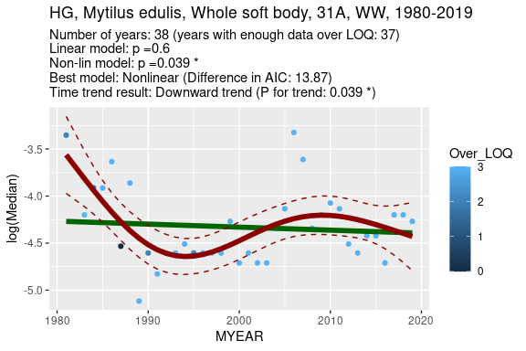<!-- -->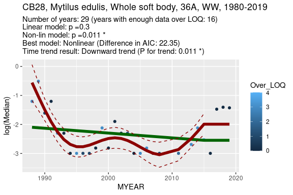<!-- -->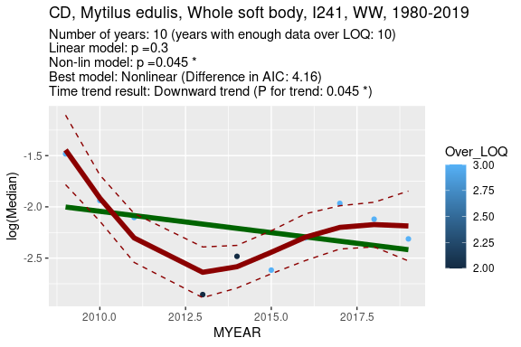<!-- -->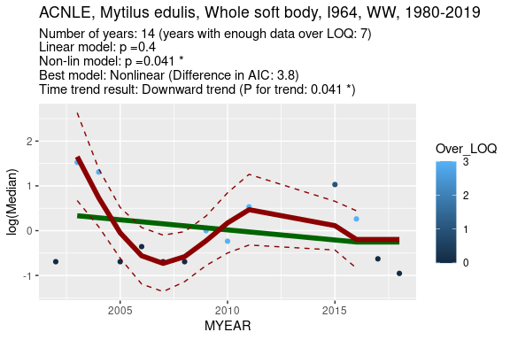<!-- -->

### Long-term trend: linear p < 0.05, non-linear p > 0.20    
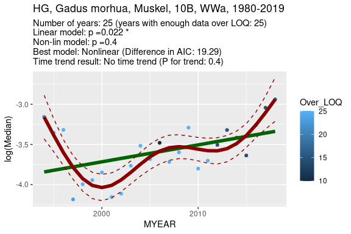<!-- -->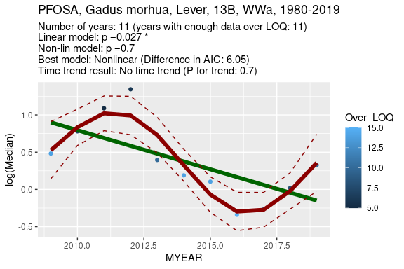<!-- -->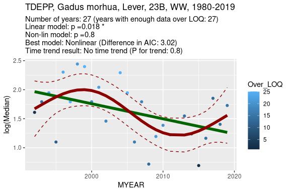<!-- -->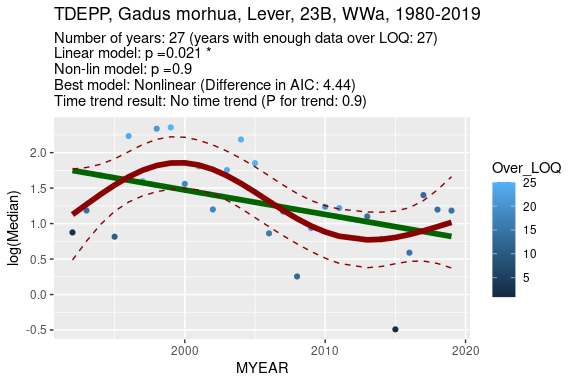<!-- -->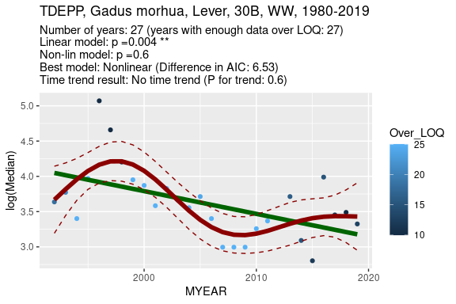<!-- -->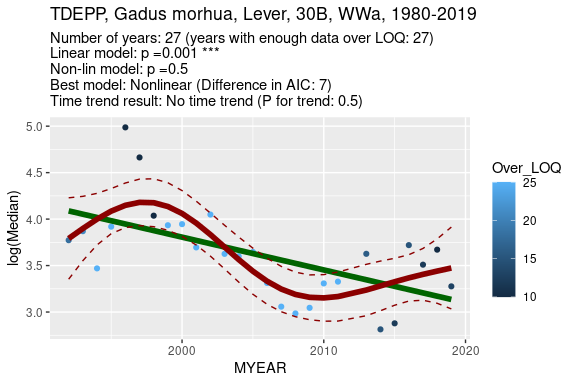<!-- -->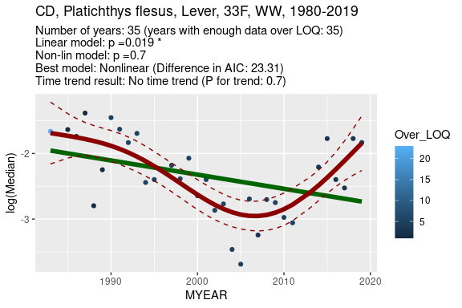<!-- -->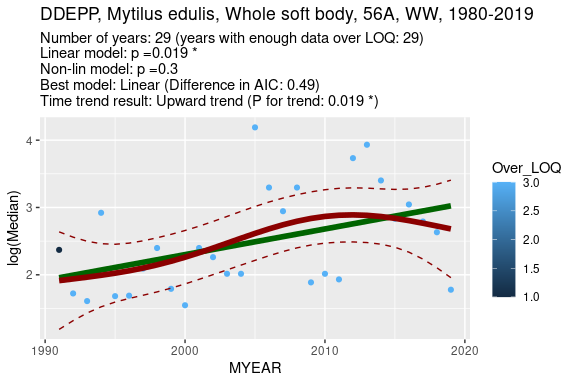<!-- -->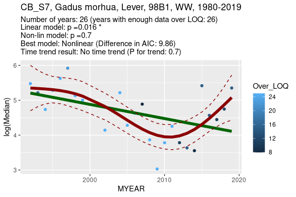<!-- -->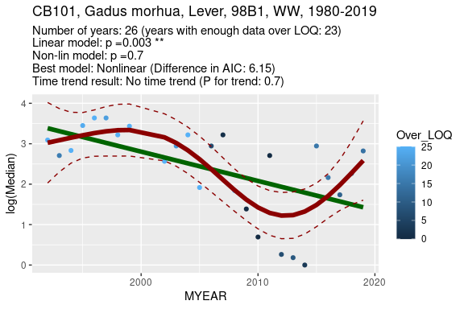<!-- -->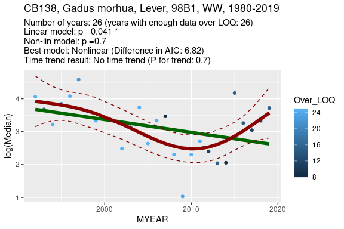<!-- --><!-- -->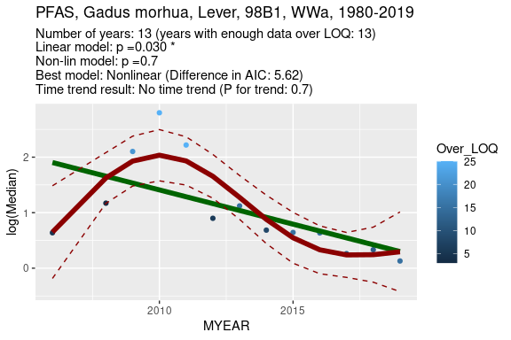<!-- -->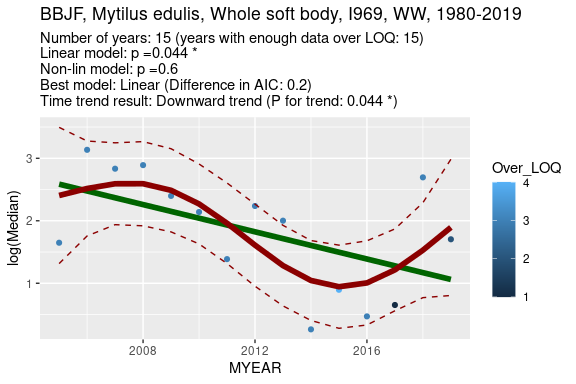<!-- -->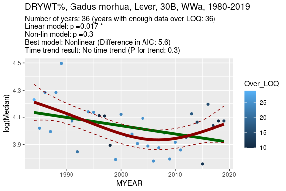<!-- -->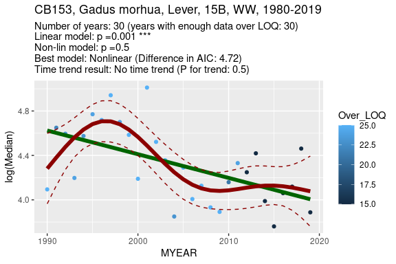<!-- -->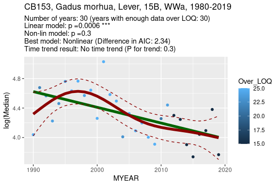<!-- -->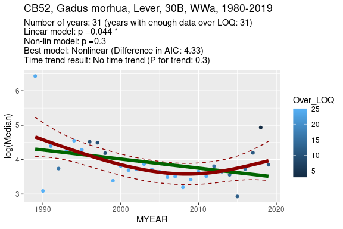<!-- -->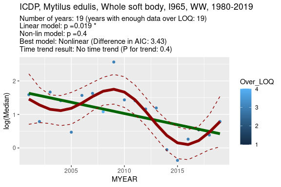<!-- -->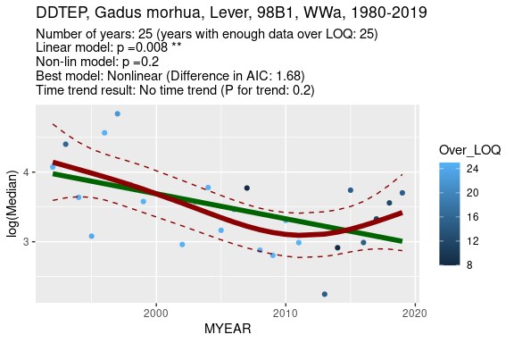<!-- -->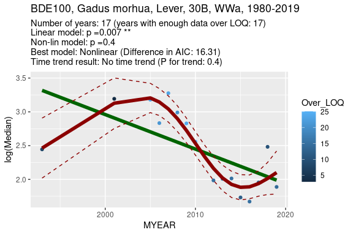<!-- -->

### 10-year trend: linear p > 0.20, non-linear p < 0.05  
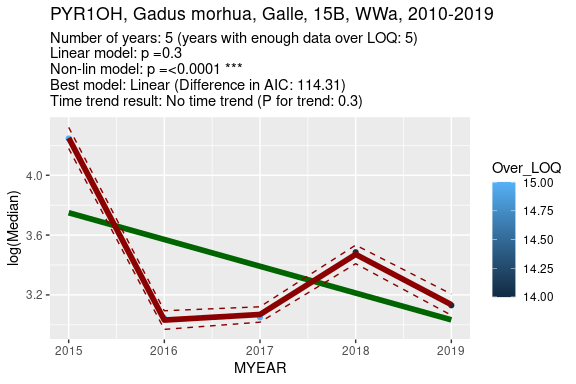<!-- -->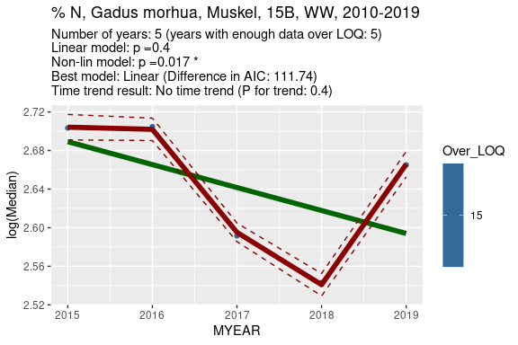<!-- -->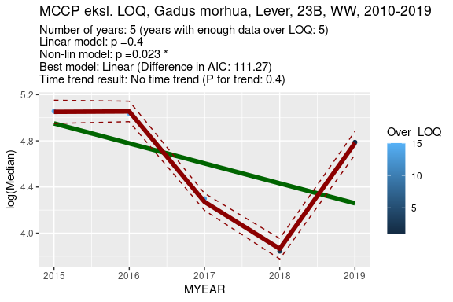<!-- -->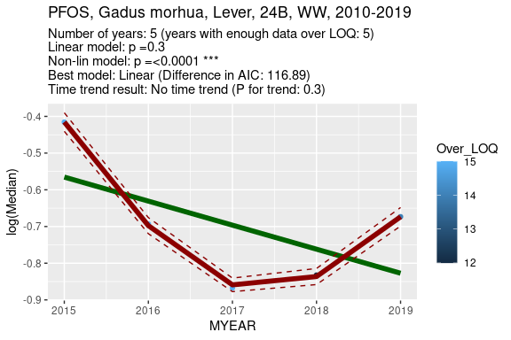<!-- -->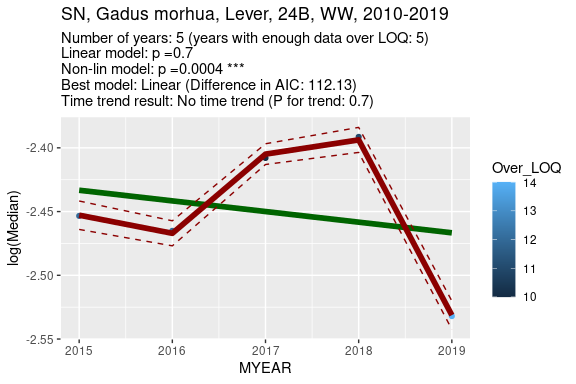<!-- -->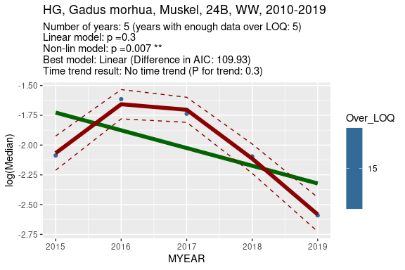<!-- -->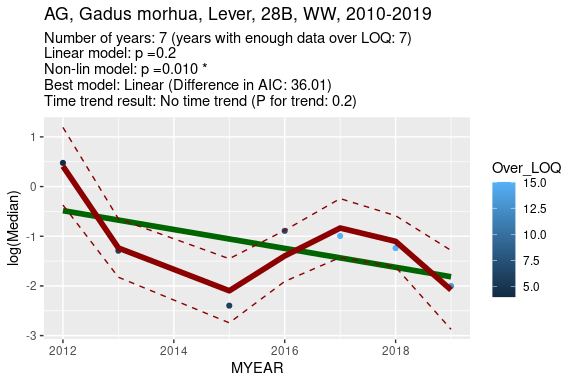<!-- -->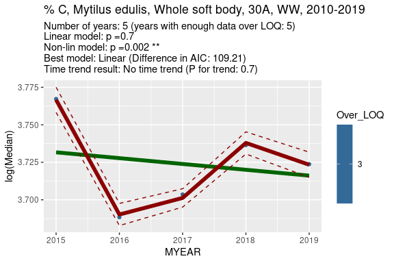<!-- -->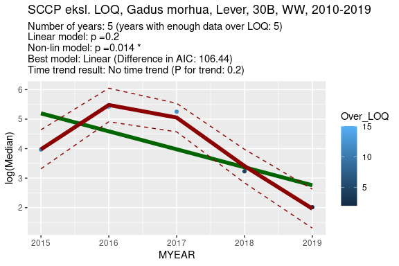<!-- -->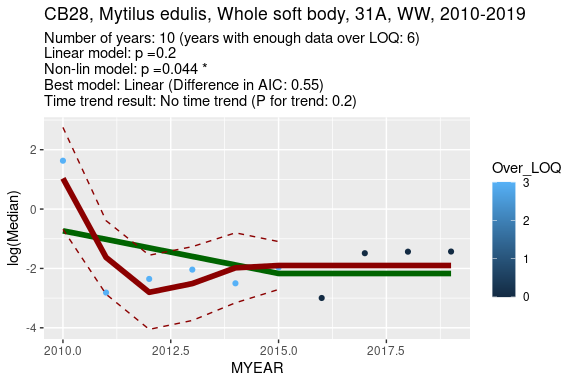<!-- -->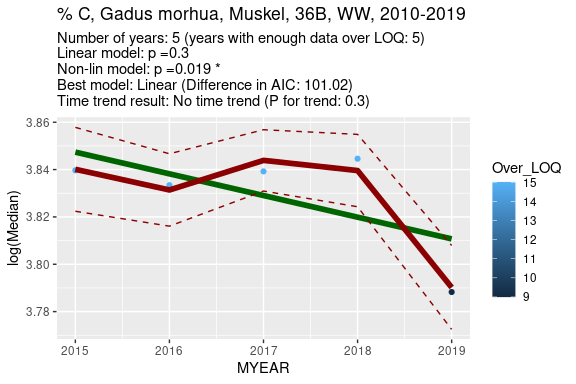<!-- -->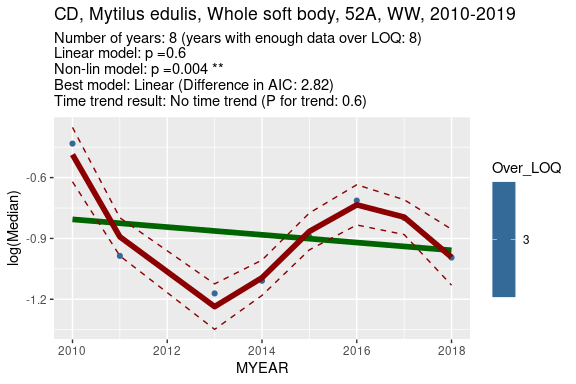<!-- -->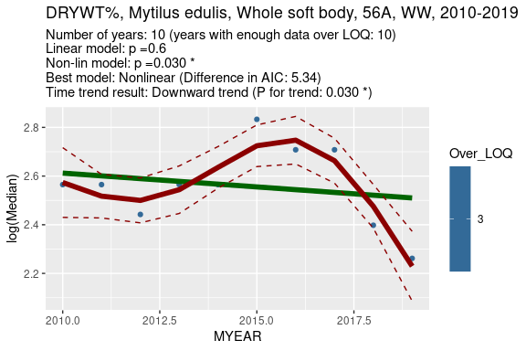<!-- -->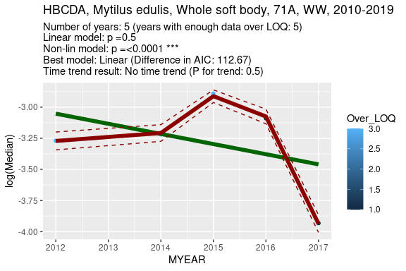<!-- -->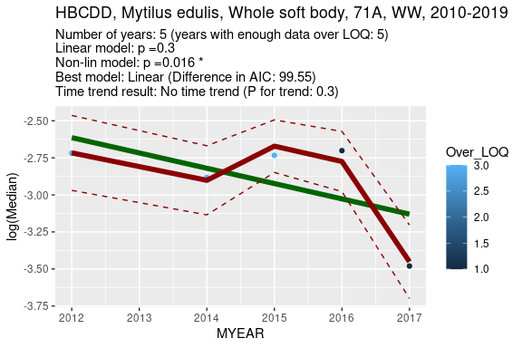<!-- -->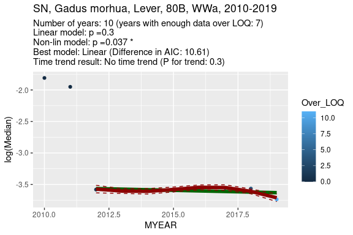<!-- -->

### 10-year trend: linear p < 0.05, non-linear p > 0.20    


