---
title: "252_Check_increasing_LOQ_effects"
output: 
  html_document:
    toc: true
    toc_float: true  
    keep_md: true
---   

Background: 
* LOQ has increased for PCB (in 2017), silver (2019) and napthalene (2019)   
* This leads to 'false' increasing trends due to the method of selecting random numbers between LOQ/2 and LOQ   
* Here we check those trends more carefully  


```r
knitr::opts_chunk$set(echo = FALSE)  
```


## 1. Read data

### a. Main data  
Read and reformat the most recent data (by default)  

```
## File '101_data_updated_2021-10-08.rds' (file number 1) has been read 
##   This is the newest file. If you want to read an older file, put a different 'filenumber' 
## 
## Time since this file was modified: 
## Time difference of 55.10102 days
```

### b. Medians per year   
Made in script 110  

```
## File '110_mediandata_updated_2021-10-08.rds' (file number 1) has been read 
##   This is the newest file. If you want to read an older file, put a different 'filenumber' 
## 
## Time since this file was modified: 
## Time difference of 5.069474 days
## File date text: 2021-10-08
```

### c. Time trend results   

```
## 
## File '120_result_10yr_2020_2021-10-08_run04.rds' (file number 1) has been read 
##   This is the newest file. If you want to read an older file, put a different 'filenumber' 
## 
## Time since this file was modified: 
## Time difference of 5.068759 days
## 
## File '120_result_long_2020_2021-10-08_run04.rds' (file number 1) has been read 
##   This is the newest file. If you want to read an older file, put a different 'filenumber' 
## 
## Time since this file was modified: 
## Time difference of 5.068758 days
```

## 2. PCB 7  

**Conclusion: all upward short.time (10 year) trends should be marked as dubious, except 26A2 and 30A**     

* Part c indicates that 26A2, 30A and 22A have 'robust' increase     
* However in part d-f we test each station (using the sum of CB118, CB138 and CB153), and we reject the increase of 22A, leaving us with 26A2 and 30A as having 'robust increasing trend'  

### a. Plots  

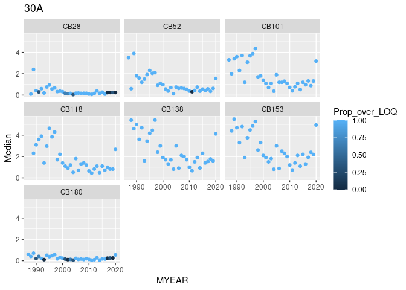<!-- -->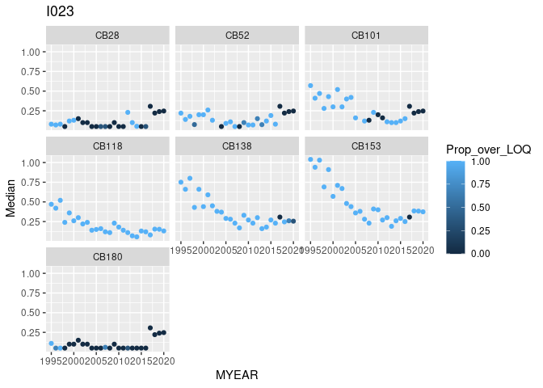<!-- -->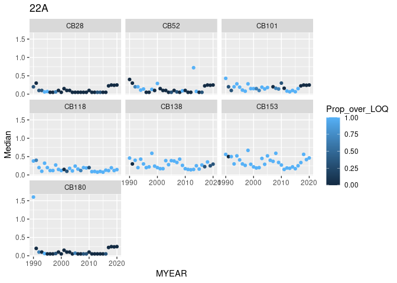<!-- -->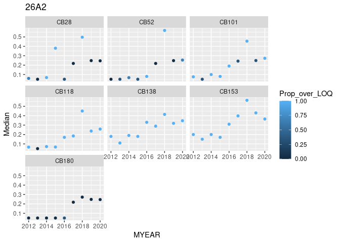<!-- -->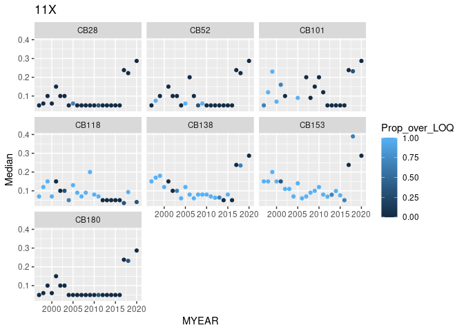<!-- -->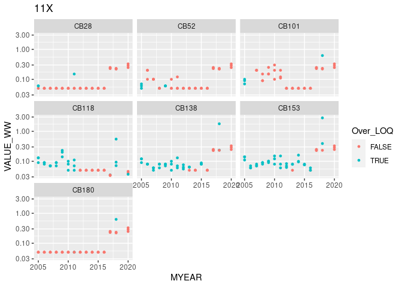<!-- -->


### b. Stations given with cb7 increase

```
## Stations with PCB7 short-term increase (original):
```

```
##  [1] 30A  I023 76A2 56A  57A  64A  65A  22A  26A2 98A2 10A2 11X 
## Levels: 30A I023 76A2 56A 57A 64A 65A 22A 26A2 98A2 10A2 11X
```

### c. Stations with 'robust' cb7 increase   
* For each CB parameter, define 'robust' increase as 'increase when there are at least 2 years among 2017-2020 that has >50% over LOQ'     
* For each station, define 'robust' cb7 increase as having at least 2 parameters with robust increase   
* 26A2, 30A and 22A are selected as 'robust' increase     
* However in the next parts, we reject the increase of 22A, leaving us with 26A2 and 30A  

```
## # A tibble: 12 × 4
##    STATION_CODE N_param_increase Params_increasing              `Robust increas…
##    <chr>                   <int> <chr>                          <chr>           
##  1 26A2                        5 "CB52; CB101; CB118; CB138; C… Yes             
##  2 30A                         3 "CB101; CB138; CB153"          Yes             
##  3 22A                         2 "CB118; CB153"                 Yes             
##  4 I023                        1 "CB153"                        No              
##  5 10A2                        0 ""                             No              
##  6 11X                         0 ""                             No              
##  7 56A                         0 ""                             No              
##  8 57A                         0 ""                             No              
##  9 64A                         0 ""                             No              
## 10 65A                         0 ""                             No              
## 11 76A2                        0 ""                             No              
## 12 98A2                        0 ""                             No
```

### d. 26A2  

```
##       PARAM
## MYEAR  CB101 CB118 CB138 CB153 CB28 CB52
##   2012     1     1     1     1    1    0
##   2013     0     0     1     1    0    0
##   2014     1     1     1     1    1    1
##   2015     1     1     1     1    1    0
##   2016     1     1     1     1    0    1
##   2017     0     1     1     1    0    0
##   2018     1     1     1     1    1    1
##   2019     0     1     1     1    0    0
##   2020     1     1     1     1    0    1
```

```
## `summarise()` has grouped output by 'STATION_CODE', 'LATIN_NAME', 'TISSUE_NAME', 'MYEAR', 'N_median', 'Over_LOQ'. You can override using the `.groups` argument.
```

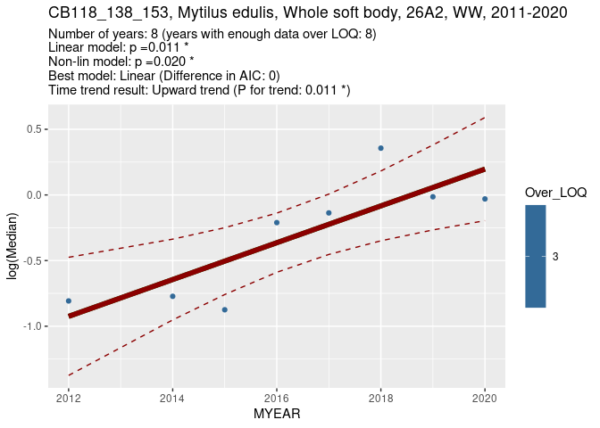<!-- -->

```
##   Nplus   p_linear p_nonlinear AICc_lin AICc_nonlin Lin_slope    Lin_yr1
## x     8 0.01106779  0.02026554 11.65309    11.65309 0.1402325 -0.9248004
##     Lin_yr2 Nonlin_yr1 Nonlin_yr2 Over_LOQ_yr2 Model_used   P_change Dir_change
## x 0.1970595 -0.9248004  0.1970595            3     Linear 0.01106779         Up
##   Status
## x GAM OK
```


### e. 30A  

```
##       PARAM
## MYEAR  CB101 CB118 CB138 CB153 CB180 CB28 CB52
##   2009     1     1     1     1     1    1    1
##   2010     1     1     1     1     1    1    1
##   2011     1     1     1     1     1    1    0
##   2012     1     1     1     1     1    1    1
##   2013     1     1     1     1     1    1    1
##   2014     1     1     1     1     1    1    1
##   2015     1     1     1     1     1    1    1
##   2016     1     1     1     1     1    1    1
##   2017     1     1     1     1     0    0    1
##   2018     1     1     1     1     0    0    1
##   2019     1     1     1     1     0    0    1
##   2020     1     1     1     1     1    0    1
```

```
## `summarise()` has grouped output by 'STATION_CODE', 'LATIN_NAME', 'TISSUE_NAME', 'MYEAR', 'N_median', 'Over_LOQ'. You can override using the `.groups` argument.
```

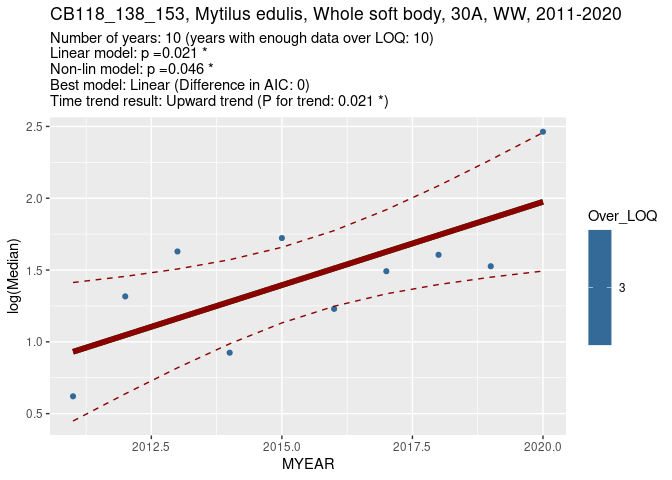<!-- -->

```
##   Nplus   p_linear p_nonlinear AICc_lin AICc_nonlin Lin_slope   Lin_yr1
## x    10 0.02108407  0.04621214 16.16555    16.16555 0.1160259 0.9308811
##    Lin_yr2 Nonlin_yr1 Nonlin_yr2 Over_LOQ_yr2 Model_used   P_change Dir_change
## x 1.975115  0.9308811   1.975115            3     Linear 0.02108407         Up
##   Status
## x GAM OK
```


### f. 22A  

```
##       PARAM
## MYEAR  CB101 CB118 CB138 CB153 CB52
##   2009     1     1     1     1    1
##   2010     0     0     1     1    0
##   2011     0     1     1     1    0
##   2012     1     1     1     1    0
##   2013     1     1     1     1    1
##   2014     1     1     1     1    1
##   2015     1     1     1     1    0
##   2016     1     1     1     1    0
##   2017     0     1     0     1    0
##   2018     0     1     1     1    0
##   2019     0     1     0     1    0
##   2020     0     1     0     1    0
```

```
## `summarise()` has grouped output by 'STATION_CODE', 'LATIN_NAME', 'TISSUE_NAME', 'MYEAR', 'N_median', 'Over_LOQ'. You can override using the `.groups` argument.
```

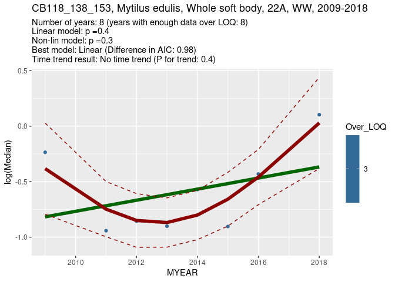<!-- -->

```
##   Nplus  p_linear p_nonlinear AICc_lin AICc_nonlin  Lin_slope   Lin_yr1
## x     8 0.3583088   0.3072655 17.01875    18.00102 0.04993641 -0.816779
##      Lin_yr2 Nonlin_yr1 Nonlin_yr2 Over_LOQ_yr2 Model_used  P_change Dir_change
## x -0.3673513 -0.3828853 0.02875412            3     Linear 0.3583088           
##   Status
## x GAM OK
```


## 3. Silver  

**Conclusion: all upward short-time (10 year) trends (there is only one) should be marked as dubious**  

### a. Plots  

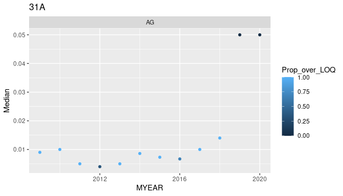<!-- -->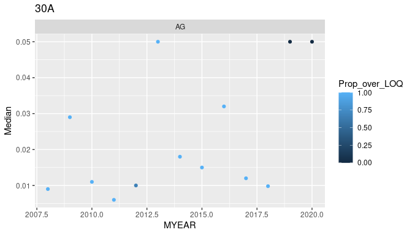<!-- -->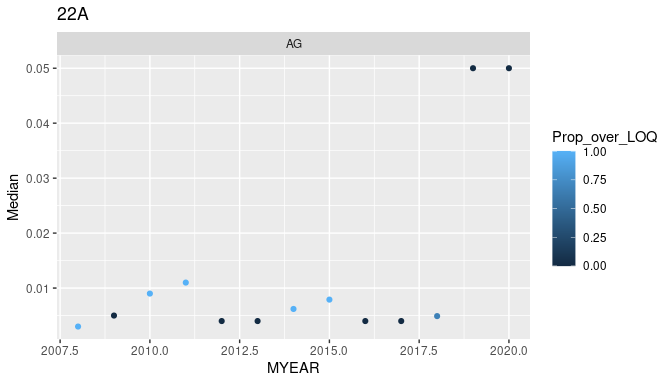<!-- -->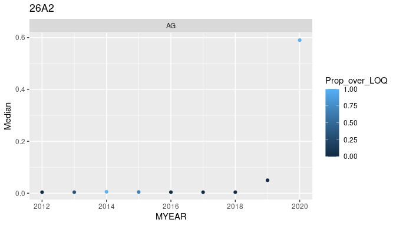<!-- --><!-- -->


### b. Stations given with increase

```
## Stations with AG short-term increase (original):
```

```
## [1] 31A
## Levels: 31A
```

### c. Test stations with 'robust' increase   
* Regression for 30A for 2009-2018      
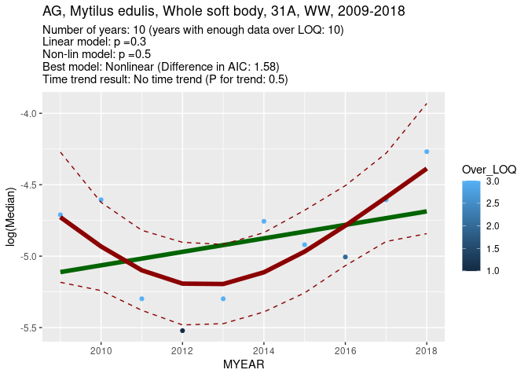<!-- -->

```
##   Nplus  p_linear p_nonlinear AICc_lin AICc_nonlin  Lin_slope   Lin_yr1
## x    10 0.2929946   0.4505254 16.84018    15.25945 0.04719338 -5.111289
##     Lin_yr2 Nonlin_yr1 Nonlin_yr2 Over_LOQ_yr2 Model_used  P_change Dir_change
## x -4.686548  -4.727413  -4.386885            3  Nonlinear 0.4505254           
##   Status
## x GAM OK
```


## 4. Naphtalene    

**Conclusion: no upward trends given - no need to change anything**  

* Obvious from the plots that the 2019 data are not very useful and if there had been a trend, it would have been dubious  


### a. Plots  

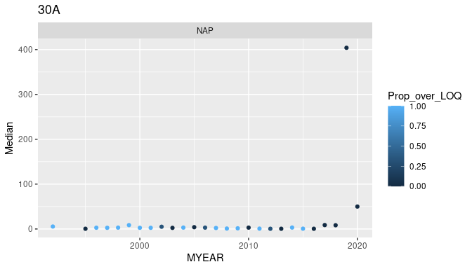<!-- -->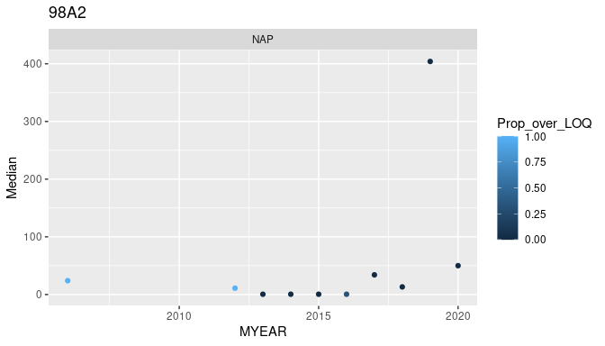<!-- -->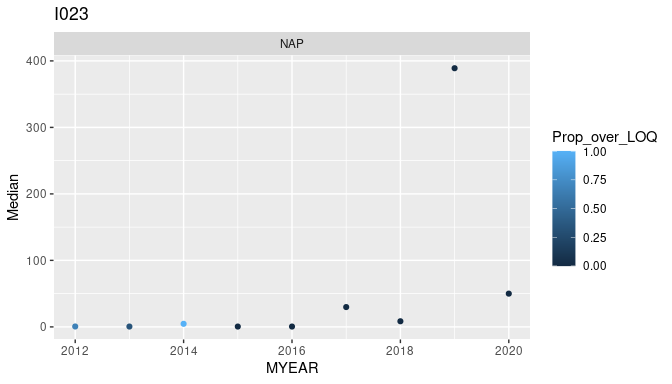<!-- -->


### b. Stations given with short-term increase   

```
## Stations with NAP short-term increase (original):
```

```
## factor(0)
## Levels:
```


### c. Stations given with long-term increase   

```
## Stations with NAP long-term increase (original):
```

```
## factor(0)
## Levels:
```
