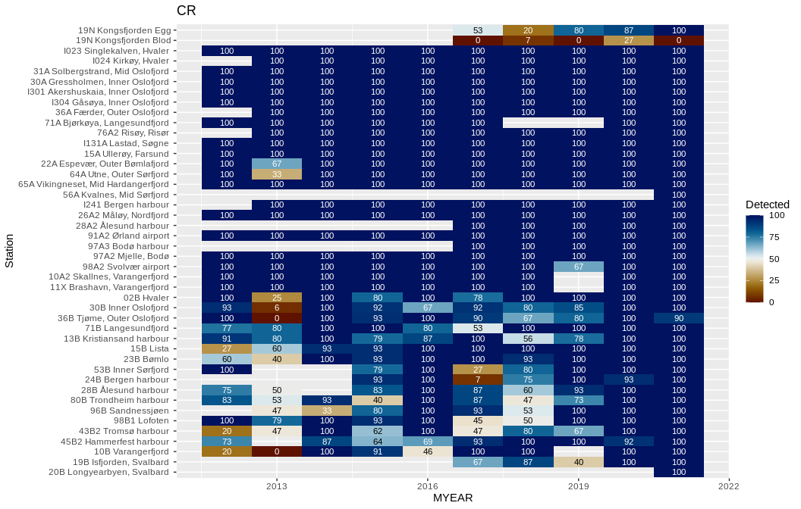

## Startup  


## Data    


## Median LOQ by year


### Tables  

```
## # A tibble: 26 × 12
##    PARAM `2001` `2002` `2003`  `2004` `2005` `2006` `2007` `2008` `2009` `2010`
##    <fct>  <dbl>  <dbl>  <dbl>   <dbl>  <dbl>  <dbl>  <dbl>  <dbl>  <dbl>  <dbl>
##  1 AG     NA     NA     NA     0.0016  NA     NA     NA     0.005  0.005  0.005
##  2 AS     NA     NA     NA    NA       NA     NA     NA    NA     NA     NA    
##  3 CD     NA     NA     NA    NA       NA     NA     NA    NA      0.002 NA    
##  4 CO     NA     NA     NA    NA       NA     NA     NA    NA      0.008 NA    
##  5 CR     NA     NA     NA    NA       NA     NA      0.3   0.2    0.2    0.2  
##  6 CU     NA     NA     NA    NA       NA     NA     NA    NA     NA     NA    
##  7 HG     NA     NA     NA    NA       NA     NA     NA    NA      0.011 NA    
##  8 NI     NA     NA     NA    NA       NA     NA     NA    NA      0.02   0.02 
##  9 PB      0.03   0.01   0.02  0.02     0.02   0.02   0.02  0.02   0.02   0.02 
## 10 ZN     NA     NA     NA    NA       NA     NA     NA    NA     NA     NA    
## # … with 16 more rows, and 1 more variable: `2011` <dbl>
## # A tibble: 27 × 11
##    PARAM `2012` `2013` `2014` `2015` `2016` `2017`  `2018`  `2019`  `2020`
##    <fct>  <dbl>  <dbl>  <dbl>  <dbl>  <dbl>  <dbl>   <dbl>   <dbl>   <dbl>
##  1 AG     0.004  0.004  0.004  0.004  0.004  0.004  0.004   0.05    0.05  
##  2 AS    NA     NA      0.05  NA     NA     NA     NA      NA      NA     
##  3 CD     0.001  0.001  0.001 NA     NA     NA      0.0003 NA       0.0002
##  4 CO     0.003  0.003  0.003  0.003 NA     NA      0.003  NA       0.001 
##  5 CR     0.03   0.03   0.03   0.03   0.03   0.03   0.03    0.01    0.0025
##  6 CU    NA     NA      0.02  NA     NA     NA     NA      NA      NA     
##  7 HG     0.05  NA     NA      0.005  0.005 NA     NA       0.005  NA     
##  8 NI     0.04   0.04   0.04   0.04   0.04   0.04   0.04    0.0031  0.0026
##  9 PB     0.03   0.03   0.03   0.03   0.03   0.03   0.03    0.0014  0.005 
## 10 ZN    NA     NA      0.5   NA     NA     NA     NA      NA      NA     
## # … with 17 more rows, and 1 more variable: `2021` <dbl>
```


### Plot  
<!-- --><!-- -->


## Detection frequency


### Detection frequency 1 (by param * station, one parameter in all years)  

* Vik color scale used  
* This plot shows the median value for each station/year, it could instead show limit of quantification (median value of less-thans)  


```
## Joining, by = "STATION_CODE"
```

<!-- -->
### Other way  
<!-- -->


### Detection frequency 2 (by year * station, one parameter in all years)  

* Vik color scale used  
* This plot shows the median value for each station/year, it could instead show limit of quantification (median value of less-thans)  


```
## Joining, by = "STATION_CODE"
## `summarise()` has grouped output by 'Station'. You can override using the
## `.groups` argument.
```

<!-- -->
