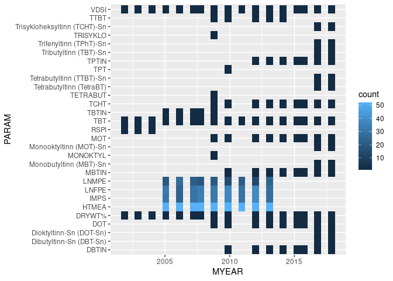
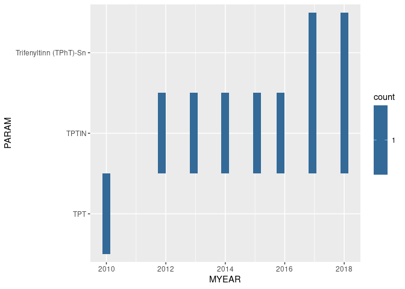
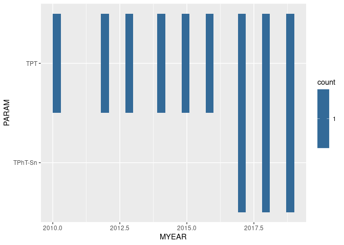

## 1. Libraries


## 2. Station  

```r
station <- "11G"
```


## 3. Script 101

```r
#
# 1. Legacy data going into script 101
#
data101_through_2018 <- readRDS("Input_data/Data_through_2018.rds") 

#
# 2. New (2019) data going into script 101
#
filename <- list_files("Data_Nivabasen", pattern = "Data_CEMP_Biota")[1]
```

```
## There are 11 files with pattern 'Data_CEMP_Biota' to choose from
```

```r
data101_new <- AqMexport_read_chemistry_table(filename) %>%
  mutate(
    Month = month(CatchDateFirst),
    MYEAR = case_when(
      Month <= 2 ~ year(CatchDateFirst)-1,   # measurments in Jan-Feb belong to the year before
      Month >= 3 ~ year(CatchDateFirst))
  ) %>%
  filter(MYEAR %in% 2019:2020)
```

```
## New names:
## * `` -> ...1
## * `` -> ...2
## * `` -> ...3
## * `` -> ...4
## * `` -> ...5
## * ...
```

```r
if (FALSE){
  xtabs(~MYEAR + PARAM, data101_through_2018 %>% filter(STATION_CODE == station))
}

#
# 3. result of script 101
#
filename <- list_files("Data", pattern = "101_data_updated")[1]
```

```
## There are 8 files with pattern '101_data_updated' to choose from
```

```r
data101_final <- readRDS(paste0("Data/", filename))

#
# output 1
#
data101_new %>% 
  filter(StationCode == station) %>%
  filter(grepl("TPT", Substance) | grepl("Trifenyltinn", Substance) |  grepl("TPhT", Substance)) %>%
  xtabs(~Substance, .)
```

```
## Substance
## TPhT 
##    1
```

```r
#
# output 2
#
data101_through_2018 %>% 
  filter(STATION_CODE == station) %>%
  ggplot(aes(MYEAR, PARAM)) +
  stat_bin2d()
```

<!-- -->

```r
#
# output 3
#
data101_through_2018 %>% 
  filter(STATION_CODE == station) %>%
  filter(grepl("TPT", PARAM) | grepl("Trifenyltinn", PARAM) |  grepl("TPhT", PARAM)) %>%
  ggplot(aes(MYEAR, PARAM)) +
  stat_bin2d()
```

<!-- -->

```r
#
# output 4
#
data101_final %>% 
  filter(STATION_CODE == station) %>%
  filter(grepl("TPT", PARAM) | grepl("Trifenyltinn", PARAM) |  grepl("TPhT", PARAM)) %>%
  ggplot(aes(MYEAR, PARAM)) +
  stat_bin2d()
```

<!-- -->

```r
#
# output 5
#
data101_final %>% 
  filter(STATION_CODE == station) %>%
  filter(grepl("TPT", PARAM) | grepl("Trifenyltinn", PARAM) |  grepl("TPhT", PARAM)) %>%
  select(STATION_CODE, MYEAR, PARAM, VALUE_WW)
```

```
## # A tibble: 12 x 4
##    STATION_CODE MYEAR PARAM   VALUE_WW
##    <chr>        <dbl> <chr>      <dbl>
##  1 11G           2010 TPT        0.3  
##  2 11G           2012 TPT        0.306
##  3 11G           2013 TPT        0.674
##  4 11G           2014 TPT        0.825
##  5 11G           2015 TPT        0.94 
##  6 11G           2016 TPT        0.3  
##  7 11G           2017 TPT        0.5  
##  8 11G           2017 TPhT-Sn    0.17 
##  9 11G           2018 TPT        0.5  
## 10 11G           2018 TPhT-Sn    0.17 
## 11 11G           2019 TPhT-Sn    0.64 
## 12 11G           2019 TPT        1.9
```

## 4. Script 109

```r
filename <- list_files("Data", pattern = "109_adjusted_data")[1]
```

```
## There are 5 files with pattern '109_adjusted_data' to choose from
```

```r
data109_final <- readRDS(paste0("Data/", filename))

data109_final %>% 
  filter(STATION_CODE == station) %>%
  filter(grepl("TPT", PARAM) | grepl("Trifenyltinn", PARAM) |  grepl("TPhT", PARAM)) %>%
  select(STATION_CODE, MYEAR, PARAM, VALUE_WW) %>%
  ggplot(aes(MYEAR, PARAM)) +
  stat_bin2d()
```

<!-- -->

## 5. Script 110

```r
filename <- list_files("Data", pattern = "110_mediandata_updated")[1]
```

```
## There are 6 files with pattern '110_mediandata_updated' to choose from
```

```r
data110_final <- readRDS(paste0("Data/", filename))

data110_final %>% 
  filter(STATION_CODE == station) %>%
  filter(grepl("TPT", PARAM) | grepl("Trifenyltinn", PARAM) |  grepl("TPhT", PARAM)) %>%
  filter(Basis == "WW") %>%
  select(STATION_CODE, MYEAR, PARAM, Value) %>%
  ggplot(aes(MYEAR, PARAM)) +
  stat_bin2d()
```

<!-- -->

## 5. Script 201

```r
filename <- list_files("Big_excel_table", pattern = "Data_xl_.+.rds")[1]
```

```
## There are 10 files with pattern 'Data_xl_.+.rds' to choose from
```

```r
data201_final <- readRDS(paste0("Big_excel_table/", filename))

data201_final %>% 
  filter(STATION_CODE == station) %>%
  filter(grepl("TPT", PARAM) | grepl("Trifenyltinn", PARAM) |  grepl("TPhT", PARAM)) %>%
  filter(Basis == "WW") %>%
  select(PARAM, Substance.Group, LATIN_NAME, TISSUE_NAME, STATION_CODE, Basis, 
         Yr_2003, Yr_2010, Yr_2014, Yr_2018, Yr_2019, N_string, SD_last, EQS)
```

```
##     PARAM Substance.Group       LATIN_NAME     TISSUE_NAME STATION_CODE Basis
## 1 TPhT-Sn            <NA> Nucella lapillus Whole soft body          11G    WW
## 2     TPT            <NA> Nucella lapillus Whole soft body          11G    WW
##   Yr_2003 Yr_2010 Yr_2014 Yr_2018 Yr_2019 N_string SD_last EQS
## 1      NA      NA      NA    0.17    0.64 1 (1-30)      NA  NA
## 2      NA     0.3   0.825    0.50    1.90 1 (1-30)      NA 152
```
