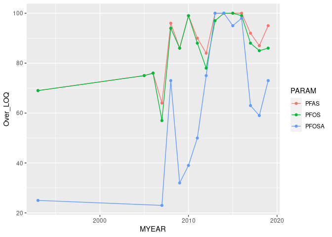
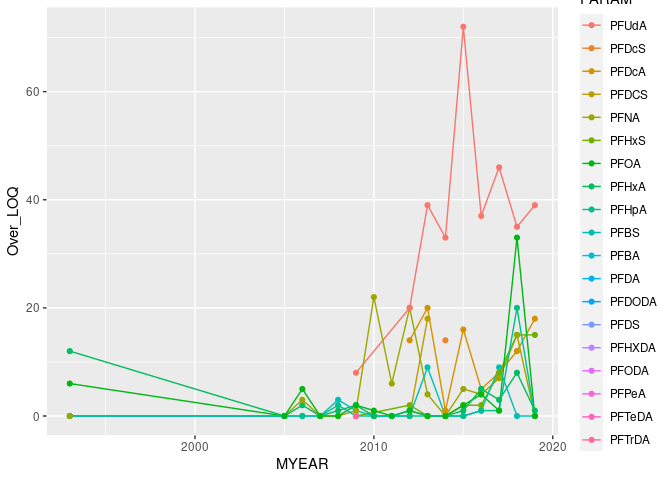
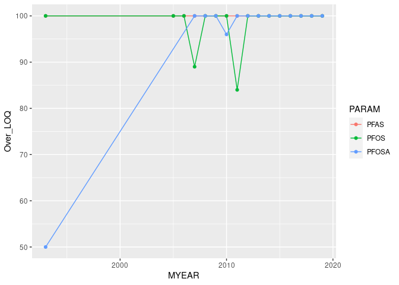
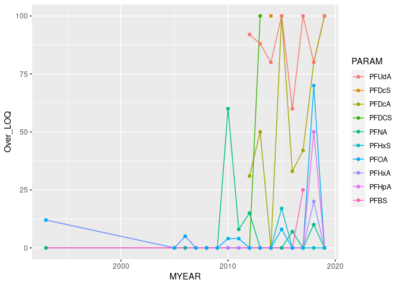
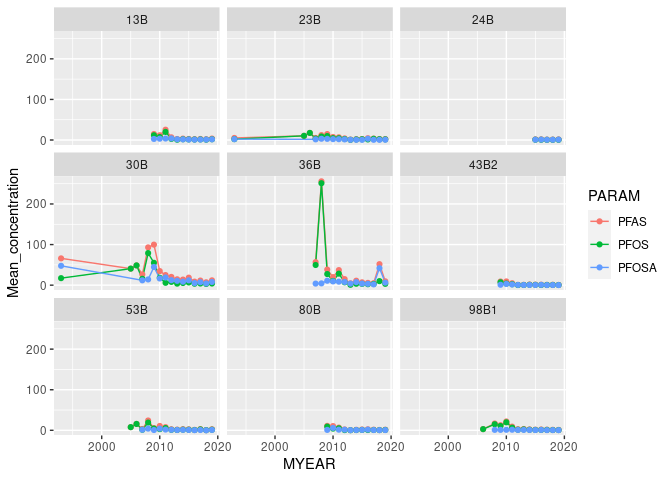
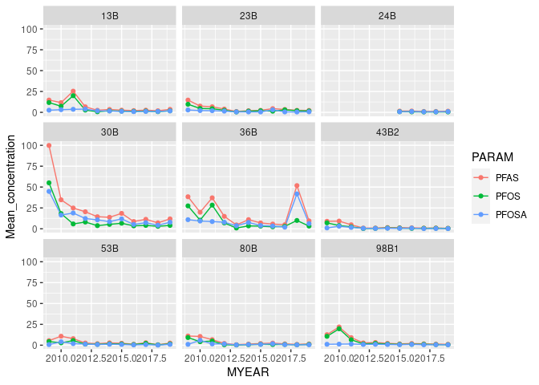
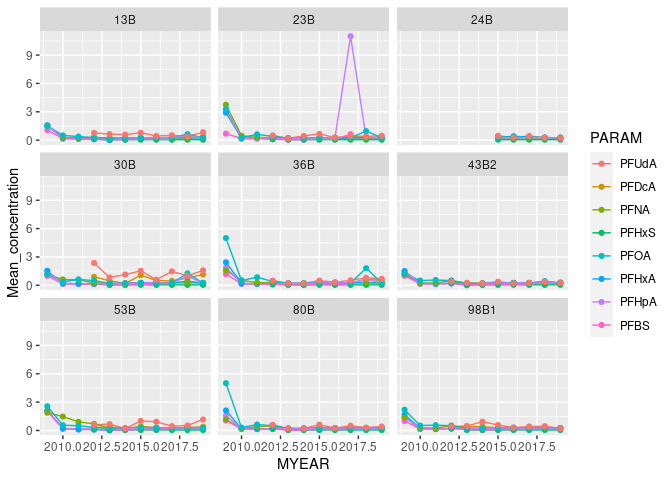
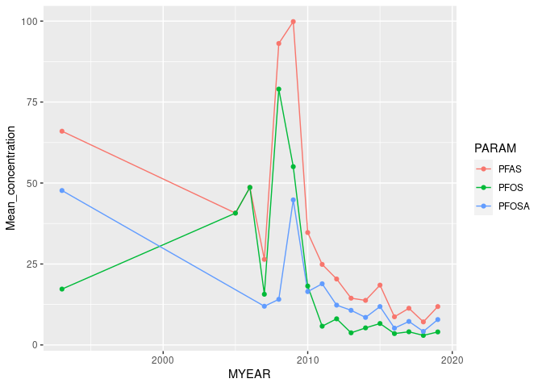
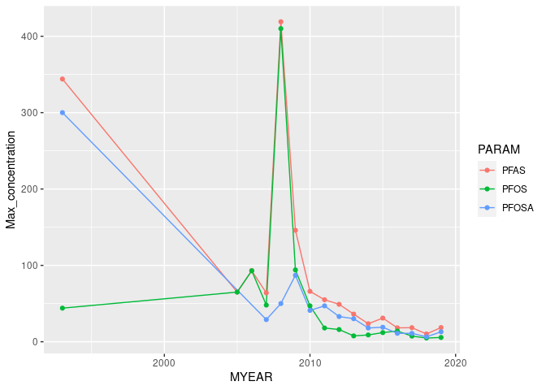
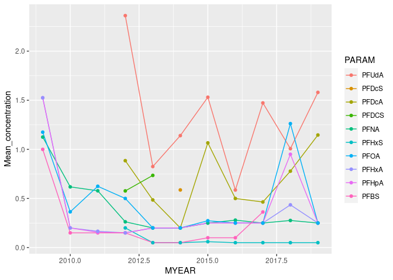

## 1. Packages  

```r
library(dplyr)
```

```
## 
## Attaching package: 'dplyr'
```

```
## The following objects are masked from 'package:stats':
## 
##     filter, lag
```

```
## The following objects are masked from 'package:base':
## 
##     intersect, setdiff, setequal, union
```

```r
library(purrr)
library(ggplot2)
library(forcats)
library(plotly)
```

```
## 
## Attaching package: 'plotly'
```

```
## The following object is masked from 'package:ggplot2':
## 
##     last_plot
```

```
## The following object is masked from 'package:stats':
## 
##     filter
```

```
## The following object is masked from 'package:graphics':
## 
##     layout
```

## 2. Data 

### Main data  
Read and reformat the most recent data (by default)  

```r

files <- dir("Data", pattern = "109_adjusted_data") %>% rev()

cat("Reading the last file downloaded:")
## Reading the last file downloaded:
cat("\n", files[1])
## 
##  109_adjusted_data_2020-08-05.rds
cat("\n")
cat("If you want to read a different file, replace 'files[1]' with the file you want")
## If you want to read a different file, replace 'files[1]' with the file you want
cat("\n\n")

filename <- files[1]
cat("Time since this file was modified: \n")
## Time since this file was modified:
Sys.time() - file.info(paste0("Data/", filename))$mtime
## Time difference of 31.27739 days

data_all <- readRDS(paste0("Data/", filename))

# We save the date part of the text (e.g., '2020-04-23')
# This will be used in part 10, when we save the resulting file
pos1 <- regexpr("20", filename)[1]   # search for the first place "20" occurs inside filename
pos2 <- pos1 + 9
file_date <- substr(filename, pos1, pos2)    # pick out the part of the text from character no. 17 to no. 26
```

## 3. Percentage over LOQ, all stations    

### Table    

```r
df1 <- data_all %>% 
  filter(substr(PARAM, 1, 2) == "PF") %>%
  group_by(PARAM, MYEAR) %>%
  summarise(
    Over_LOQ = round(100*mean(is.na(FLAG1)),0)
    )# regrouping output by 'PARAM'
```

```
## `summarise()` regrouping output by 'PARAM' (override with `.groups` argument)
```

```r
# For correct oredring of PARAM
# The same ordering used for Indre Oslofjord also  
df_param <- df1 %>%    
  # the 'mutate' and 'arrange' below is only for setting factors ('fct_inorder')    
  summarise(
    Over_LOQ_mean = mean(Over_LOQ, na.rm = TRUE)) %>%   
  arrange(desc(Over_LOQ_mean))
```

```
## `summarise()` ungrouping output (override with `.groups` argument)
```

```r
df1 <- df1 %>%
  mutate(
    PARAM = factor(PARAM, levels = df_param$PARAM)
  )
# levels(df1$PARAM)

df2 <- df1 %>%
  arrange(PARAM, MYEAR) %>%
  tidyr::pivot_wider(names_from = PARAM, values_from = Over_LOQ) %>%
  arrange(MYEAR)

df2
```

```
## # A tibble: 16 x 23
##    MYEAR  PFAS  PFOS PFOSA PFUdA PFDcS PFDcA PFDCS  PFNA PFHxS  PFOA PFHxA PFHpA
##    <dbl> <dbl> <dbl> <dbl> <dbl> <dbl> <dbl> <dbl> <dbl> <dbl> <dbl> <dbl> <dbl>
##  1  1993    69    69    25    NA    NA    NA    NA     0    NA     6    12     0
##  2  2005    75    75    NA    NA    NA    NA    NA     0    NA     0     0     0
##  3  2006    76    76    NA    NA    NA    NA    NA     3    NA     5     2     0
##  4  2007    64    57    23    NA    NA    NA    NA     0    NA     0     0     0
##  5  2008    96    94    73    NA    NA    NA    NA     0    NA     0     1     2
##  6  2009    86    86    32     8    NA    NA    NA     1     0     2     2     0
##  7  2010    99    99    39    NA    NA    NA    NA    22    NA     1     0     0
##  8  2011    90    88    50    NA    NA    NA    NA     6    NA     0     0     0
##  9  2012    84    78    75    20    NA    14     0    20     2     1     1     0
## 10  2013   100    97   100    39    NA    20    18     4     0     0     0     0
## 11  2014   100   100   100    33    14     1    NA     0     0     0     0     0
## 12  2015   100   100    95    72    NA    16    NA     5     2     2     1     0
## 13  2016   100    99    98    37    NA     5    NA     4     2     4     5     1
## 14  2017    92    88    63    46    NA     8    NA     7     8     1     3     1
## 15  2018    87    85    59    35    NA    12    NA    15    15    33     8    20
## 16  2019    95    86    73    39    NA    18    NA     0    15     0     1     0
## # … with 10 more variables: PFBS <dbl>, PFBA <dbl>, PFDA <dbl>, PFDODA <dbl>,
## #   PFDS <dbl>, PFHXDA <dbl>, PFODA <dbl>, PFPeA <dbl>, PFTeDA <dbl>,
## #   PFTrDA <dbl>
```

### Plot 

The most common ones  

```r
gg <- df1 %>%
  filter(PARAM %in% c("PFAS", "PFOS", "PFOSA")) %>%
  ggplot(aes(MYEAR, Over_LOQ, color = PARAM)) +
  geom_line() +
  geom_point()

gg
```

<!-- -->

```r
plotly::ggplotly(gg)  
```

<!--html_preserve--><div id="htmlwidget-c35885f237ec8f10e371" style="width:672px;height:480px;" class="plotly html-widget"></div>
<script type="application/json" data-for="htmlwidget-c35885f237ec8f10e371">{"x":{"data":[{"x":[1993,2005,2006,2007,2008,2009,2010,2011,2012,2013,2014,2015,2016,2017,2018,2019],"y":[69,75,76,64,96,86,99,90,84,100,100,100,100,92,87,95],"text":["MYEAR: 1993<br />Over_LOQ:  69<br />PARAM: PFAS","MYEAR: 2005<br />Over_LOQ:  75<br />PARAM: PFAS","MYEAR: 2006<br />Over_LOQ:  76<br />PARAM: PFAS","MYEAR: 2007<br />Over_LOQ:  64<br />PARAM: PFAS","MYEAR: 2008<br />Over_LOQ:  96<br />PARAM: PFAS","MYEAR: 2009<br />Over_LOQ:  86<br />PARAM: PFAS","MYEAR: 2010<br />Over_LOQ:  99<br />PARAM: PFAS","MYEAR: 2011<br />Over_LOQ:  90<br />PARAM: PFAS","MYEAR: 2012<br />Over_LOQ:  84<br />PARAM: PFAS","MYEAR: 2013<br />Over_LOQ: 100<br />PARAM: PFAS","MYEAR: 2014<br />Over_LOQ: 100<br />PARAM: PFAS","MYEAR: 2015<br />Over_LOQ: 100<br />PARAM: PFAS","MYEAR: 2016<br />Over_LOQ: 100<br />PARAM: PFAS","MYEAR: 2017<br />Over_LOQ:  92<br />PARAM: PFAS","MYEAR: 2018<br />Over_LOQ:  87<br />PARAM: PFAS","MYEAR: 2019<br />Over_LOQ:  95<br />PARAM: PFAS"],"type":"scatter","mode":"lines+markers","line":{"width":1.88976377952756,"color":"rgba(248,118,109,1)","dash":"solid"},"hoveron":"points","name":"PFAS","legendgroup":"PFAS","showlegend":true,"xaxis":"x","yaxis":"y","hoverinfo":"text","marker":{"autocolorscale":false,"color":"rgba(248,118,109,1)","opacity":1,"size":5.66929133858268,"symbol":"circle","line":{"width":1.88976377952756,"color":"rgba(248,118,109,1)"}},"frame":null},{"x":[1993,2005,2006,2007,2008,2009,2010,2011,2012,2013,2014,2015,2016,2017,2018,2019],"y":[69,75,76,57,94,86,99,88,78,97,100,100,99,88,85,86],"text":["MYEAR: 1993<br />Over_LOQ:  69<br />PARAM: PFOS","MYEAR: 2005<br />Over_LOQ:  75<br />PARAM: PFOS","MYEAR: 2006<br />Over_LOQ:  76<br />PARAM: PFOS","MYEAR: 2007<br />Over_LOQ:  57<br />PARAM: PFOS","MYEAR: 2008<br />Over_LOQ:  94<br />PARAM: PFOS","MYEAR: 2009<br />Over_LOQ:  86<br />PARAM: PFOS","MYEAR: 2010<br />Over_LOQ:  99<br />PARAM: PFOS","MYEAR: 2011<br />Over_LOQ:  88<br />PARAM: PFOS","MYEAR: 2012<br />Over_LOQ:  78<br />PARAM: PFOS","MYEAR: 2013<br />Over_LOQ:  97<br />PARAM: PFOS","MYEAR: 2014<br />Over_LOQ: 100<br />PARAM: PFOS","MYEAR: 2015<br />Over_LOQ: 100<br />PARAM: PFOS","MYEAR: 2016<br />Over_LOQ:  99<br />PARAM: PFOS","MYEAR: 2017<br />Over_LOQ:  88<br />PARAM: PFOS","MYEAR: 2018<br />Over_LOQ:  85<br />PARAM: PFOS","MYEAR: 2019<br />Over_LOQ:  86<br />PARAM: PFOS"],"type":"scatter","mode":"lines+markers","line":{"width":1.88976377952756,"color":"rgba(0,186,56,1)","dash":"solid"},"hoveron":"points","name":"PFOS","legendgroup":"PFOS","showlegend":true,"xaxis":"x","yaxis":"y","hoverinfo":"text","marker":{"autocolorscale":false,"color":"rgba(0,186,56,1)","opacity":1,"size":5.66929133858268,"symbol":"circle","line":{"width":1.88976377952756,"color":"rgba(0,186,56,1)"}},"frame":null},{"x":[1993,2007,2008,2009,2010,2011,2012,2013,2014,2015,2016,2017,2018,2019],"y":[25,23,73,32,39,50,75,100,100,95,98,63,59,73],"text":["MYEAR: 1993<br />Over_LOQ:  25<br />PARAM: PFOSA","MYEAR: 2007<br />Over_LOQ:  23<br />PARAM: PFOSA","MYEAR: 2008<br />Over_LOQ:  73<br />PARAM: PFOSA","MYEAR: 2009<br />Over_LOQ:  32<br />PARAM: PFOSA","MYEAR: 2010<br />Over_LOQ:  39<br />PARAM: PFOSA","MYEAR: 2011<br />Over_LOQ:  50<br />PARAM: PFOSA","MYEAR: 2012<br />Over_LOQ:  75<br />PARAM: PFOSA","MYEAR: 2013<br />Over_LOQ: 100<br />PARAM: PFOSA","MYEAR: 2014<br />Over_LOQ: 100<br />PARAM: PFOSA","MYEAR: 2015<br />Over_LOQ:  95<br />PARAM: PFOSA","MYEAR: 2016<br />Over_LOQ:  98<br />PARAM: PFOSA","MYEAR: 2017<br />Over_LOQ:  63<br />PARAM: PFOSA","MYEAR: 2018<br />Over_LOQ:  59<br />PARAM: PFOSA","MYEAR: 2019<br />Over_LOQ:  73<br />PARAM: PFOSA"],"type":"scatter","mode":"lines+markers","line":{"width":1.88976377952756,"color":"rgba(97,156,255,1)","dash":"solid"},"hoveron":"points","name":"PFOSA","legendgroup":"PFOSA","showlegend":true,"xaxis":"x","yaxis":"y","hoverinfo":"text","marker":{"autocolorscale":false,"color":"rgba(97,156,255,1)","opacity":1,"size":5.66929133858268,"symbol":"circle","line":{"width":1.88976377952756,"color":"rgba(97,156,255,1)"}},"frame":null}],"layout":{"margin":{"t":26.2283105022831,"r":7.30593607305936,"b":40.1826484018265,"l":43.1050228310502},"plot_bgcolor":"rgba(235,235,235,1)","paper_bgcolor":"rgba(255,255,255,1)","font":{"color":"rgba(0,0,0,1)","family":"","size":14.6118721461187},"xaxis":{"domain":[0,1],"automargin":true,"type":"linear","autorange":false,"range":[1991.7,2020.3],"tickmode":"array","ticktext":["2000","2010","2020"],"tickvals":[2000,2010,2020],"categoryorder":"array","categoryarray":["2000","2010","2020"],"nticks":null,"ticks":"outside","tickcolor":"rgba(51,51,51,1)","ticklen":3.65296803652968,"tickwidth":0.66417600664176,"showticklabels":true,"tickfont":{"color":"rgba(77,77,77,1)","family":"","size":11.689497716895},"tickangle":-0,"showline":false,"linecolor":null,"linewidth":0,"showgrid":true,"gridcolor":"rgba(255,255,255,1)","gridwidth":0.66417600664176,"zeroline":false,"anchor":"y","title":{"text":"MYEAR","font":{"color":"rgba(0,0,0,1)","family":"","size":14.6118721461187}},"hoverformat":".2f"},"yaxis":{"domain":[0,1],"automargin":true,"type":"linear","autorange":false,"range":[19.15,103.85],"tickmode":"array","ticktext":["20","40","60","80","100"],"tickvals":[20,40,60,80,100],"categoryorder":"array","categoryarray":["20","40","60","80","100"],"nticks":null,"ticks":"outside","tickcolor":"rgba(51,51,51,1)","ticklen":3.65296803652968,"tickwidth":0.66417600664176,"showticklabels":true,"tickfont":{"color":"rgba(77,77,77,1)","family":"","size":11.689497716895},"tickangle":-0,"showline":false,"linecolor":null,"linewidth":0,"showgrid":true,"gridcolor":"rgba(255,255,255,1)","gridwidth":0.66417600664176,"zeroline":false,"anchor":"x","title":{"text":"Over_LOQ","font":{"color":"rgba(0,0,0,1)","family":"","size":14.6118721461187}},"hoverformat":".2f"},"shapes":[{"type":"rect","fillcolor":null,"line":{"color":null,"width":0,"linetype":[]},"yref":"paper","xref":"paper","x0":0,"x1":1,"y0":0,"y1":1}],"showlegend":true,"legend":{"bgcolor":"rgba(255,255,255,1)","bordercolor":"transparent","borderwidth":1.88976377952756,"font":{"color":"rgba(0,0,0,1)","family":"","size":11.689497716895},"y":0.93503937007874},"annotations":[{"text":"PARAM","x":1.02,"y":1,"showarrow":false,"ax":0,"ay":0,"font":{"color":"rgba(0,0,0,1)","family":"","size":14.6118721461187},"xref":"paper","yref":"paper","textangle":-0,"xanchor":"left","yanchor":"bottom","legendTitle":true}],"hovermode":"closest","barmode":"relative"},"config":{"doubleClick":"reset","showSendToCloud":false},"source":"A","attrs":{"62c5e97e713":{"x":{},"y":{},"colour":{},"type":"scatter"},"62c58cbd009":{"x":{},"y":{},"colour":{}}},"cur_data":"62c5e97e713","visdat":{"62c5e97e713":["function (y) ","x"],"62c58cbd009":["function (y) ","x"]},"highlight":{"on":"plotly_click","persistent":false,"dynamic":false,"selectize":false,"opacityDim":0.2,"selected":{"opacity":1},"debounce":0},"shinyEvents":["plotly_hover","plotly_click","plotly_selected","plotly_relayout","plotly_brushed","plotly_brushing","plotly_clickannotation","plotly_doubleclick","plotly_deselect","plotly_afterplot","plotly_sunburstclick"],"base_url":"https://plot.ly"},"evals":[],"jsHooks":[]}</script><!--/html_preserve-->
The less common ones  

```r
gg <- df1 %>%
  filter(!PARAM %in% c("PFAS", "PFOS", "PFOSA")) %>%
  ggplot(aes(MYEAR, Over_LOQ, color = PARAM)) +
  geom_line() +
  geom_point()

gg
```

<!-- -->

```r
plotly::ggplotly(gg)  
```

<!--html_preserve--><div id="htmlwidget-91b1a8591f19c416b6c1" style="width:672px;height:480px;" class="plotly html-widget"></div>
<script type="application/json" data-for="htmlwidget-91b1a8591f19c416b6c1">{"x":{"data":[{"x":[2009,2012,2013,2014,2015,2016,2017,2018,2019],"y":[8,20,39,33,72,37,46,35,39],"text":["MYEAR: 2009<br />Over_LOQ:  8<br />PARAM: PFUdA","MYEAR: 2012<br />Over_LOQ: 20<br />PARAM: PFUdA","MYEAR: 2013<br />Over_LOQ: 39<br />PARAM: PFUdA","MYEAR: 2014<br />Over_LOQ: 33<br />PARAM: PFUdA","MYEAR: 2015<br />Over_LOQ: 72<br />PARAM: PFUdA","MYEAR: 2016<br />Over_LOQ: 37<br />PARAM: PFUdA","MYEAR: 2017<br />Over_LOQ: 46<br />PARAM: PFUdA","MYEAR: 2018<br />Over_LOQ: 35<br />PARAM: PFUdA","MYEAR: 2019<br />Over_LOQ: 39<br />PARAM: PFUdA"],"type":"scatter","mode":"lines+markers","line":{"width":1.88976377952756,"color":"rgba(248,118,109,1)","dash":"solid"},"hoveron":"points","name":"PFUdA","legendgroup":"PFUdA","showlegend":true,"xaxis":"x","yaxis":"y","hoverinfo":"text","marker":{"autocolorscale":false,"color":"rgba(248,118,109,1)","opacity":1,"size":5.66929133858268,"symbol":"circle","line":{"width":1.88976377952756,"color":"rgba(248,118,109,1)"}},"frame":null},{"x":[2014],"y":[14],"text":"MYEAR: 2014<br />Over_LOQ: 14<br />PARAM: PFDcS","type":"scatter","mode":"lines+markers","line":{"width":1.88976377952756,"color":"rgba(233,132,44,1)","dash":"solid"},"hoveron":"points","name":"PFDcS","legendgroup":"PFDcS","showlegend":true,"xaxis":"x","yaxis":"y","hoverinfo":"text","marker":{"autocolorscale":false,"color":"rgba(233,132,44,1)","opacity":1,"size":5.66929133858268,"symbol":"circle","line":{"width":1.88976377952756,"color":"rgba(233,132,44,1)"}},"frame":null},{"x":[2012,2013,2014,2015,2016,2017,2018,2019],"y":[14,20,1,16,5,8,12,18],"text":["MYEAR: 2012<br />Over_LOQ: 14<br />PARAM: PFDcA","MYEAR: 2013<br />Over_LOQ: 20<br />PARAM: PFDcA","MYEAR: 2014<br />Over_LOQ:  1<br />PARAM: PFDcA","MYEAR: 2015<br />Over_LOQ: 16<br />PARAM: PFDcA","MYEAR: 2016<br />Over_LOQ:  5<br />PARAM: PFDcA","MYEAR: 2017<br />Over_LOQ:  8<br />PARAM: PFDcA","MYEAR: 2018<br />Over_LOQ: 12<br />PARAM: PFDcA","MYEAR: 2019<br />Over_LOQ: 18<br />PARAM: PFDcA"],"type":"scatter","mode":"lines+markers","line":{"width":1.88976377952756,"color":"rgba(214,145,0,1)","dash":"solid"},"hoveron":"points","name":"PFDcA","legendgroup":"PFDcA","showlegend":true,"xaxis":"x","yaxis":"y","hoverinfo":"text","marker":{"autocolorscale":false,"color":"rgba(214,145,0,1)","opacity":1,"size":5.66929133858268,"symbol":"circle","line":{"width":1.88976377952756,"color":"rgba(214,145,0,1)"}},"frame":null},{"x":[2012,2013],"y":[0,18],"text":["MYEAR: 2012<br />Over_LOQ:  0<br />PARAM: PFDCS","MYEAR: 2013<br />Over_LOQ: 18<br />PARAM: PFDCS"],"type":"scatter","mode":"lines+markers","line":{"width":1.88976377952756,"color":"rgba(188,157,0,1)","dash":"solid"},"hoveron":"points","name":"PFDCS","legendgroup":"PFDCS","showlegend":true,"xaxis":"x","yaxis":"y","hoverinfo":"text","marker":{"autocolorscale":false,"color":"rgba(188,157,0,1)","opacity":1,"size":5.66929133858268,"symbol":"circle","line":{"width":1.88976377952756,"color":"rgba(188,157,0,1)"}},"frame":null},{"x":[1993,2005,2006,2007,2008,2009,2010,2011,2012,2013,2014,2015,2016,2017,2018,2019],"y":[0,0,3,0,0,1,22,6,20,4,0,5,4,7,15,0],"text":["MYEAR: 1993<br />Over_LOQ:  0<br />PARAM: PFNA","MYEAR: 2005<br />Over_LOQ:  0<br />PARAM: PFNA","MYEAR: 2006<br />Over_LOQ:  3<br />PARAM: PFNA","MYEAR: 2007<br />Over_LOQ:  0<br />PARAM: PFNA","MYEAR: 2008<br />Over_LOQ:  0<br />PARAM: PFNA","MYEAR: 2009<br />Over_LOQ:  1<br />PARAM: PFNA","MYEAR: 2010<br />Over_LOQ: 22<br />PARAM: PFNA","MYEAR: 2011<br />Over_LOQ:  6<br />PARAM: PFNA","MYEAR: 2012<br />Over_LOQ: 20<br />PARAM: PFNA","MYEAR: 2013<br />Over_LOQ:  4<br />PARAM: PFNA","MYEAR: 2014<br />Over_LOQ:  0<br />PARAM: PFNA","MYEAR: 2015<br />Over_LOQ:  5<br />PARAM: PFNA","MYEAR: 2016<br />Over_LOQ:  4<br />PARAM: PFNA","MYEAR: 2017<br />Over_LOQ:  7<br />PARAM: PFNA","MYEAR: 2018<br />Over_LOQ: 15<br />PARAM: PFNA","MYEAR: 2019<br />Over_LOQ:  0<br />PARAM: PFNA"],"type":"scatter","mode":"lines+markers","line":{"width":1.88976377952756,"color":"rgba(156,167,0,1)","dash":"solid"},"hoveron":"points","name":"PFNA","legendgroup":"PFNA","showlegend":true,"xaxis":"x","yaxis":"y","hoverinfo":"text","marker":{"autocolorscale":false,"color":"rgba(156,167,0,1)","opacity":1,"size":5.66929133858268,"symbol":"circle","line":{"width":1.88976377952756,"color":"rgba(156,167,0,1)"}},"frame":null},{"x":[2009,2012,2013,2014,2015,2016,2017,2018,2019],"y":[0,2,0,0,2,2,8,15,15],"text":["MYEAR: 2009<br />Over_LOQ:  0<br />PARAM: PFHxS","MYEAR: 2012<br />Over_LOQ:  2<br />PARAM: PFHxS","MYEAR: 2013<br />Over_LOQ:  0<br />PARAM: PFHxS","MYEAR: 2014<br />Over_LOQ:  0<br />PARAM: PFHxS","MYEAR: 2015<br />Over_LOQ:  2<br />PARAM: PFHxS","MYEAR: 2016<br />Over_LOQ:  2<br />PARAM: PFHxS","MYEAR: 2017<br />Over_LOQ:  8<br />PARAM: PFHxS","MYEAR: 2018<br />Over_LOQ: 15<br />PARAM: PFHxS","MYEAR: 2019<br />Over_LOQ: 15<br />PARAM: PFHxS"],"type":"scatter","mode":"lines+markers","line":{"width":1.88976377952756,"color":"rgba(111,176,0,1)","dash":"solid"},"hoveron":"points","name":"PFHxS","legendgroup":"PFHxS","showlegend":true,"xaxis":"x","yaxis":"y","hoverinfo":"text","marker":{"autocolorscale":false,"color":"rgba(111,176,0,1)","opacity":1,"size":5.66929133858268,"symbol":"circle","line":{"width":1.88976377952756,"color":"rgba(111,176,0,1)"}},"frame":null},{"x":[1993,2005,2006,2007,2008,2009,2010,2011,2012,2013,2014,2015,2016,2017,2018,2019],"y":[6,0,5,0,0,2,1,0,1,0,0,2,4,1,33,0],"text":["MYEAR: 1993<br />Over_LOQ:  6<br />PARAM: PFOA","MYEAR: 2005<br />Over_LOQ:  0<br />PARAM: PFOA","MYEAR: 2006<br />Over_LOQ:  5<br />PARAM: PFOA","MYEAR: 2007<br />Over_LOQ:  0<br />PARAM: PFOA","MYEAR: 2008<br />Over_LOQ:  0<br />PARAM: PFOA","MYEAR: 2009<br />Over_LOQ:  2<br />PARAM: PFOA","MYEAR: 2010<br />Over_LOQ:  1<br />PARAM: PFOA","MYEAR: 2011<br />Over_LOQ:  0<br />PARAM: PFOA","MYEAR: 2012<br />Over_LOQ:  1<br />PARAM: PFOA","MYEAR: 2013<br />Over_LOQ:  0<br />PARAM: PFOA","MYEAR: 2014<br />Over_LOQ:  0<br />PARAM: PFOA","MYEAR: 2015<br />Over_LOQ:  2<br />PARAM: PFOA","MYEAR: 2016<br />Over_LOQ:  4<br />PARAM: PFOA","MYEAR: 2017<br />Over_LOQ:  1<br />PARAM: PFOA","MYEAR: 2018<br />Over_LOQ: 33<br />PARAM: PFOA","MYEAR: 2019<br />Over_LOQ:  0<br />PARAM: PFOA"],"type":"scatter","mode":"lines+markers","line":{"width":1.88976377952756,"color":"rgba(0,184,19,1)","dash":"solid"},"hoveron":"points","name":"PFOA","legendgroup":"PFOA","showlegend":true,"xaxis":"x","yaxis":"y","hoverinfo":"text","marker":{"autocolorscale":false,"color":"rgba(0,184,19,1)","opacity":1,"size":5.66929133858268,"symbol":"circle","line":{"width":1.88976377952756,"color":"rgba(0,184,19,1)"}},"frame":null},{"x":[1993,2005,2006,2007,2008,2009,2010,2011,2012,2013,2014,2015,2016,2017,2018,2019],"y":[12,0,2,0,1,2,0,0,1,0,0,1,5,3,8,1],"text":["MYEAR: 1993<br />Over_LOQ: 12<br />PARAM: PFHxA","MYEAR: 2005<br />Over_LOQ:  0<br />PARAM: PFHxA","MYEAR: 2006<br />Over_LOQ:  2<br />PARAM: PFHxA","MYEAR: 2007<br />Over_LOQ:  0<br />PARAM: PFHxA","MYEAR: 2008<br />Over_LOQ:  1<br />PARAM: PFHxA","MYEAR: 2009<br />Over_LOQ:  2<br />PARAM: PFHxA","MYEAR: 2010<br />Over_LOQ:  0<br />PARAM: PFHxA","MYEAR: 2011<br />Over_LOQ:  0<br />PARAM: PFHxA","MYEAR: 2012<br />Over_LOQ:  1<br />PARAM: PFHxA","MYEAR: 2013<br />Over_LOQ:  0<br />PARAM: PFHxA","MYEAR: 2014<br />Over_LOQ:  0<br />PARAM: PFHxA","MYEAR: 2015<br />Over_LOQ:  1<br />PARAM: PFHxA","MYEAR: 2016<br />Over_LOQ:  5<br />PARAM: PFHxA","MYEAR: 2017<br />Over_LOQ:  3<br />PARAM: PFHxA","MYEAR: 2018<br />Over_LOQ:  8<br />PARAM: PFHxA","MYEAR: 2019<br />Over_LOQ:  1<br />PARAM: PFHxA"],"type":"scatter","mode":"lines+markers","line":{"width":1.88976377952756,"color":"rgba(0,189,97,1)","dash":"solid"},"hoveron":"points","name":"PFHxA","legendgroup":"PFHxA","showlegend":true,"xaxis":"x","yaxis":"y","hoverinfo":"text","marker":{"autocolorscale":false,"color":"rgba(0,189,97,1)","opacity":1,"size":5.66929133858268,"symbol":"circle","line":{"width":1.88976377952756,"color":"rgba(0,189,97,1)"}},"frame":null},{"x":[1993,2005,2006,2007,2008,2009,2010,2011,2012,2013,2014,2015,2016,2017,2018,2019],"y":[0,0,0,0,2,0,0,0,0,0,0,0,1,1,20,0],"text":["MYEAR: 1993<br />Over_LOQ:  0<br />PARAM: PFHpA","MYEAR: 2005<br />Over_LOQ:  0<br />PARAM: PFHpA","MYEAR: 2006<br />Over_LOQ:  0<br />PARAM: PFHpA","MYEAR: 2007<br />Over_LOQ:  0<br />PARAM: PFHpA","MYEAR: 2008<br />Over_LOQ:  2<br />PARAM: PFHpA","MYEAR: 2009<br />Over_LOQ:  0<br />PARAM: PFHpA","MYEAR: 2010<br />Over_LOQ:  0<br />PARAM: PFHpA","MYEAR: 2011<br />Over_LOQ:  0<br />PARAM: PFHpA","MYEAR: 2012<br />Over_LOQ:  0<br />PARAM: PFHpA","MYEAR: 2013<br />Over_LOQ:  0<br />PARAM: PFHpA","MYEAR: 2014<br />Over_LOQ:  0<br />PARAM: PFHpA","MYEAR: 2015<br />Over_LOQ:  0<br />PARAM: PFHpA","MYEAR: 2016<br />Over_LOQ:  1<br />PARAM: PFHpA","MYEAR: 2017<br />Over_LOQ:  1<br />PARAM: PFHpA","MYEAR: 2018<br />Over_LOQ: 20<br />PARAM: PFHpA","MYEAR: 2019<br />Over_LOQ:  0<br />PARAM: PFHpA"],"type":"scatter","mode":"lines+markers","line":{"width":1.88976377952756,"color":"rgba(0,192,142,1)","dash":"solid"},"hoveron":"points","name":"PFHpA","legendgroup":"PFHpA","showlegend":true,"xaxis":"x","yaxis":"y","hoverinfo":"text","marker":{"autocolorscale":false,"color":"rgba(0,192,142,1)","opacity":1,"size":5.66929133858268,"symbol":"circle","line":{"width":1.88976377952756,"color":"rgba(0,192,142,1)"}},"frame":null},{"x":[1993,2005,2006,2007,2008,2009,2010,2011,2012,2013,2014,2015,2016,2017,2018,2019],"y":[0,0,0,0,3,1,0,0,0,9,0,0,1,9,0,0],"text":["MYEAR: 1993<br />Over_LOQ:  0<br />PARAM: PFBS","MYEAR: 2005<br />Over_LOQ:  0<br />PARAM: PFBS","MYEAR: 2006<br />Over_LOQ:  0<br />PARAM: PFBS","MYEAR: 2007<br />Over_LOQ:  0<br />PARAM: PFBS","MYEAR: 2008<br />Over_LOQ:  3<br />PARAM: PFBS","MYEAR: 2009<br />Over_LOQ:  1<br />PARAM: PFBS","MYEAR: 2010<br />Over_LOQ:  0<br />PARAM: PFBS","MYEAR: 2011<br />Over_LOQ:  0<br />PARAM: PFBS","MYEAR: 2012<br />Over_LOQ:  0<br />PARAM: PFBS","MYEAR: 2013<br />Over_LOQ:  9<br />PARAM: PFBS","MYEAR: 2014<br />Over_LOQ:  0<br />PARAM: PFBS","MYEAR: 2015<br />Over_LOQ:  0<br />PARAM: PFBS","MYEAR: 2016<br />Over_LOQ:  1<br />PARAM: PFBS","MYEAR: 2017<br />Over_LOQ:  9<br />PARAM: PFBS","MYEAR: 2018<br />Over_LOQ:  0<br />PARAM: PFBS","MYEAR: 2019<br />Over_LOQ:  0<br />PARAM: PFBS"],"type":"scatter","mode":"lines+markers","line":{"width":1.88976377952756,"color":"rgba(0,192,180,1)","dash":"solid"},"hoveron":"points","name":"PFBS","legendgroup":"PFBS","showlegend":true,"xaxis":"x","yaxis":"y","hoverinfo":"text","marker":{"autocolorscale":false,"color":"rgba(0,192,180,1)","opacity":1,"size":5.66929133858268,"symbol":"circle","line":{"width":1.88976377952756,"color":"rgba(0,192,180,1)"}},"frame":null},{"x":[2009],"y":[0],"text":"MYEAR: 2009<br />Over_LOQ:  0<br />PARAM: PFBA","type":"scatter","mode":"lines+markers","line":{"width":1.88976377952756,"color":"rgba(0,189,212,1)","dash":"solid"},"hoveron":"points","name":"PFBA","legendgroup":"PFBA","showlegend":true,"xaxis":"x","yaxis":"y","hoverinfo":"text","marker":{"autocolorscale":false,"color":"rgba(0,189,212,1)","opacity":1,"size":5.66929133858268,"symbol":"circle","line":{"width":1.88976377952756,"color":"rgba(0,189,212,1)"}},"frame":null},{"x":[2009],"y":[0],"text":"MYEAR: 2009<br />Over_LOQ:  0<br />PARAM: PFDA","type":"scatter","mode":"lines+markers","line":{"width":1.88976377952756,"color":"rgba(0,181,238,1)","dash":"solid"},"hoveron":"points","name":"PFDA","legendgroup":"PFDA","showlegend":true,"xaxis":"x","yaxis":"y","hoverinfo":"text","marker":{"autocolorscale":false,"color":"rgba(0,181,238,1)","opacity":1,"size":5.66929133858268,"symbol":"circle","line":{"width":1.88976377952756,"color":"rgba(0,181,238,1)"}},"frame":null},{"x":[2009],"y":[0],"text":"MYEAR: 2009<br />Over_LOQ:  0<br />PARAM: PFDODA","type":"scatter","mode":"lines+markers","line":{"width":1.88976377952756,"color":"rgba(0,167,255,1)","dash":"solid"},"hoveron":"points","name":"PFDODA","legendgroup":"PFDODA","showlegend":true,"xaxis":"x","yaxis":"y","hoverinfo":"text","marker":{"autocolorscale":false,"color":"rgba(0,167,255,1)","opacity":1,"size":5.66929133858268,"symbol":"circle","line":{"width":1.88976377952756,"color":"rgba(0,167,255,1)"}},"frame":null},{"x":[2009],"y":[0],"text":"MYEAR: 2009<br />Over_LOQ:  0<br />PARAM: PFDS","type":"scatter","mode":"lines+markers","line":{"width":1.88976377952756,"color":"rgba(127,150,255,1)","dash":"solid"},"hoveron":"points","name":"PFDS","legendgroup":"PFDS","showlegend":true,"xaxis":"x","yaxis":"y","hoverinfo":"text","marker":{"autocolorscale":false,"color":"rgba(127,150,255,1)","opacity":1,"size":5.66929133858268,"symbol":"circle","line":{"width":1.88976377952756,"color":"rgba(127,150,255,1)"}},"frame":null},{"x":[2009],"y":[0],"text":"MYEAR: 2009<br />Over_LOQ:  0<br />PARAM: PFHXDA","type":"scatter","mode":"lines+markers","line":{"width":1.88976377952756,"color":"rgba(188,129,255,1)","dash":"solid"},"hoveron":"points","name":"PFHXDA","legendgroup":"PFHXDA","showlegend":true,"xaxis":"x","yaxis":"y","hoverinfo":"text","marker":{"autocolorscale":false,"color":"rgba(188,129,255,1)","opacity":1,"size":5.66929133858268,"symbol":"circle","line":{"width":1.88976377952756,"color":"rgba(188,129,255,1)"}},"frame":null},{"x":[2009],"y":[0],"text":"MYEAR: 2009<br />Over_LOQ:  0<br />PARAM: PFODA","type":"scatter","mode":"lines+markers","line":{"width":1.88976377952756,"color":"rgba(226,110,247,1)","dash":"solid"},"hoveron":"points","name":"PFODA","legendgroup":"PFODA","showlegend":true,"xaxis":"x","yaxis":"y","hoverinfo":"text","marker":{"autocolorscale":false,"color":"rgba(226,110,247,1)","opacity":1,"size":5.66929133858268,"symbol":"circle","line":{"width":1.88976377952756,"color":"rgba(226,110,247,1)"}},"frame":null},{"x":[2009],"y":[0],"text":"MYEAR: 2009<br />Over_LOQ:  0<br />PARAM: PFPeA","type":"scatter","mode":"lines+markers","line":{"width":1.88976377952756,"color":"rgba(248,99,223,1)","dash":"solid"},"hoveron":"points","name":"PFPeA","legendgroup":"PFPeA","showlegend":true,"xaxis":"x","yaxis":"y","hoverinfo":"text","marker":{"autocolorscale":false,"color":"rgba(248,99,223,1)","opacity":1,"size":5.66929133858268,"symbol":"circle","line":{"width":1.88976377952756,"color":"rgba(248,99,223,1)"}},"frame":null},{"x":[2009],"y":[0],"text":"MYEAR: 2009<br />Over_LOQ:  0<br />PARAM: PFTeDA","type":"scatter","mode":"lines+markers","line":{"width":1.88976377952756,"color":"rgba(255,98,191,1)","dash":"solid"},"hoveron":"points","name":"PFTeDA","legendgroup":"PFTeDA","showlegend":true,"xaxis":"x","yaxis":"y","hoverinfo":"text","marker":{"autocolorscale":false,"color":"rgba(255,98,191,1)","opacity":1,"size":5.66929133858268,"symbol":"circle","line":{"width":1.88976377952756,"color":"rgba(255,98,191,1)"}},"frame":null},{"x":[2009],"y":[0],"text":"MYEAR: 2009<br />Over_LOQ:  0<br />PARAM: PFTrDA","type":"scatter","mode":"lines+markers","line":{"width":1.88976377952756,"color":"rgba(255,106,154,1)","dash":"solid"},"hoveron":"points","name":"PFTrDA","legendgroup":"PFTrDA","showlegend":true,"xaxis":"x","yaxis":"y","hoverinfo":"text","marker":{"autocolorscale":false,"color":"rgba(255,106,154,1)","opacity":1,"size":5.66929133858268,"symbol":"circle","line":{"width":1.88976377952756,"color":"rgba(255,106,154,1)"}},"frame":null}],"layout":{"margin":{"t":26.2283105022831,"r":7.30593607305936,"b":40.1826484018265,"l":37.2602739726027},"plot_bgcolor":"rgba(235,235,235,1)","paper_bgcolor":"rgba(255,255,255,1)","font":{"color":"rgba(0,0,0,1)","family":"","size":14.6118721461187},"xaxis":{"domain":[0,1],"automargin":true,"type":"linear","autorange":false,"range":[1991.7,2020.3],"tickmode":"array","ticktext":["2000","2010","2020"],"tickvals":[2000,2010,2020],"categoryorder":"array","categoryarray":["2000","2010","2020"],"nticks":null,"ticks":"outside","tickcolor":"rgba(51,51,51,1)","ticklen":3.65296803652968,"tickwidth":0.66417600664176,"showticklabels":true,"tickfont":{"color":"rgba(77,77,77,1)","family":"","size":11.689497716895},"tickangle":-0,"showline":false,"linecolor":null,"linewidth":0,"showgrid":true,"gridcolor":"rgba(255,255,255,1)","gridwidth":0.66417600664176,"zeroline":false,"anchor":"y","title":{"text":"MYEAR","font":{"color":"rgba(0,0,0,1)","family":"","size":14.6118721461187}},"hoverformat":".2f"},"yaxis":{"domain":[0,1],"automargin":true,"type":"linear","autorange":false,"range":[-3.6,75.6],"tickmode":"array","ticktext":["0","20","40","60"],"tickvals":[0,20,40,60],"categoryorder":"array","categoryarray":["0","20","40","60"],"nticks":null,"ticks":"outside","tickcolor":"rgba(51,51,51,1)","ticklen":3.65296803652968,"tickwidth":0.66417600664176,"showticklabels":true,"tickfont":{"color":"rgba(77,77,77,1)","family":"","size":11.689497716895},"tickangle":-0,"showline":false,"linecolor":null,"linewidth":0,"showgrid":true,"gridcolor":"rgba(255,255,255,1)","gridwidth":0.66417600664176,"zeroline":false,"anchor":"x","title":{"text":"Over_LOQ","font":{"color":"rgba(0,0,0,1)","family":"","size":14.6118721461187}},"hoverformat":".2f"},"shapes":[{"type":"rect","fillcolor":null,"line":{"color":null,"width":0,"linetype":[]},"yref":"paper","xref":"paper","x0":0,"x1":1,"y0":0,"y1":1}],"showlegend":true,"legend":{"bgcolor":"rgba(255,255,255,1)","bordercolor":"transparent","borderwidth":1.88976377952756,"font":{"color":"rgba(0,0,0,1)","family":"","size":11.689497716895},"y":0.93503937007874},"annotations":[{"text":"PARAM","x":1.02,"y":1,"showarrow":false,"ax":0,"ay":0,"font":{"color":"rgba(0,0,0,1)","family":"","size":14.6118721461187},"xref":"paper","yref":"paper","textangle":-0,"xanchor":"left","yanchor":"bottom","legendTitle":true}],"hovermode":"closest","barmode":"relative"},"config":{"doubleClick":"reset","showSendToCloud":false},"source":"A","attrs":{"62c4ac4f86e":{"x":{},"y":{},"colour":{},"type":"scatter"},"62c39d131b2":{"x":{},"y":{},"colour":{}}},"cur_data":"62c4ac4f86e","visdat":{"62c4ac4f86e":["function (y) ","x"],"62c39d131b2":["function (y) ","x"]},"highlight":{"on":"plotly_click","persistent":false,"dynamic":false,"selectize":false,"opacityDim":0.2,"selected":{"opacity":1},"debounce":0},"shinyEvents":["plotly_hover","plotly_click","plotly_selected","plotly_relayout","plotly_brushed","plotly_brushing","plotly_clickannotation","plotly_doubleclick","plotly_deselect","plotly_afterplot","plotly_sunburstclick"],"base_url":"https://plot.ly"},"evals":[],"jsHooks":[]}</script><!--/html_preserve-->


### Table    

```r
df1 <- data_all %>% 
  filter(substr(PARAM, 1, 2) == "PF") %>%
  group_by(PARAM, MYEAR) %>%
  summarise(
    Over_LOQ = round(100*mean(is.na(FLAG1)),0)
    )# regrouping output by 'PARAM'
```

```
## `summarise()` regrouping output by 'PARAM' (override with `.groups` argument)
```

```r
# For correct oredring of PARAM
df_param <- df1 %>%    
  # the 'mutate' and 'arrange' below is only for setting factors ('fct_inorder')    
  summarise(
    Over_LOQ_mean = mean(Over_LOQ, na.rm = TRUE)) %>%   
  arrange(desc(Over_LOQ_mean))
```

```
## `summarise()` ungrouping output (override with `.groups` argument)
```

```r
df1 <- df1 %>%
  mutate(
    PARAM = factor(PARAM, levels = df_param$PARAM)
  )
# levels(df1$PARAM)

df2 <- df1 %>%
  arrange(PARAM, MYEAR) %>%
  tidyr::pivot_wider(names_from = PARAM, values_from = Over_LOQ) %>%
  arrange(MYEAR)

df2
```

```
## # A tibble: 16 x 23
##    MYEAR  PFAS  PFOS PFOSA PFUdA PFDcS PFDcA PFDCS  PFNA PFHxS  PFOA PFHxA PFHpA
##    <dbl> <dbl> <dbl> <dbl> <dbl> <dbl> <dbl> <dbl> <dbl> <dbl> <dbl> <dbl> <dbl>
##  1  1993    69    69    25    NA    NA    NA    NA     0    NA     6    12     0
##  2  2005    75    75    NA    NA    NA    NA    NA     0    NA     0     0     0
##  3  2006    76    76    NA    NA    NA    NA    NA     3    NA     5     2     0
##  4  2007    64    57    23    NA    NA    NA    NA     0    NA     0     0     0
##  5  2008    96    94    73    NA    NA    NA    NA     0    NA     0     1     2
##  6  2009    86    86    32     8    NA    NA    NA     1     0     2     2     0
##  7  2010    99    99    39    NA    NA    NA    NA    22    NA     1     0     0
##  8  2011    90    88    50    NA    NA    NA    NA     6    NA     0     0     0
##  9  2012    84    78    75    20    NA    14     0    20     2     1     1     0
## 10  2013   100    97   100    39    NA    20    18     4     0     0     0     0
## 11  2014   100   100   100    33    14     1    NA     0     0     0     0     0
## 12  2015   100   100    95    72    NA    16    NA     5     2     2     1     0
## 13  2016   100    99    98    37    NA     5    NA     4     2     4     5     1
## 14  2017    92    88    63    46    NA     8    NA     7     8     1     3     1
## 15  2018    87    85    59    35    NA    12    NA    15    15    33     8    20
## 16  2019    95    86    73    39    NA    18    NA     0    15     0     1     0
## # … with 10 more variables: PFBS <dbl>, PFBA <dbl>, PFDA <dbl>, PFDODA <dbl>,
## #   PFDS <dbl>, PFHXDA <dbl>, PFODA <dbl>, PFPeA <dbl>, PFTeDA <dbl>,
## #   PFTrDA <dbl>
```


## 4. Percentage over LOQ, Oslo  

### Table    

```r
# Same ordering as for 'all stations' ('df_param' from part 3)

df1 <- data_all %>% 
  filter(substr(PARAM, 1, 2) == "PF" & STATION_CODE == "30B") %>%
  group_by(PARAM, MYEAR) %>%
  summarise(
    Over_LOQ = round(100*mean(is.na(FLAG1)),0)
    )  %>% # regrouping output by 'PARAM'
  mutate(
    PARAM = factor(PARAM, levels = df_param$PARAM)
  )
```

```
## `summarise()` regrouping output by 'PARAM' (override with `.groups` argument)
```

```r
# levels(df1$PARAM)

df2 <- df1 %>%
  arrange(PARAM, MYEAR) %>%
  tidyr::pivot_wider(names_from = PARAM, values_from = Over_LOQ) %>%
  arrange(MYEAR)

df2
```

```
## # A tibble: 16 x 14
##    MYEAR  PFAS  PFOS PFOSA PFUdA PFDcS PFDcA PFDCS  PFNA PFHxS  PFOA PFHxA PFHpA
##    <dbl> <dbl> <dbl> <dbl> <dbl> <dbl> <dbl> <dbl> <dbl> <dbl> <dbl> <dbl> <dbl>
##  1  1993   100   100    50    NA    NA    NA    NA     0    NA    12    12     0
##  2  2005   100   100    NA    NA    NA    NA    NA     0    NA     0     0     0
##  3  2006   100   100    NA    NA    NA    NA    NA     0    NA     5     5     0
##  4  2007   100    89   100    NA    NA    NA    NA     0    NA     0     0     0
##  5  2008   100   100   100    NA    NA    NA    NA     0    NA     0     0     0
##  6  2009   100   100   100    NA    NA    NA    NA     0    NA     0     0     0
##  7  2010   100   100    96    NA    NA    NA    NA    60    NA     4     0     0
##  8  2011   100    84   100    NA    NA    NA    NA     8    NA     4     0     0
##  9  2012   100   100   100    92    NA    31     0    15     0     0     0     0
## 10  2013   100   100   100    88    NA    50   100     0     0     0     0     0
## 11  2014   100   100   100    80   100     0    NA     0     0     0     0     0
## 12  2015   100   100   100   100    NA   100    NA     0    17     8     0     0
## 13  2016   100   100   100    60    NA    33    NA     7     0     0     0     0
## 14  2017   100   100   100   100    NA    42    NA     0     0     0     0     0
## 15  2018   100   100   100    80    NA    80    NA    10     0    70    20    50
## 16  2019   100   100   100   100    NA   100    NA     0     0     0     0     0
## # … with 1 more variable: PFBS <dbl>
```

### Plot 

The most common ones  

```r
gg <- df1 %>%
  filter(PARAM %in% c("PFAS", "PFOS", "PFOSA")) %>%
  ggplot(aes(MYEAR, Over_LOQ, color = PARAM)) +
  geom_line() +
  geom_point()

gg
```

<!-- -->

```r
plotly::ggplotly(gg)  
```

<!--html_preserve--><div id="htmlwidget-dee8fb635619eba2919a" style="width:672px;height:480px;" class="plotly html-widget"></div>
<script type="application/json" data-for="htmlwidget-dee8fb635619eba2919a">{"x":{"data":[{"x":[1993,2005,2006,2007,2008,2009,2010,2011,2012,2013,2014,2015,2016,2017,2018,2019],"y":[100,100,100,100,100,100,100,100,100,100,100,100,100,100,100,100],"text":["MYEAR: 1993<br />Over_LOQ: 100<br />PARAM: PFAS","MYEAR: 2005<br />Over_LOQ: 100<br />PARAM: PFAS","MYEAR: 2006<br />Over_LOQ: 100<br />PARAM: PFAS","MYEAR: 2007<br />Over_LOQ: 100<br />PARAM: PFAS","MYEAR: 2008<br />Over_LOQ: 100<br />PARAM: PFAS","MYEAR: 2009<br />Over_LOQ: 100<br />PARAM: PFAS","MYEAR: 2010<br />Over_LOQ: 100<br />PARAM: PFAS","MYEAR: 2011<br />Over_LOQ: 100<br />PARAM: PFAS","MYEAR: 2012<br />Over_LOQ: 100<br />PARAM: PFAS","MYEAR: 2013<br />Over_LOQ: 100<br />PARAM: PFAS","MYEAR: 2014<br />Over_LOQ: 100<br />PARAM: PFAS","MYEAR: 2015<br />Over_LOQ: 100<br />PARAM: PFAS","MYEAR: 2016<br />Over_LOQ: 100<br />PARAM: PFAS","MYEAR: 2017<br />Over_LOQ: 100<br />PARAM: PFAS","MYEAR: 2018<br />Over_LOQ: 100<br />PARAM: PFAS","MYEAR: 2019<br />Over_LOQ: 100<br />PARAM: PFAS"],"type":"scatter","mode":"lines+markers","line":{"width":1.88976377952756,"color":"rgba(248,118,109,1)","dash":"solid"},"hoveron":"points","name":"PFAS","legendgroup":"PFAS","showlegend":true,"xaxis":"x","yaxis":"y","hoverinfo":"text","marker":{"autocolorscale":false,"color":"rgba(248,118,109,1)","opacity":1,"size":5.66929133858268,"symbol":"circle","line":{"width":1.88976377952756,"color":"rgba(248,118,109,1)"}},"frame":null},{"x":[1993,2005,2006,2007,2008,2009,2010,2011,2012,2013,2014,2015,2016,2017,2018,2019],"y":[100,100,100,89,100,100,100,84,100,100,100,100,100,100,100,100],"text":["MYEAR: 1993<br />Over_LOQ: 100<br />PARAM: PFOS","MYEAR: 2005<br />Over_LOQ: 100<br />PARAM: PFOS","MYEAR: 2006<br />Over_LOQ: 100<br />PARAM: PFOS","MYEAR: 2007<br />Over_LOQ:  89<br />PARAM: PFOS","MYEAR: 2008<br />Over_LOQ: 100<br />PARAM: PFOS","MYEAR: 2009<br />Over_LOQ: 100<br />PARAM: PFOS","MYEAR: 2010<br />Over_LOQ: 100<br />PARAM: PFOS","MYEAR: 2011<br />Over_LOQ:  84<br />PARAM: PFOS","MYEAR: 2012<br />Over_LOQ: 100<br />PARAM: PFOS","MYEAR: 2013<br />Over_LOQ: 100<br />PARAM: PFOS","MYEAR: 2014<br />Over_LOQ: 100<br />PARAM: PFOS","MYEAR: 2015<br />Over_LOQ: 100<br />PARAM: PFOS","MYEAR: 2016<br />Over_LOQ: 100<br />PARAM: PFOS","MYEAR: 2017<br />Over_LOQ: 100<br />PARAM: PFOS","MYEAR: 2018<br />Over_LOQ: 100<br />PARAM: PFOS","MYEAR: 2019<br />Over_LOQ: 100<br />PARAM: PFOS"],"type":"scatter","mode":"lines+markers","line":{"width":1.88976377952756,"color":"rgba(0,186,56,1)","dash":"solid"},"hoveron":"points","name":"PFOS","legendgroup":"PFOS","showlegend":true,"xaxis":"x","yaxis":"y","hoverinfo":"text","marker":{"autocolorscale":false,"color":"rgba(0,186,56,1)","opacity":1,"size":5.66929133858268,"symbol":"circle","line":{"width":1.88976377952756,"color":"rgba(0,186,56,1)"}},"frame":null},{"x":[1993,2007,2008,2009,2010,2011,2012,2013,2014,2015,2016,2017,2018,2019],"y":[50,100,100,100,96,100,100,100,100,100,100,100,100,100],"text":["MYEAR: 1993<br />Over_LOQ:  50<br />PARAM: PFOSA","MYEAR: 2007<br />Over_LOQ: 100<br />PARAM: PFOSA","MYEAR: 2008<br />Over_LOQ: 100<br />PARAM: PFOSA","MYEAR: 2009<br />Over_LOQ: 100<br />PARAM: PFOSA","MYEAR: 2010<br />Over_LOQ:  96<br />PARAM: PFOSA","MYEAR: 2011<br />Over_LOQ: 100<br />PARAM: PFOSA","MYEAR: 2012<br />Over_LOQ: 100<br />PARAM: PFOSA","MYEAR: 2013<br />Over_LOQ: 100<br />PARAM: PFOSA","MYEAR: 2014<br />Over_LOQ: 100<br />PARAM: PFOSA","MYEAR: 2015<br />Over_LOQ: 100<br />PARAM: PFOSA","MYEAR: 2016<br />Over_LOQ: 100<br />PARAM: PFOSA","MYEAR: 2017<br />Over_LOQ: 100<br />PARAM: PFOSA","MYEAR: 2018<br />Over_LOQ: 100<br />PARAM: PFOSA","MYEAR: 2019<br />Over_LOQ: 100<br />PARAM: PFOSA"],"type":"scatter","mode":"lines+markers","line":{"width":1.88976377952756,"color":"rgba(97,156,255,1)","dash":"solid"},"hoveron":"points","name":"PFOSA","legendgroup":"PFOSA","showlegend":true,"xaxis":"x","yaxis":"y","hoverinfo":"text","marker":{"autocolorscale":false,"color":"rgba(97,156,255,1)","opacity":1,"size":5.66929133858268,"symbol":"circle","line":{"width":1.88976377952756,"color":"rgba(97,156,255,1)"}},"frame":null}],"layout":{"margin":{"t":26.2283105022831,"r":7.30593607305936,"b":40.1826484018265,"l":43.1050228310502},"plot_bgcolor":"rgba(235,235,235,1)","paper_bgcolor":"rgba(255,255,255,1)","font":{"color":"rgba(0,0,0,1)","family":"","size":14.6118721461187},"xaxis":{"domain":[0,1],"automargin":true,"type":"linear","autorange":false,"range":[1991.7,2020.3],"tickmode":"array","ticktext":["2000","2010","2020"],"tickvals":[2000,2010,2020],"categoryorder":"array","categoryarray":["2000","2010","2020"],"nticks":null,"ticks":"outside","tickcolor":"rgba(51,51,51,1)","ticklen":3.65296803652968,"tickwidth":0.66417600664176,"showticklabels":true,"tickfont":{"color":"rgba(77,77,77,1)","family":"","size":11.689497716895},"tickangle":-0,"showline":false,"linecolor":null,"linewidth":0,"showgrid":true,"gridcolor":"rgba(255,255,255,1)","gridwidth":0.66417600664176,"zeroline":false,"anchor":"y","title":{"text":"MYEAR","font":{"color":"rgba(0,0,0,1)","family":"","size":14.6118721461187}},"hoverformat":".2f"},"yaxis":{"domain":[0,1],"automargin":true,"type":"linear","autorange":false,"range":[47.5,102.5],"tickmode":"array","ticktext":["50","60","70","80","90","100"],"tickvals":[50,60,70,80,90,100],"categoryorder":"array","categoryarray":["50","60","70","80","90","100"],"nticks":null,"ticks":"outside","tickcolor":"rgba(51,51,51,1)","ticklen":3.65296803652968,"tickwidth":0.66417600664176,"showticklabels":true,"tickfont":{"color":"rgba(77,77,77,1)","family":"","size":11.689497716895},"tickangle":-0,"showline":false,"linecolor":null,"linewidth":0,"showgrid":true,"gridcolor":"rgba(255,255,255,1)","gridwidth":0.66417600664176,"zeroline":false,"anchor":"x","title":{"text":"Over_LOQ","font":{"color":"rgba(0,0,0,1)","family":"","size":14.6118721461187}},"hoverformat":".2f"},"shapes":[{"type":"rect","fillcolor":null,"line":{"color":null,"width":0,"linetype":[]},"yref":"paper","xref":"paper","x0":0,"x1":1,"y0":0,"y1":1}],"showlegend":true,"legend":{"bgcolor":"rgba(255,255,255,1)","bordercolor":"transparent","borderwidth":1.88976377952756,"font":{"color":"rgba(0,0,0,1)","family":"","size":11.689497716895},"y":0.93503937007874},"annotations":[{"text":"PARAM","x":1.02,"y":1,"showarrow":false,"ax":0,"ay":0,"font":{"color":"rgba(0,0,0,1)","family":"","size":14.6118721461187},"xref":"paper","yref":"paper","textangle":-0,"xanchor":"left","yanchor":"bottom","legendTitle":true}],"hovermode":"closest","barmode":"relative"},"config":{"doubleClick":"reset","showSendToCloud":false},"source":"A","attrs":{"62c7bae453e":{"x":{},"y":{},"colour":{},"type":"scatter"},"62c403053dd":{"x":{},"y":{},"colour":{}}},"cur_data":"62c7bae453e","visdat":{"62c7bae453e":["function (y) ","x"],"62c403053dd":["function (y) ","x"]},"highlight":{"on":"plotly_click","persistent":false,"dynamic":false,"selectize":false,"opacityDim":0.2,"selected":{"opacity":1},"debounce":0},"shinyEvents":["plotly_hover","plotly_click","plotly_selected","plotly_relayout","plotly_brushed","plotly_brushing","plotly_clickannotation","plotly_doubleclick","plotly_deselect","plotly_afterplot","plotly_sunburstclick"],"base_url":"https://plot.ly"},"evals":[],"jsHooks":[]}</script><!--/html_preserve-->
The less common ones  

```r
gg <- df1 %>%
  filter(!PARAM %in% c("PFAS", "PFOS", "PFOSA")) %>%
  ggplot(aes(MYEAR, Over_LOQ, color = PARAM)) +
  geom_line() +
  geom_point()

gg
```

<!-- -->

```r
plotly::ggplotly(gg)  
```

<!--html_preserve--><div id="htmlwidget-b47cc0237981d861bd64" style="width:672px;height:480px;" class="plotly html-widget"></div>
<script type="application/json" data-for="htmlwidget-b47cc0237981d861bd64">{"x":{"data":[{"x":[2012,2013,2014,2015,2016,2017,2018,2019],"y":[92,88,80,100,60,100,80,100],"text":["MYEAR: 2012<br />Over_LOQ:  92<br />PARAM: PFUdA","MYEAR: 2013<br />Over_LOQ:  88<br />PARAM: PFUdA","MYEAR: 2014<br />Over_LOQ:  80<br />PARAM: PFUdA","MYEAR: 2015<br />Over_LOQ: 100<br />PARAM: PFUdA","MYEAR: 2016<br />Over_LOQ:  60<br />PARAM: PFUdA","MYEAR: 2017<br />Over_LOQ: 100<br />PARAM: PFUdA","MYEAR: 2018<br />Over_LOQ:  80<br />PARAM: PFUdA","MYEAR: 2019<br />Over_LOQ: 100<br />PARAM: PFUdA"],"type":"scatter","mode":"lines+markers","line":{"width":1.88976377952756,"color":"rgba(248,118,109,1)","dash":"solid"},"hoveron":"points","name":"PFUdA","legendgroup":"PFUdA","showlegend":true,"xaxis":"x","yaxis":"y","hoverinfo":"text","marker":{"autocolorscale":false,"color":"rgba(248,118,109,1)","opacity":1,"size":5.66929133858268,"symbol":"circle","line":{"width":1.88976377952756,"color":"rgba(248,118,109,1)"}},"frame":null},{"x":[2014],"y":[100],"text":"MYEAR: 2014<br />Over_LOQ: 100<br />PARAM: PFDcS","type":"scatter","mode":"lines+markers","line":{"width":1.88976377952756,"color":"rgba(216,144,0,1)","dash":"solid"},"hoveron":"points","name":"PFDcS","legendgroup":"PFDcS","showlegend":true,"xaxis":"x","yaxis":"y","hoverinfo":"text","marker":{"autocolorscale":false,"color":"rgba(216,144,0,1)","opacity":1,"size":5.66929133858268,"symbol":"circle","line":{"width":1.88976377952756,"color":"rgba(216,144,0,1)"}},"frame":null},{"x":[2012,2013,2014,2015,2016,2017,2018,2019],"y":[31,50,0,100,33,42,80,100],"text":["MYEAR: 2012<br />Over_LOQ:  31<br />PARAM: PFDcA","MYEAR: 2013<br />Over_LOQ:  50<br />PARAM: PFDcA","MYEAR: 2014<br />Over_LOQ:   0<br />PARAM: PFDcA","MYEAR: 2015<br />Over_LOQ: 100<br />PARAM: PFDcA","MYEAR: 2016<br />Over_LOQ:  33<br />PARAM: PFDcA","MYEAR: 2017<br />Over_LOQ:  42<br />PARAM: PFDcA","MYEAR: 2018<br />Over_LOQ:  80<br />PARAM: PFDcA","MYEAR: 2019<br />Over_LOQ: 100<br />PARAM: PFDcA"],"type":"scatter","mode":"lines+markers","line":{"width":1.88976377952756,"color":"rgba(163,165,0,1)","dash":"solid"},"hoveron":"points","name":"PFDcA","legendgroup":"PFDcA","showlegend":true,"xaxis":"x","yaxis":"y","hoverinfo":"text","marker":{"autocolorscale":false,"color":"rgba(163,165,0,1)","opacity":1,"size":5.66929133858268,"symbol":"circle","line":{"width":1.88976377952756,"color":"rgba(163,165,0,1)"}},"frame":null},{"x":[2012,2013],"y":[0,100],"text":["MYEAR: 2012<br />Over_LOQ:   0<br />PARAM: PFDCS","MYEAR: 2013<br />Over_LOQ: 100<br />PARAM: PFDCS"],"type":"scatter","mode":"lines+markers","line":{"width":1.88976377952756,"color":"rgba(57,182,0,1)","dash":"solid"},"hoveron":"points","name":"PFDCS","legendgroup":"PFDCS","showlegend":true,"xaxis":"x","yaxis":"y","hoverinfo":"text","marker":{"autocolorscale":false,"color":"rgba(57,182,0,1)","opacity":1,"size":5.66929133858268,"symbol":"circle","line":{"width":1.88976377952756,"color":"rgba(57,182,0,1)"}},"frame":null},{"x":[1993,2005,2006,2007,2008,2009,2010,2011,2012,2013,2014,2015,2016,2017,2018,2019],"y":[0,0,0,0,0,0,60,8,15,0,0,0,7,0,10,0],"text":["MYEAR: 1993<br />Over_LOQ:   0<br />PARAM: PFNA","MYEAR: 2005<br />Over_LOQ:   0<br />PARAM: PFNA","MYEAR: 2006<br />Over_LOQ:   0<br />PARAM: PFNA","MYEAR: 2007<br />Over_LOQ:   0<br />PARAM: PFNA","MYEAR: 2008<br />Over_LOQ:   0<br />PARAM: PFNA","MYEAR: 2009<br />Over_LOQ:   0<br />PARAM: PFNA","MYEAR: 2010<br />Over_LOQ:  60<br />PARAM: PFNA","MYEAR: 2011<br />Over_LOQ:   8<br />PARAM: PFNA","MYEAR: 2012<br />Over_LOQ:  15<br />PARAM: PFNA","MYEAR: 2013<br />Over_LOQ:   0<br />PARAM: PFNA","MYEAR: 2014<br />Over_LOQ:   0<br />PARAM: PFNA","MYEAR: 2015<br />Over_LOQ:   0<br />PARAM: PFNA","MYEAR: 2016<br />Over_LOQ:   7<br />PARAM: PFNA","MYEAR: 2017<br />Over_LOQ:   0<br />PARAM: PFNA","MYEAR: 2018<br />Over_LOQ:  10<br />PARAM: PFNA","MYEAR: 2019<br />Over_LOQ:   0<br />PARAM: PFNA"],"type":"scatter","mode":"lines+markers","line":{"width":1.88976377952756,"color":"rgba(0,191,125,1)","dash":"solid"},"hoveron":"points","name":"PFNA","legendgroup":"PFNA","showlegend":true,"xaxis":"x","yaxis":"y","hoverinfo":"text","marker":{"autocolorscale":false,"color":"rgba(0,191,125,1)","opacity":1,"size":5.66929133858268,"symbol":"circle","line":{"width":1.88976377952756,"color":"rgba(0,191,125,1)"}},"frame":null},{"x":[2012,2013,2014,2015,2016,2017,2018,2019],"y":[0,0,0,17,0,0,0,0],"text":["MYEAR: 2012<br />Over_LOQ:   0<br />PARAM: PFHxS","MYEAR: 2013<br />Over_LOQ:   0<br />PARAM: PFHxS","MYEAR: 2014<br />Over_LOQ:   0<br />PARAM: PFHxS","MYEAR: 2015<br />Over_LOQ:  17<br />PARAM: PFHxS","MYEAR: 2016<br />Over_LOQ:   0<br />PARAM: PFHxS","MYEAR: 2017<br />Over_LOQ:   0<br />PARAM: PFHxS","MYEAR: 2018<br />Over_LOQ:   0<br />PARAM: PFHxS","MYEAR: 2019<br />Over_LOQ:   0<br />PARAM: PFHxS"],"type":"scatter","mode":"lines+markers","line":{"width":1.88976377952756,"color":"rgba(0,191,196,1)","dash":"solid"},"hoveron":"points","name":"PFHxS","legendgroup":"PFHxS","showlegend":true,"xaxis":"x","yaxis":"y","hoverinfo":"text","marker":{"autocolorscale":false,"color":"rgba(0,191,196,1)","opacity":1,"size":5.66929133858268,"symbol":"circle","line":{"width":1.88976377952756,"color":"rgba(0,191,196,1)"}},"frame":null},{"x":[1993,2005,2006,2007,2008,2009,2010,2011,2012,2013,2014,2015,2016,2017,2018,2019],"y":[12,0,5,0,0,0,4,4,0,0,0,8,0,0,70,0],"text":["MYEAR: 1993<br />Over_LOQ:  12<br />PARAM: PFOA","MYEAR: 2005<br />Over_LOQ:   0<br />PARAM: PFOA","MYEAR: 2006<br />Over_LOQ:   5<br />PARAM: PFOA","MYEAR: 2007<br />Over_LOQ:   0<br />PARAM: PFOA","MYEAR: 2008<br />Over_LOQ:   0<br />PARAM: PFOA","MYEAR: 2009<br />Over_LOQ:   0<br />PARAM: PFOA","MYEAR: 2010<br />Over_LOQ:   4<br />PARAM: PFOA","MYEAR: 2011<br />Over_LOQ:   4<br />PARAM: PFOA","MYEAR: 2012<br />Over_LOQ:   0<br />PARAM: PFOA","MYEAR: 2013<br />Over_LOQ:   0<br />PARAM: PFOA","MYEAR: 2014<br />Over_LOQ:   0<br />PARAM: PFOA","MYEAR: 2015<br />Over_LOQ:   8<br />PARAM: PFOA","MYEAR: 2016<br />Over_LOQ:   0<br />PARAM: PFOA","MYEAR: 2017<br />Over_LOQ:   0<br />PARAM: PFOA","MYEAR: 2018<br />Over_LOQ:  70<br />PARAM: PFOA","MYEAR: 2019<br />Over_LOQ:   0<br />PARAM: PFOA"],"type":"scatter","mode":"lines+markers","line":{"width":1.88976377952756,"color":"rgba(0,176,246,1)","dash":"solid"},"hoveron":"points","name":"PFOA","legendgroup":"PFOA","showlegend":true,"xaxis":"x","yaxis":"y","hoverinfo":"text","marker":{"autocolorscale":false,"color":"rgba(0,176,246,1)","opacity":1,"size":5.66929133858268,"symbol":"circle","line":{"width":1.88976377952756,"color":"rgba(0,176,246,1)"}},"frame":null},{"x":[1993,2005,2006,2007,2008,2009,2010,2011,2012,2013,2014,2015,2016,2017,2018,2019],"y":[12,0,5,0,0,0,0,0,0,0,0,0,0,0,20,0],"text":["MYEAR: 1993<br />Over_LOQ:  12<br />PARAM: PFHxA","MYEAR: 2005<br />Over_LOQ:   0<br />PARAM: PFHxA","MYEAR: 2006<br />Over_LOQ:   5<br />PARAM: PFHxA","MYEAR: 2007<br />Over_LOQ:   0<br />PARAM: PFHxA","MYEAR: 2008<br />Over_LOQ:   0<br />PARAM: PFHxA","MYEAR: 2009<br />Over_LOQ:   0<br />PARAM: PFHxA","MYEAR: 2010<br />Over_LOQ:   0<br />PARAM: PFHxA","MYEAR: 2011<br />Over_LOQ:   0<br />PARAM: PFHxA","MYEAR: 2012<br />Over_LOQ:   0<br />PARAM: PFHxA","MYEAR: 2013<br />Over_LOQ:   0<br />PARAM: PFHxA","MYEAR: 2014<br />Over_LOQ:   0<br />PARAM: PFHxA","MYEAR: 2015<br />Over_LOQ:   0<br />PARAM: PFHxA","MYEAR: 2016<br />Over_LOQ:   0<br />PARAM: PFHxA","MYEAR: 2017<br />Over_LOQ:   0<br />PARAM: PFHxA","MYEAR: 2018<br />Over_LOQ:  20<br />PARAM: PFHxA","MYEAR: 2019<br />Over_LOQ:   0<br />PARAM: PFHxA"],"type":"scatter","mode":"lines+markers","line":{"width":1.88976377952756,"color":"rgba(149,144,255,1)","dash":"solid"},"hoveron":"points","name":"PFHxA","legendgroup":"PFHxA","showlegend":true,"xaxis":"x","yaxis":"y","hoverinfo":"text","marker":{"autocolorscale":false,"color":"rgba(149,144,255,1)","opacity":1,"size":5.66929133858268,"symbol":"circle","line":{"width":1.88976377952756,"color":"rgba(149,144,255,1)"}},"frame":null},{"x":[1993,2005,2006,2007,2008,2009,2010,2011,2012,2013,2014,2015,2016,2017,2018,2019],"y":[0,0,0,0,0,0,0,0,0,0,0,0,0,0,50,0],"text":["MYEAR: 1993<br />Over_LOQ:   0<br />PARAM: PFHpA","MYEAR: 2005<br />Over_LOQ:   0<br />PARAM: PFHpA","MYEAR: 2006<br />Over_LOQ:   0<br />PARAM: PFHpA","MYEAR: 2007<br />Over_LOQ:   0<br />PARAM: PFHpA","MYEAR: 2008<br />Over_LOQ:   0<br />PARAM: PFHpA","MYEAR: 2009<br />Over_LOQ:   0<br />PARAM: PFHpA","MYEAR: 2010<br />Over_LOQ:   0<br />PARAM: PFHpA","MYEAR: 2011<br />Over_LOQ:   0<br />PARAM: PFHpA","MYEAR: 2012<br />Over_LOQ:   0<br />PARAM: PFHpA","MYEAR: 2013<br />Over_LOQ:   0<br />PARAM: PFHpA","MYEAR: 2014<br />Over_LOQ:   0<br />PARAM: PFHpA","MYEAR: 2015<br />Over_LOQ:   0<br />PARAM: PFHpA","MYEAR: 2016<br />Over_LOQ:   0<br />PARAM: PFHpA","MYEAR: 2017<br />Over_LOQ:   0<br />PARAM: PFHpA","MYEAR: 2018<br />Over_LOQ:  50<br />PARAM: PFHpA","MYEAR: 2019<br />Over_LOQ:   0<br />PARAM: PFHpA"],"type":"scatter","mode":"lines+markers","line":{"width":1.88976377952756,"color":"rgba(231,107,243,1)","dash":"solid"},"hoveron":"points","name":"PFHpA","legendgroup":"PFHpA","showlegend":true,"xaxis":"x","yaxis":"y","hoverinfo":"text","marker":{"autocolorscale":false,"color":"rgba(231,107,243,1)","opacity":1,"size":5.66929133858268,"symbol":"circle","line":{"width":1.88976377952756,"color":"rgba(231,107,243,1)"}},"frame":null},{"x":[1993,2005,2006,2007,2008,2009,2010,2011,2012,2013,2014,2015,2016,2017],"y":[0,0,0,0,0,0,0,0,0,0,0,0,0,25],"text":["MYEAR: 1993<br />Over_LOQ:   0<br />PARAM: PFBS","MYEAR: 2005<br />Over_LOQ:   0<br />PARAM: PFBS","MYEAR: 2006<br />Over_LOQ:   0<br />PARAM: PFBS","MYEAR: 2007<br />Over_LOQ:   0<br />PARAM: PFBS","MYEAR: 2008<br />Over_LOQ:   0<br />PARAM: PFBS","MYEAR: 2009<br />Over_LOQ:   0<br />PARAM: PFBS","MYEAR: 2010<br />Over_LOQ:   0<br />PARAM: PFBS","MYEAR: 2011<br />Over_LOQ:   0<br />PARAM: PFBS","MYEAR: 2012<br />Over_LOQ:   0<br />PARAM: PFBS","MYEAR: 2013<br />Over_LOQ:   0<br />PARAM: PFBS","MYEAR: 2014<br />Over_LOQ:   0<br />PARAM: PFBS","MYEAR: 2015<br />Over_LOQ:   0<br />PARAM: PFBS","MYEAR: 2016<br />Over_LOQ:   0<br />PARAM: PFBS","MYEAR: 2017<br />Over_LOQ:  25<br />PARAM: PFBS"],"type":"scatter","mode":"lines+markers","line":{"width":1.88976377952756,"color":"rgba(255,98,188,1)","dash":"solid"},"hoveron":"points","name":"PFBS","legendgroup":"PFBS","showlegend":true,"xaxis":"x","yaxis":"y","hoverinfo":"text","marker":{"autocolorscale":false,"color":"rgba(255,98,188,1)","opacity":1,"size":5.66929133858268,"symbol":"circle","line":{"width":1.88976377952756,"color":"rgba(255,98,188,1)"}},"frame":null}],"layout":{"margin":{"t":26.2283105022831,"r":7.30593607305936,"b":40.1826484018265,"l":43.1050228310502},"plot_bgcolor":"rgba(235,235,235,1)","paper_bgcolor":"rgba(255,255,255,1)","font":{"color":"rgba(0,0,0,1)","family":"","size":14.6118721461187},"xaxis":{"domain":[0,1],"automargin":true,"type":"linear","autorange":false,"range":[1991.7,2020.3],"tickmode":"array","ticktext":["2000","2010","2020"],"tickvals":[2000,2010,2020],"categoryorder":"array","categoryarray":["2000","2010","2020"],"nticks":null,"ticks":"outside","tickcolor":"rgba(51,51,51,1)","ticklen":3.65296803652968,"tickwidth":0.66417600664176,"showticklabels":true,"tickfont":{"color":"rgba(77,77,77,1)","family":"","size":11.689497716895},"tickangle":-0,"showline":false,"linecolor":null,"linewidth":0,"showgrid":true,"gridcolor":"rgba(255,255,255,1)","gridwidth":0.66417600664176,"zeroline":false,"anchor":"y","title":{"text":"MYEAR","font":{"color":"rgba(0,0,0,1)","family":"","size":14.6118721461187}},"hoverformat":".2f"},"yaxis":{"domain":[0,1],"automargin":true,"type":"linear","autorange":false,"range":[-5,105],"tickmode":"array","ticktext":["0","25","50","75","100"],"tickvals":[0,25,50,75,100],"categoryorder":"array","categoryarray":["0","25","50","75","100"],"nticks":null,"ticks":"outside","tickcolor":"rgba(51,51,51,1)","ticklen":3.65296803652968,"tickwidth":0.66417600664176,"showticklabels":true,"tickfont":{"color":"rgba(77,77,77,1)","family":"","size":11.689497716895},"tickangle":-0,"showline":false,"linecolor":null,"linewidth":0,"showgrid":true,"gridcolor":"rgba(255,255,255,1)","gridwidth":0.66417600664176,"zeroline":false,"anchor":"x","title":{"text":"Over_LOQ","font":{"color":"rgba(0,0,0,1)","family":"","size":14.6118721461187}},"hoverformat":".2f"},"shapes":[{"type":"rect","fillcolor":null,"line":{"color":null,"width":0,"linetype":[]},"yref":"paper","xref":"paper","x0":0,"x1":1,"y0":0,"y1":1}],"showlegend":true,"legend":{"bgcolor":"rgba(255,255,255,1)","bordercolor":"transparent","borderwidth":1.88976377952756,"font":{"color":"rgba(0,0,0,1)","family":"","size":11.689497716895},"y":0.93503937007874},"annotations":[{"text":"PARAM","x":1.02,"y":1,"showarrow":false,"ax":0,"ay":0,"font":{"color":"rgba(0,0,0,1)","family":"","size":14.6118721461187},"xref":"paper","yref":"paper","textangle":-0,"xanchor":"left","yanchor":"bottom","legendTitle":true}],"hovermode":"closest","barmode":"relative"},"config":{"doubleClick":"reset","showSendToCloud":false},"source":"A","attrs":{"62c2cc36186":{"x":{},"y":{},"colour":{},"type":"scatter"},"62c504d213":{"x":{},"y":{},"colour":{}}},"cur_data":"62c2cc36186","visdat":{"62c2cc36186":["function (y) ","x"],"62c504d213":["function (y) ","x"]},"highlight":{"on":"plotly_click","persistent":false,"dynamic":false,"selectize":false,"opacityDim":0.2,"selected":{"opacity":1},"debounce":0},"shinyEvents":["plotly_hover","plotly_click","plotly_selected","plotly_relayout","plotly_brushed","plotly_brushing","plotly_clickannotation","plotly_doubleclick","plotly_deselect","plotly_afterplot","plotly_sunburstclick"],"base_url":"https://plot.ly"},"evals":[],"jsHooks":[]}</script><!--/html_preserve-->


## 5. Concentrations, all stations    

### Data      

```r
# Same ordering as for 'all stations' ('df_param' from part 3)

df1 <- data_all %>% 
  filter(substr(PARAM, 1, 2) == "PF") %>%
  mutate(Conc = case_when(
    is.na(FLAG1) ~ VALUE_WW,
    !is.na(FLAG1) ~ VALUE_WW/2)) %>%
  group_by(PARAM, STATION_CODE, MYEAR) %>%
  summarise(
    Mean_concentration = mean(Conc, na.rm = TRUE),
    Median_concentration = median(Conc, na.rm = TRUE),
    Max_concentration = max(Conc, na.rm = TRUE),
    LOQ = median(VALUE_WW[!is.na(FLAG1)], na.rm = TRUE)
    )  %>% # regrouping output by 'PARAM'
  mutate(
    PARAM = factor(PARAM, levels = df_param$PARAM),
    N_years = length(unique(MYEAR))                # per PARAM, STATION_CODE
  )
```

```
## `summarise()` regrouping output by 'PARAM', 'STATION_CODE' (override with `.groups` argument)
```

```r
# levels(df1$PARAM)
```


### Plot the most common ones, mean    

```r
gg <- df1 %>%
  filter(PARAM %in% c("PFAS", "PFOS", "PFOSA") & N_years >= 5) %>%
  ggplot(aes(MYEAR, Mean_concentration, color = PARAM)) +
  geom_line() +
  geom_point() +
  facet_wrap(vars(STATION_CODE))

gg
```

<!-- -->

```r
# plotly::ggplotly(gg)  
```

The most common ones, mean since 2009    

```r
gg <- df1 %>%
  filter(PARAM %in% c("PFAS", "PFOS", "PFOSA") & N_years >= 5 & MYEAR >= 2009) %>%
  ggplot(aes(MYEAR, Mean_concentration, color = PARAM)) +
  geom_line() +
  geom_point() +
  facet_wrap(vars(STATION_CODE))

gg
```

<!-- -->

```r
# plotly::ggplotly(gg)  
```


### Plot the less common ones, mean    

* Strongly affected by high LOQ for PFOA and PFBS 2008, so these are deleted  

```r
gg1 <- df1 %>%
  filter(!PARAM %in% c("PFAS", "PFOS", "PFOSA") & N_years >= 5) %>%  
  ggplot(aes(MYEAR, Mean_concentration, color = PARAM)) +
  geom_line() +
  geom_point() +
  facet_wrap(vars(STATION_CODE))

plotly::ggplotly(gg1)  
```

```
## Warning: `group_by_()` is deprecated as of dplyr 0.7.0.
## Please use `group_by()` instead.
## See vignette('programming') for more help
## This warning is displayed once every 8 hours.
## Call `lifecycle::last_warnings()` to see where this warning was generated.
```

<!--html_preserve--><div id="htmlwidget-ecda61c66fcf3be7f0c0" style="width:672px;height:480px;" class="plotly html-widget"></div>
<script type="application/json" data-for="htmlwidget-ecda61c66fcf3be7f0c0">{"x":{"data":[{"x":[2012,2013,2014,2015,2016,2017,2018,2019],"y":[0.766666666666667,0.639,0.585714285714286,0.785,0.446666666666667,0.516666666666667,0.378888888888889,0.838],"text":["MYEAR: 2012<br />Mean_concentration:  0.76666667<br />PARAM: PFUdA","MYEAR: 2013<br />Mean_concentration:  0.63900000<br />PARAM: PFUdA","MYEAR: 2014<br />Mean_concentration:  0.58571429<br />PARAM: PFUdA","MYEAR: 2015<br />Mean_concentration:  0.78500000<br />PARAM: PFUdA","MYEAR: 2016<br />Mean_concentration:  0.44666667<br />PARAM: PFUdA","MYEAR: 2017<br />Mean_concentration:  0.51666667<br />PARAM: PFUdA","MYEAR: 2018<br />Mean_concentration:  0.37888889<br />PARAM: PFUdA","MYEAR: 2019<br />Mean_concentration:  0.83800000<br />PARAM: PFUdA"],"type":"scatter","mode":"lines+markers","line":{"width":1.88976377952756,"color":"rgba(248,118,109,1)","dash":"solid"},"hoveron":"points","name":"PFUdA","legendgroup":"PFUdA","showlegend":true,"xaxis":"x","yaxis":"y","hoverinfo":"text","marker":{"autocolorscale":false,"color":"rgba(248,118,109,1)","opacity":1,"size":5.66929133858268,"symbol":"circle","line":{"width":1.88976377952756,"color":"rgba(248,118,109,1)"}},"frame":null},{"x":[2012,2013,2014,2015,2016,2017,2018,2019],"y":[0.5,0.2,0.442857142857143,0.664666666666667,0.269333333333333,0.439230769230769,0.392857142857143,0.466],"text":["MYEAR: 2012<br />Mean_concentration:  0.50000000<br />PARAM: PFUdA","MYEAR: 2013<br />Mean_concentration:  0.20000000<br />PARAM: PFUdA","MYEAR: 2014<br />Mean_concentration:  0.44285714<br />PARAM: PFUdA","MYEAR: 2015<br />Mean_concentration:  0.66466667<br />PARAM: PFUdA","MYEAR: 2016<br />Mean_concentration:  0.26933333<br />PARAM: PFUdA","MYEAR: 2017<br />Mean_concentration:  0.43923077<br />PARAM: PFUdA","MYEAR: 2018<br />Mean_concentration:  0.39285714<br />PARAM: PFUdA","MYEAR: 2019<br />Mean_concentration:  0.46600000<br />PARAM: PFUdA"],"type":"scatter","mode":"lines+markers","line":{"width":1.88976377952756,"color":"rgba(248,118,109,1)","dash":"solid"},"hoveron":"points","name":"PFUdA","legendgroup":"PFUdA","showlegend":false,"xaxis":"x2","yaxis":"y","hoverinfo":"text","marker":{"autocolorscale":false,"color":"rgba(248,118,109,1)","opacity":1,"size":5.66929133858268,"symbol":"circle","line":{"width":1.88976377952756,"color":"rgba(248,118,109,1)"}},"frame":null},{"x":[2015,2016,2017,2018,2019],"y":[0.47,0.262,0.45,0.254166666666667,0.2],"text":["MYEAR: 2015<br />Mean_concentration:  0.47000000<br />PARAM: PFUdA","MYEAR: 2016<br />Mean_concentration:  0.26200000<br />PARAM: PFUdA","MYEAR: 2017<br />Mean_concentration:  0.45000000<br />PARAM: PFUdA","MYEAR: 2018<br />Mean_concentration:  0.25416667<br />PARAM: PFUdA","MYEAR: 2019<br />Mean_concentration:  0.20000000<br />PARAM: PFUdA"],"type":"scatter","mode":"lines+markers","line":{"width":1.88976377952756,"color":"rgba(248,118,109,1)","dash":"solid"},"hoveron":"points","name":"PFUdA","legendgroup":"PFUdA","showlegend":false,"xaxis":"x3","yaxis":"y","hoverinfo":"text","marker":{"autocolorscale":false,"color":"rgba(248,118,109,1)","opacity":1,"size":5.66929133858268,"symbol":"circle","line":{"width":1.88976377952756,"color":"rgba(248,118,109,1)"}},"frame":null},{"x":[2012,2013,2014,2015,2016,2017,2018,2019],"y":[2.36153846153846,0.825,1.14,1.53083333333333,0.586,1.4725,1.007,1.58],"text":["MYEAR: 2012<br />Mean_concentration:  2.36153846<br />PARAM: PFUdA","MYEAR: 2013<br />Mean_concentration:  0.82500000<br />PARAM: PFUdA","MYEAR: 2014<br />Mean_concentration:  1.14000000<br />PARAM: PFUdA","MYEAR: 2015<br />Mean_concentration:  1.53083333<br />PARAM: PFUdA","MYEAR: 2016<br />Mean_concentration:  0.58600000<br />PARAM: PFUdA","MYEAR: 2017<br />Mean_concentration:  1.47250000<br />PARAM: PFUdA","MYEAR: 2018<br />Mean_concentration:  1.00700000<br />PARAM: PFUdA","MYEAR: 2019<br />Mean_concentration:  1.58000000<br />PARAM: PFUdA"],"type":"scatter","mode":"lines+markers","line":{"width":1.88976377952756,"color":"rgba(248,118,109,1)","dash":"solid"},"hoveron":"points","name":"PFUdA","legendgroup":"PFUdA","showlegend":false,"xaxis":"x","yaxis":"y2","hoverinfo":"text","marker":{"autocolorscale":false,"color":"rgba(248,118,109,1)","opacity":1,"size":5.66929133858268,"symbol":"circle","line":{"width":1.88976377952756,"color":"rgba(248,118,109,1)"}},"frame":null},{"x":[2012,2013,2014,2015,2016,2017,2018,2019],"y":[0.5,0.2,0.2,0.503333333333333,0.315333333333333,0.532,0.794,0.678333333333333],"text":["MYEAR: 2012<br />Mean_concentration:  0.50000000<br />PARAM: PFUdA","MYEAR: 2013<br />Mean_concentration:  0.20000000<br />PARAM: PFUdA","MYEAR: 2014<br />Mean_concentration:  0.20000000<br />PARAM: PFUdA","MYEAR: 2015<br />Mean_concentration:  0.50333333<br />PARAM: PFUdA","MYEAR: 2016<br />Mean_concentration:  0.31533333<br />PARAM: PFUdA","MYEAR: 2017<br />Mean_concentration:  0.53200000<br />PARAM: PFUdA","MYEAR: 2018<br />Mean_concentration:  0.79400000<br />PARAM: PFUdA","MYEAR: 2019<br />Mean_concentration:  0.67833333<br />PARAM: PFUdA"],"type":"scatter","mode":"lines+markers","line":{"width":1.88976377952756,"color":"rgba(248,118,109,1)","dash":"solid"},"hoveron":"points","name":"PFUdA","legendgroup":"PFUdA","showlegend":false,"xaxis":"x2","yaxis":"y2","hoverinfo":"text","marker":{"autocolorscale":false,"color":"rgba(248,118,109,1)","opacity":1,"size":5.66929133858268,"symbol":"circle","line":{"width":1.88976377952756,"color":"rgba(248,118,109,1)"}},"frame":null},{"x":[2012,2013,2014,2015,2016,2017,2018,2019],"y":[0.4,0.260666666666667,0.2,0.385384615384615,0.2,0.263333333333333,0.340666666666667,0.238666666666667],"text":["MYEAR: 2012<br />Mean_concentration:  0.40000000<br />PARAM: PFUdA","MYEAR: 2013<br />Mean_concentration:  0.26066667<br />PARAM: PFUdA","MYEAR: 2014<br />Mean_concentration:  0.20000000<br />PARAM: PFUdA","MYEAR: 2015<br />Mean_concentration:  0.38538462<br />PARAM: PFUdA","MYEAR: 2016<br />Mean_concentration:  0.20000000<br />PARAM: PFUdA","MYEAR: 2017<br />Mean_concentration:  0.26333333<br />PARAM: PFUdA","MYEAR: 2018<br />Mean_concentration:  0.34066667<br />PARAM: PFUdA","MYEAR: 2019<br />Mean_concentration:  0.23866667<br />PARAM: PFUdA"],"type":"scatter","mode":"lines+markers","line":{"width":1.88976377952756,"color":"rgba(248,118,109,1)","dash":"solid"},"hoveron":"points","name":"PFUdA","legendgroup":"PFUdA","showlegend":false,"xaxis":"x3","yaxis":"y2","hoverinfo":"text","marker":{"autocolorscale":false,"color":"rgba(248,118,109,1)","opacity":1,"size":5.66929133858268,"symbol":"circle","line":{"width":1.88976377952756,"color":"rgba(248,118,109,1)"}},"frame":null},{"x":[2012,2013,2014,2015,2016,2017,2018,2019],"y":[0.6,0.675,0.2,1.00714285714286,0.920666666666667,0.454,0.523333333333333,1.16466666666667],"text":["MYEAR: 2012<br />Mean_concentration:  0.60000000<br />PARAM: PFUdA","MYEAR: 2013<br />Mean_concentration:  0.67500000<br />PARAM: PFUdA","MYEAR: 2014<br />Mean_concentration:  0.20000000<br />PARAM: PFUdA","MYEAR: 2015<br />Mean_concentration:  1.00714286<br />PARAM: PFUdA","MYEAR: 2016<br />Mean_concentration:  0.92066667<br />PARAM: PFUdA","MYEAR: 2017<br />Mean_concentration:  0.45400000<br />PARAM: PFUdA","MYEAR: 2018<br />Mean_concentration:  0.52333333<br />PARAM: PFUdA","MYEAR: 2019<br />Mean_concentration:  1.16466667<br />PARAM: PFUdA"],"type":"scatter","mode":"lines+markers","line":{"width":1.88976377952756,"color":"rgba(248,118,109,1)","dash":"solid"},"hoveron":"points","name":"PFUdA","legendgroup":"PFUdA","showlegend":false,"xaxis":"x","yaxis":"y3","hoverinfo":"text","marker":{"autocolorscale":false,"color":"rgba(248,118,109,1)","opacity":1,"size":5.66929133858268,"symbol":"circle","line":{"width":1.88976377952756,"color":"rgba(248,118,109,1)"}},"frame":null},{"x":[2012,2013,2014,2015,2016,2017,2018,2019],"y":[0.6,0.2,0.2,0.618666666666667,0.243571428571429,0.5,0.300714285714286,0.421818181818182],"text":["MYEAR: 2012<br />Mean_concentration:  0.60000000<br />PARAM: PFUdA","MYEAR: 2013<br />Mean_concentration:  0.20000000<br />PARAM: PFUdA","MYEAR: 2014<br />Mean_concentration:  0.20000000<br />PARAM: PFUdA","MYEAR: 2015<br />Mean_concentration:  0.61866667<br />PARAM: PFUdA","MYEAR: 2016<br />Mean_concentration:  0.24357143<br />PARAM: PFUdA","MYEAR: 2017<br />Mean_concentration:  0.50000000<br />PARAM: PFUdA","MYEAR: 2018<br />Mean_concentration:  0.30071429<br />PARAM: PFUdA","MYEAR: 2019<br />Mean_concentration:  0.42181818<br />PARAM: PFUdA"],"type":"scatter","mode":"lines+markers","line":{"width":1.88976377952756,"color":"rgba(248,118,109,1)","dash":"solid"},"hoveron":"points","name":"PFUdA","legendgroup":"PFUdA","showlegend":false,"xaxis":"x2","yaxis":"y3","hoverinfo":"text","marker":{"autocolorscale":false,"color":"rgba(248,118,109,1)","opacity":1,"size":5.66929133858268,"symbol":"circle","line":{"width":1.88976377952756,"color":"rgba(248,118,109,1)"}},"frame":null},{"x":[2012,2013,2014,2015,2016,2017,2018,2019],"y":[0.4,0.479333333333333,0.925,0.574,0.303333333333333,0.422727272727273,0.455833333333333,0.2],"text":["MYEAR: 2012<br />Mean_concentration:  0.40000000<br />PARAM: PFUdA","MYEAR: 2013<br />Mean_concentration:  0.47933333<br />PARAM: PFUdA","MYEAR: 2014<br />Mean_concentration:  0.92500000<br />PARAM: PFUdA","MYEAR: 2015<br />Mean_concentration:  0.57400000<br />PARAM: PFUdA","MYEAR: 2016<br />Mean_concentration:  0.30333333<br />PARAM: PFUdA","MYEAR: 2017<br />Mean_concentration:  0.42272727<br />PARAM: PFUdA","MYEAR: 2018<br />Mean_concentration:  0.45583333<br />PARAM: PFUdA","MYEAR: 2019<br />Mean_concentration:  0.20000000<br />PARAM: PFUdA"],"type":"scatter","mode":"lines+markers","line":{"width":1.88976377952756,"color":"rgba(248,118,109,1)","dash":"solid"},"hoveron":"points","name":"PFUdA","legendgroup":"PFUdA","showlegend":false,"xaxis":"x3","yaxis":"y3","hoverinfo":"text","marker":{"autocolorscale":false,"color":"rgba(248,118,109,1)","opacity":1,"size":5.66929133858268,"symbol":"circle","line":{"width":1.88976377952756,"color":"rgba(248,118,109,1)"}},"frame":null},{"x":[2012,2013,2014,2015,2016,2017,2018,2019],"y":[0.25,0.222,0.2,0.25,0.25,0.25,0.25,0.419],"text":["MYEAR: 2012<br />Mean_concentration:  0.25000000<br />PARAM: PFDcA","MYEAR: 2013<br />Mean_concentration:  0.22200000<br />PARAM: PFDcA","MYEAR: 2014<br />Mean_concentration:  0.20000000<br />PARAM: PFDcA","MYEAR: 2015<br />Mean_concentration:  0.25000000<br />PARAM: PFDcA","MYEAR: 2016<br />Mean_concentration:  0.25000000<br />PARAM: PFDcA","MYEAR: 2017<br />Mean_concentration:  0.25000000<br />PARAM: PFDcA","MYEAR: 2018<br />Mean_concentration:  0.25000000<br />PARAM: PFDcA","MYEAR: 2019<br />Mean_concentration:  0.41900000<br />PARAM: PFDcA"],"type":"scatter","mode":"lines+markers","line":{"width":1.88976377952756,"color":"rgba(205,150,0,1)","dash":"solid"},"hoveron":"points","name":"PFDcA","legendgroup":"PFDcA","showlegend":true,"xaxis":"x","yaxis":"y","hoverinfo":"text","marker":{"autocolorscale":false,"color":"rgba(205,150,0,1)","opacity":1,"size":5.66929133858268,"symbol":"circle","line":{"width":1.88976377952756,"color":"rgba(205,150,0,1)"}},"frame":null},{"x":[2012,2013,2014,2015,2016,2017,2018,2019],"y":[0.234545454545455,0.2,0.2,0.25,0.25,0.325384615384615,0.268571428571429,0.25],"text":["MYEAR: 2012<br />Mean_concentration:  0.23454545<br />PARAM: PFDcA","MYEAR: 2013<br />Mean_concentration:  0.20000000<br />PARAM: PFDcA","MYEAR: 2014<br />Mean_concentration:  0.20000000<br />PARAM: PFDcA","MYEAR: 2015<br />Mean_concentration:  0.25000000<br />PARAM: PFDcA","MYEAR: 2016<br />Mean_concentration:  0.25000000<br />PARAM: PFDcA","MYEAR: 2017<br />Mean_concentration:  0.32538462<br />PARAM: PFDcA","MYEAR: 2018<br />Mean_concentration:  0.26857143<br />PARAM: PFDcA","MYEAR: 2019<br />Mean_concentration:  0.25000000<br />PARAM: PFDcA"],"type":"scatter","mode":"lines+markers","line":{"width":1.88976377952756,"color":"rgba(205,150,0,1)","dash":"solid"},"hoveron":"points","name":"PFDcA","legendgroup":"PFDcA","showlegend":false,"xaxis":"x2","yaxis":"y","hoverinfo":"text","marker":{"autocolorscale":false,"color":"rgba(205,150,0,1)","opacity":1,"size":5.66929133858268,"symbol":"circle","line":{"width":1.88976377952756,"color":"rgba(205,150,0,1)"}},"frame":null},{"x":[2015,2016,2017,2018,2019],"y":[0.25,0.25,0.25,0.25,0.25],"text":["MYEAR: 2015<br />Mean_concentration:  0.25000000<br />PARAM: PFDcA","MYEAR: 2016<br />Mean_concentration:  0.25000000<br />PARAM: PFDcA","MYEAR: 2017<br />Mean_concentration:  0.25000000<br />PARAM: PFDcA","MYEAR: 2018<br />Mean_concentration:  0.25000000<br />PARAM: PFDcA","MYEAR: 2019<br />Mean_concentration:  0.25000000<br />PARAM: PFDcA"],"type":"scatter","mode":"lines+markers","line":{"width":1.88976377952756,"color":"rgba(205,150,0,1)","dash":"solid"},"hoveron":"points","name":"PFDcA","legendgroup":"PFDcA","showlegend":false,"xaxis":"x3","yaxis":"y","hoverinfo":"text","marker":{"autocolorscale":false,"color":"rgba(205,150,0,1)","opacity":1,"size":5.66929133858268,"symbol":"circle","line":{"width":1.88976377952756,"color":"rgba(205,150,0,1)"}},"frame":null},{"x":[2012,2013,2014,2015,2016,2017,2018,2019],"y":[0.884615384615385,0.485,0.2,1.06583333333333,0.5,0.464166666666667,0.778,1.146],"text":["MYEAR: 2012<br />Mean_concentration:  0.88461538<br />PARAM: PFDcA","MYEAR: 2013<br />Mean_concentration:  0.48500000<br />PARAM: PFDcA","MYEAR: 2014<br />Mean_concentration:  0.20000000<br />PARAM: PFDcA","MYEAR: 2015<br />Mean_concentration:  1.06583333<br />PARAM: PFDcA","MYEAR: 2016<br />Mean_concentration:  0.50000000<br />PARAM: PFDcA","MYEAR: 2017<br />Mean_concentration:  0.46416667<br />PARAM: PFDcA","MYEAR: 2018<br />Mean_concentration:  0.77800000<br />PARAM: PFDcA","MYEAR: 2019<br />Mean_concentration:  1.14600000<br />PARAM: PFDcA"],"type":"scatter","mode":"lines+markers","line":{"width":1.88976377952756,"color":"rgba(205,150,0,1)","dash":"solid"},"hoveron":"points","name":"PFDcA","legendgroup":"PFDcA","showlegend":false,"xaxis":"x","yaxis":"y2","hoverinfo":"text","marker":{"autocolorscale":false,"color":"rgba(205,150,0,1)","opacity":1,"size":5.66929133858268,"symbol":"circle","line":{"width":1.88976377952756,"color":"rgba(205,150,0,1)"}},"frame":null},{"x":[2012,2013,2014,2015,2016,2017,2018,2019],"y":[0.390909090909091,0.2,0.2,0.307333333333333,0.278666666666667,0.25,0.648666666666667,0.516666666666667],"text":["MYEAR: 2012<br />Mean_concentration:  0.39090909<br />PARAM: PFDcA","MYEAR: 2013<br />Mean_concentration:  0.20000000<br />PARAM: PFDcA","MYEAR: 2014<br />Mean_concentration:  0.20000000<br />PARAM: PFDcA","MYEAR: 2015<br />Mean_concentration:  0.30733333<br />PARAM: PFDcA","MYEAR: 2016<br />Mean_concentration:  0.27866667<br />PARAM: PFDcA","MYEAR: 2017<br />Mean_concentration:  0.25000000<br />PARAM: PFDcA","MYEAR: 2018<br />Mean_concentration:  0.64866667<br />PARAM: PFDcA","MYEAR: 2019<br />Mean_concentration:  0.51666667<br />PARAM: PFDcA"],"type":"scatter","mode":"lines+markers","line":{"width":1.88976377952756,"color":"rgba(205,150,0,1)","dash":"solid"},"hoveron":"points","name":"PFDcA","legendgroup":"PFDcA","showlegend":false,"xaxis":"x2","yaxis":"y2","hoverinfo":"text","marker":{"autocolorscale":false,"color":"rgba(205,150,0,1)","opacity":1,"size":5.66929133858268,"symbol":"circle","line":{"width":1.88976377952756,"color":"rgba(205,150,0,1)"}},"frame":null},{"x":[2012,2013,2014,2015,2016,2017,2018,2019],"y":[0.4,0.2,0.2,0.25,0.25,0.25,0.272,0.312],"text":["MYEAR: 2012<br />Mean_concentration:  0.40000000<br />PARAM: PFDcA","MYEAR: 2013<br />Mean_concentration:  0.20000000<br />PARAM: PFDcA","MYEAR: 2014<br />Mean_concentration:  0.20000000<br />PARAM: PFDcA","MYEAR: 2015<br />Mean_concentration:  0.25000000<br />PARAM: PFDcA","MYEAR: 2016<br />Mean_concentration:  0.25000000<br />PARAM: PFDcA","MYEAR: 2017<br />Mean_concentration:  0.25000000<br />PARAM: PFDcA","MYEAR: 2018<br />Mean_concentration:  0.27200000<br />PARAM: PFDcA","MYEAR: 2019<br />Mean_concentration:  0.31200000<br />PARAM: PFDcA"],"type":"scatter","mode":"lines+markers","line":{"width":1.88976377952756,"color":"rgba(205,150,0,1)","dash":"solid"},"hoveron":"points","name":"PFDcA","legendgroup":"PFDcA","showlegend":false,"xaxis":"x3","yaxis":"y2","hoverinfo":"text","marker":{"autocolorscale":false,"color":"rgba(205,150,0,1)","opacity":1,"size":5.66929133858268,"symbol":"circle","line":{"width":1.88976377952756,"color":"rgba(205,150,0,1)"}},"frame":null},{"x":[2012,2013,2014,2015,2016,2017,2018,2019],"y":[0.332142857142857,0.386666666666667,0.2,0.425714285714286,0.276666666666667,0.25,0.32,0.39],"text":["MYEAR: 2012<br />Mean_concentration:  0.33214286<br />PARAM: PFDcA","MYEAR: 2013<br />Mean_concentration:  0.38666667<br />PARAM: PFDcA","MYEAR: 2014<br />Mean_concentration:  0.20000000<br />PARAM: PFDcA","MYEAR: 2015<br />Mean_concentration:  0.42571429<br />PARAM: PFDcA","MYEAR: 2016<br />Mean_concentration:  0.27666667<br />PARAM: PFDcA","MYEAR: 2017<br />Mean_concentration:  0.25000000<br />PARAM: PFDcA","MYEAR: 2018<br />Mean_concentration:  0.32000000<br />PARAM: PFDcA","MYEAR: 2019<br />Mean_concentration:  0.39000000<br />PARAM: PFDcA"],"type":"scatter","mode":"lines+markers","line":{"width":1.88976377952756,"color":"rgba(205,150,0,1)","dash":"solid"},"hoveron":"points","name":"PFDcA","legendgroup":"PFDcA","showlegend":false,"xaxis":"x","yaxis":"y3","hoverinfo":"text","marker":{"autocolorscale":false,"color":"rgba(205,150,0,1)","opacity":1,"size":5.66929133858268,"symbol":"circle","line":{"width":1.88976377952756,"color":"rgba(205,150,0,1)"}},"frame":null},{"x":[2012,2013,2014,2015,2016,2017,2018,2019],"y":[0.4,0.2,0.2,0.3,0.25,0.300666666666667,0.25,0.2],"text":["MYEAR: 2012<br />Mean_concentration:  0.40000000<br />PARAM: PFDcA","MYEAR: 2013<br />Mean_concentration:  0.20000000<br />PARAM: PFDcA","MYEAR: 2014<br />Mean_concentration:  0.20000000<br />PARAM: PFDcA","MYEAR: 2015<br />Mean_concentration:  0.30000000<br />PARAM: PFDcA","MYEAR: 2016<br />Mean_concentration:  0.25000000<br />PARAM: PFDcA","MYEAR: 2017<br />Mean_concentration:  0.30066667<br />PARAM: PFDcA","MYEAR: 2018<br />Mean_concentration:  0.25000000<br />PARAM: PFDcA","MYEAR: 2019<br />Mean_concentration:  0.20000000<br />PARAM: PFDcA"],"type":"scatter","mode":"lines+markers","line":{"width":1.88976377952756,"color":"rgba(205,150,0,1)","dash":"solid"},"hoveron":"points","name":"PFDcA","legendgroup":"PFDcA","showlegend":false,"xaxis":"x2","yaxis":"y3","hoverinfo":"text","marker":{"autocolorscale":false,"color":"rgba(205,150,0,1)","opacity":1,"size":5.66929133858268,"symbol":"circle","line":{"width":1.88976377952756,"color":"rgba(205,150,0,1)"}},"frame":null},{"x":[2012,2013,2014,2015,2016,2017,2018,2019],"y":[0.4,0.405333333333333,0.4125,0.266666666666667,0.25,0.25,0.25,0.2],"text":["MYEAR: 2012<br />Mean_concentration:  0.40000000<br />PARAM: PFDcA","MYEAR: 2013<br />Mean_concentration:  0.40533333<br />PARAM: PFDcA","MYEAR: 2014<br />Mean_concentration:  0.41250000<br />PARAM: PFDcA","MYEAR: 2015<br />Mean_concentration:  0.26666667<br />PARAM: PFDcA","MYEAR: 2016<br />Mean_concentration:  0.25000000<br />PARAM: PFDcA","MYEAR: 2017<br />Mean_concentration:  0.25000000<br />PARAM: PFDcA","MYEAR: 2018<br />Mean_concentration:  0.25000000<br />PARAM: PFDcA","MYEAR: 2019<br />Mean_concentration:  0.20000000<br />PARAM: PFDcA"],"type":"scatter","mode":"lines+markers","line":{"width":1.88976377952756,"color":"rgba(205,150,0,1)","dash":"solid"},"hoveron":"points","name":"PFDcA","legendgroup":"PFDcA","showlegend":false,"xaxis":"x3","yaxis":"y3","hoverinfo":"text","marker":{"autocolorscale":false,"color":"rgba(205,150,0,1)","opacity":1,"size":5.66929133858268,"symbol":"circle","line":{"width":1.88976377952756,"color":"rgba(205,150,0,1)"}},"frame":null},{"x":[2009,2010,2011,2012,2013,2014,2015,2016,2017,2018,2019],"y":[1.5,0.270526315789474,0.25,0.305,0.2,0.2,0.25,0.27,0.25,0.25,0.25],"text":["MYEAR: 2009<br />Mean_concentration:  1.50000000<br />PARAM: PFNA","MYEAR: 2010<br />Mean_concentration:  0.27052632<br />PARAM: PFNA","MYEAR: 2011<br />Mean_concentration:  0.25000000<br />PARAM: PFNA","MYEAR: 2012<br />Mean_concentration:  0.30500000<br />PARAM: PFNA","MYEAR: 2013<br />Mean_concentration:  0.20000000<br />PARAM: PFNA","MYEAR: 2014<br />Mean_concentration:  0.20000000<br />PARAM: PFNA","MYEAR: 2015<br />Mean_concentration:  0.25000000<br />PARAM: PFNA","MYEAR: 2016<br />Mean_concentration:  0.27000000<br />PARAM: PFNA","MYEAR: 2017<br />Mean_concentration:  0.25000000<br />PARAM: PFNA","MYEAR: 2018<br />Mean_concentration:  0.25000000<br />PARAM: PFNA","MYEAR: 2019<br />Mean_concentration:  0.25000000<br />PARAM: PFNA"],"type":"scatter","mode":"lines+markers","line":{"width":1.88976377952756,"color":"rgba(124,174,0,1)","dash":"solid"},"hoveron":"points","name":"PFNA","legendgroup":"PFNA","showlegend":true,"xaxis":"x","yaxis":"y","hoverinfo":"text","marker":{"autocolorscale":false,"color":"rgba(124,174,0,1)","opacity":1,"size":5.66929133858268,"symbol":"circle","line":{"width":1.88976377952756,"color":"rgba(124,174,0,1)"}},"frame":null},{"x":[1993,2005,2006,2007,2008,2009,2010,2011,2012,2013,2014,2015,2016,2017,2018,2019],"y":[1.5625,1.13888888888889,2.475,3.45652173913043,0.5,3.74761904761905,0.472,0.284090909090909,0.265454545454545,0.2,0.2,0.25,0.25,0.25,0.25,0.25],"text":["MYEAR: 1993<br />Mean_concentration:  1.56250000<br />PARAM: PFNA","MYEAR: 2005<br />Mean_concentration:  1.13888889<br />PARAM: PFNA","MYEAR: 2006<br />Mean_concentration:  2.47500000<br />PARAM: PFNA","MYEAR: 2007<br />Mean_concentration:  3.45652174<br />PARAM: PFNA","MYEAR: 2008<br />Mean_concentration:  0.50000000<br />PARAM: PFNA","MYEAR: 2009<br />Mean_concentration:  3.74761905<br />PARAM: PFNA","MYEAR: 2010<br />Mean_concentration:  0.47200000<br />PARAM: PFNA","MYEAR: 2011<br />Mean_concentration:  0.28409091<br />PARAM: PFNA","MYEAR: 2012<br />Mean_concentration:  0.26545455<br />PARAM: PFNA","MYEAR: 2013<br />Mean_concentration:  0.20000000<br />PARAM: PFNA","MYEAR: 2014<br />Mean_concentration:  0.20000000<br />PARAM: PFNA","MYEAR: 2015<br />Mean_concentration:  0.25000000<br />PARAM: PFNA","MYEAR: 2016<br />Mean_concentration:  0.25000000<br />PARAM: PFNA","MYEAR: 2017<br />Mean_concentration:  0.25000000<br />PARAM: PFNA","MYEAR: 2018<br />Mean_concentration:  0.25000000<br />PARAM: PFNA","MYEAR: 2019<br />Mean_concentration:  0.25000000<br />PARAM: PFNA"],"type":"scatter","mode":"lines+markers","line":{"width":1.88976377952756,"color":"rgba(124,174,0,1)","dash":"solid"},"hoveron":"points","name":"PFNA","legendgroup":"PFNA","showlegend":false,"xaxis":"x2","yaxis":"y","hoverinfo":"text","marker":{"autocolorscale":false,"color":"rgba(124,174,0,1)","opacity":1,"size":5.66929133858268,"symbol":"circle","line":{"width":1.88976377952756,"color":"rgba(124,174,0,1)"}},"frame":null},{"x":[2015,2016,2017,2018,2019],"y":[0.25,0.25,0.25,0.25,0.25],"text":["MYEAR: 2015<br />Mean_concentration:  0.25000000<br />PARAM: PFNA","MYEAR: 2016<br />Mean_concentration:  0.25000000<br />PARAM: PFNA","MYEAR: 2017<br />Mean_concentration:  0.25000000<br />PARAM: PFNA","MYEAR: 2018<br />Mean_concentration:  0.25000000<br />PARAM: PFNA","MYEAR: 2019<br />Mean_concentration:  0.25000000<br />PARAM: PFNA"],"type":"scatter","mode":"lines+markers","line":{"width":1.88976377952756,"color":"rgba(124,174,0,1)","dash":"solid"},"hoveron":"points","name":"PFNA","legendgroup":"PFNA","showlegend":false,"xaxis":"x3","yaxis":"y","hoverinfo":"text","marker":{"autocolorscale":false,"color":"rgba(124,174,0,1)","opacity":1,"size":5.66929133858268,"symbol":"circle","line":{"width":1.88976377952756,"color":"rgba(124,174,0,1)"}},"frame":null},{"x":[1993,2005,2006,2007,2008,2009,2010,2011,2012,2013,2014,2015,2016,2017,2018,2019],"y":[1.625,1.5,2.04545454545455,1.30952380952381,4.34782608695652,1.125,0.618,0.578,0.262307692307692,0.2,0.2,0.25,0.279333333333333,0.25,0.276,0.25],"text":["MYEAR: 1993<br />Mean_concentration:  1.62500000<br />PARAM: PFNA","MYEAR: 2005<br />Mean_concentration:  1.50000000<br />PARAM: PFNA","MYEAR: 2006<br />Mean_concentration:  2.04545455<br />PARAM: PFNA","MYEAR: 2007<br />Mean_concentration:  1.30952381<br />PARAM: PFNA","MYEAR: 2008<br />Mean_concentration:  4.34782609<br />PARAM: PFNA","MYEAR: 2009<br />Mean_concentration:  1.12500000<br />PARAM: PFNA","MYEAR: 2010<br />Mean_concentration:  0.61800000<br />PARAM: PFNA","MYEAR: 2011<br />Mean_concentration:  0.57800000<br />PARAM: PFNA","MYEAR: 2012<br />Mean_concentration:  0.26230769<br />PARAM: PFNA","MYEAR: 2013<br />Mean_concentration:  0.20000000<br />PARAM: PFNA","MYEAR: 2014<br />Mean_concentration:  0.20000000<br />PARAM: PFNA","MYEAR: 2015<br />Mean_concentration:  0.25000000<br />PARAM: PFNA","MYEAR: 2016<br />Mean_concentration:  0.27933333<br />PARAM: PFNA","MYEAR: 2017<br />Mean_concentration:  0.25000000<br />PARAM: PFNA","MYEAR: 2018<br />Mean_concentration:  0.27600000<br />PARAM: PFNA","MYEAR: 2019<br />Mean_concentration:  0.25000000<br />PARAM: PFNA"],"type":"scatter","mode":"lines+markers","line":{"width":1.88976377952756,"color":"rgba(124,174,0,1)","dash":"solid"},"hoveron":"points","name":"PFNA","legendgroup":"PFNA","showlegend":false,"xaxis":"x","yaxis":"y2","hoverinfo":"text","marker":{"autocolorscale":false,"color":"rgba(124,174,0,1)","opacity":1,"size":5.66929133858268,"symbol":"circle","line":{"width":1.88976377952756,"color":"rgba(124,174,0,1)"}},"frame":null},{"x":[2007,2008,2009,2010,2011,2012,2013,2014,2015,2016,2017,2018,2019],"y":[1.63333333333333,1.5,1.55263157894737,0.5325,0.274583333333333,0.3,0.2,0.2,0.25,0.283333333333333,0.25,0.303333333333333,0.25],"text":["MYEAR: 2007<br />Mean_concentration:  1.63333333<br />PARAM: PFNA","MYEAR: 2008<br />Mean_concentration:  1.50000000<br />PARAM: PFNA","MYEAR: 2009<br />Mean_concentration:  1.55263158<br />PARAM: PFNA","MYEAR: 2010<br />Mean_concentration:  0.53250000<br />PARAM: PFNA","MYEAR: 2011<br />Mean_concentration:  0.27458333<br />PARAM: PFNA","MYEAR: 2012<br />Mean_concentration:  0.30000000<br />PARAM: PFNA","MYEAR: 2013<br />Mean_concentration:  0.20000000<br />PARAM: PFNA","MYEAR: 2014<br />Mean_concentration:  0.20000000<br />PARAM: PFNA","MYEAR: 2015<br />Mean_concentration:  0.25000000<br />PARAM: PFNA","MYEAR: 2016<br />Mean_concentration:  0.28333333<br />PARAM: PFNA","MYEAR: 2017<br />Mean_concentration:  0.25000000<br />PARAM: PFNA","MYEAR: 2018<br />Mean_concentration:  0.30333333<br />PARAM: PFNA","MYEAR: 2019<br />Mean_concentration:  0.25000000<br />PARAM: PFNA"],"type":"scatter","mode":"lines+markers","line":{"width":1.88976377952756,"color":"rgba(124,174,0,1)","dash":"solid"},"hoveron":"points","name":"PFNA","legendgroup":"PFNA","showlegend":false,"xaxis":"x2","yaxis":"y2","hoverinfo":"text","marker":{"autocolorscale":false,"color":"rgba(124,174,0,1)","opacity":1,"size":5.66929133858268,"symbol":"circle","line":{"width":1.88976377952756,"color":"rgba(124,174,0,1)"}},"frame":null},{"x":[2009,2010,2011,2012,2013,2014,2015,2016,2017,2018,2019],"y":[1.16,0.25,0.25,0.5,0.2,0.2,0.25,0.25,0.25,0.34,0.25],"text":["MYEAR: 2009<br />Mean_concentration:  1.16000000<br />PARAM: PFNA","MYEAR: 2010<br />Mean_concentration:  0.25000000<br />PARAM: PFNA","MYEAR: 2011<br />Mean_concentration:  0.25000000<br />PARAM: PFNA","MYEAR: 2012<br />Mean_concentration:  0.50000000<br />PARAM: PFNA","MYEAR: 2013<br />Mean_concentration:  0.20000000<br />PARAM: PFNA","MYEAR: 2014<br />Mean_concentration:  0.20000000<br />PARAM: PFNA","MYEAR: 2015<br />Mean_concentration:  0.25000000<br />PARAM: PFNA","MYEAR: 2016<br />Mean_concentration:  0.25000000<br />PARAM: PFNA","MYEAR: 2017<br />Mean_concentration:  0.25000000<br />PARAM: PFNA","MYEAR: 2018<br />Mean_concentration:  0.34000000<br />PARAM: PFNA","MYEAR: 2019<br />Mean_concentration:  0.25000000<br />PARAM: PFNA"],"type":"scatter","mode":"lines+markers","line":{"width":1.88976377952756,"color":"rgba(124,174,0,1)","dash":"solid"},"hoveron":"points","name":"PFNA","legendgroup":"PFNA","showlegend":false,"xaxis":"x3","yaxis":"y2","hoverinfo":"text","marker":{"autocolorscale":false,"color":"rgba(124,174,0,1)","opacity":1,"size":5.66929133858268,"symbol":"circle","line":{"width":1.88976377952756,"color":"rgba(124,174,0,1)"}},"frame":null},{"x":[2005,2006,2007,2008,2009,2010,2011,2012,2013,2014,2015,2016,2017,2018,2019],"y":[1.85,2.025,1.22727272727273,3.6,1.88235294117647,1.46714285714286,0.9075,0.697142857142857,0.29,0.2,0.357857142857143,0.306666666666667,0.25,0.25,0.25],"text":["MYEAR: 2005<br />Mean_concentration:  1.85000000<br />PARAM: PFNA","MYEAR: 2006<br />Mean_concentration:  2.02500000<br />PARAM: PFNA","MYEAR: 2007<br />Mean_concentration:  1.22727273<br />PARAM: PFNA","MYEAR: 2008<br />Mean_concentration:  3.60000000<br />PARAM: PFNA","MYEAR: 2009<br />Mean_concentration:  1.88235294<br />PARAM: PFNA","MYEAR: 2010<br />Mean_concentration:  1.46714286<br />PARAM: PFNA","MYEAR: 2011<br />Mean_concentration:  0.90750000<br />PARAM: PFNA","MYEAR: 2012<br />Mean_concentration:  0.69714286<br />PARAM: PFNA","MYEAR: 2013<br />Mean_concentration:  0.29000000<br />PARAM: PFNA","MYEAR: 2014<br />Mean_concentration:  0.20000000<br />PARAM: PFNA","MYEAR: 2015<br />Mean_concentration:  0.35785714<br />PARAM: PFNA","MYEAR: 2016<br />Mean_concentration:  0.30666667<br />PARAM: PFNA","MYEAR: 2017<br />Mean_concentration:  0.25000000<br />PARAM: PFNA","MYEAR: 2018<br />Mean_concentration:  0.25000000<br />PARAM: PFNA","MYEAR: 2019<br />Mean_concentration:  0.25000000<br />PARAM: PFNA"],"type":"scatter","mode":"lines+markers","line":{"width":1.88976377952756,"color":"rgba(124,174,0,1)","dash":"solid"},"hoveron":"points","name":"PFNA","legendgroup":"PFNA","showlegend":false,"xaxis":"x","yaxis":"y3","hoverinfo":"text","marker":{"autocolorscale":false,"color":"rgba(124,174,0,1)","opacity":1,"size":5.66929133858268,"symbol":"circle","line":{"width":1.88976377952756,"color":"rgba(124,174,0,1)"}},"frame":null},{"x":[2009,2010,2011,2012,2013,2014,2015,2016,2017,2018,2019],"y":[1.16666666666667,0.2,0.4,0.5,0.2,0.2,0.314666666666667,0.25,0.25,0.25,0.25],"text":["MYEAR: 2009<br />Mean_concentration:  1.16666667<br />PARAM: PFNA","MYEAR: 2010<br />Mean_concentration:  0.20000000<br />PARAM: PFNA","MYEAR: 2011<br />Mean_concentration:  0.40000000<br />PARAM: PFNA","MYEAR: 2012<br />Mean_concentration:  0.50000000<br />PARAM: PFNA","MYEAR: 2013<br />Mean_concentration:  0.20000000<br />PARAM: PFNA","MYEAR: 2014<br />Mean_concentration:  0.20000000<br />PARAM: PFNA","MYEAR: 2015<br />Mean_concentration:  0.31466667<br />PARAM: PFNA","MYEAR: 2016<br />Mean_concentration:  0.25000000<br />PARAM: PFNA","MYEAR: 2017<br />Mean_concentration:  0.25000000<br />PARAM: PFNA","MYEAR: 2018<br />Mean_concentration:  0.25000000<br />PARAM: PFNA","MYEAR: 2019<br />Mean_concentration:  0.25000000<br />PARAM: PFNA"],"type":"scatter","mode":"lines+markers","line":{"width":1.88976377952756,"color":"rgba(124,174,0,1)","dash":"solid"},"hoveron":"points","name":"PFNA","legendgroup":"PFNA","showlegend":false,"xaxis":"x2","yaxis":"y3","hoverinfo":"text","marker":{"autocolorscale":false,"color":"rgba(124,174,0,1)","opacity":1,"size":5.66929133858268,"symbol":"circle","line":{"width":1.88976377952756,"color":"rgba(124,174,0,1)"}},"frame":null},{"x":[2006,2008,2009,2010,2011,2012,2013,2014,2015,2016,2017,2018,2019],"y":[1.5,1.5,1.38,0.274,0.26,0.5,0.244,0.2,0.25,0.272666666666667,0.25,0.274166666666667,0.25],"text":["MYEAR: 2006<br />Mean_concentration:  1.50000000<br />PARAM: PFNA","MYEAR: 2008<br />Mean_concentration:  1.50000000<br />PARAM: PFNA","MYEAR: 2009<br />Mean_concentration:  1.38000000<br />PARAM: PFNA","MYEAR: 2010<br />Mean_concentration:  0.27400000<br />PARAM: PFNA","MYEAR: 2011<br />Mean_concentration:  0.26000000<br />PARAM: PFNA","MYEAR: 2012<br />Mean_concentration:  0.50000000<br />PARAM: PFNA","MYEAR: 2013<br />Mean_concentration:  0.24400000<br />PARAM: PFNA","MYEAR: 2014<br />Mean_concentration:  0.20000000<br />PARAM: PFNA","MYEAR: 2015<br />Mean_concentration:  0.25000000<br />PARAM: PFNA","MYEAR: 2016<br />Mean_concentration:  0.27266667<br />PARAM: PFNA","MYEAR: 2017<br />Mean_concentration:  0.25000000<br />PARAM: PFNA","MYEAR: 2018<br />Mean_concentration:  0.27416667<br />PARAM: PFNA","MYEAR: 2019<br />Mean_concentration:  0.25000000<br />PARAM: PFNA"],"type":"scatter","mode":"lines+markers","line":{"width":1.88976377952756,"color":"rgba(124,174,0,1)","dash":"solid"},"hoveron":"points","name":"PFNA","legendgroup":"PFNA","showlegend":false,"xaxis":"x3","yaxis":"y3","hoverinfo":"text","marker":{"autocolorscale":false,"color":"rgba(124,174,0,1)","opacity":1,"size":5.66929133858268,"symbol":"circle","line":{"width":1.88976377952756,"color":"rgba(124,174,0,1)"}},"frame":null},{"x":[2012,2013,2014,2015,2016,2017,2018,2019],"y":[0.15,0.05,0.05,0.05,0.05,0.05,0.05,0.05],"text":["MYEAR: 2012<br />Mean_concentration:  0.15000000<br />PARAM: PFHxS","MYEAR: 2013<br />Mean_concentration:  0.05000000<br />PARAM: PFHxS","MYEAR: 2014<br />Mean_concentration:  0.05000000<br />PARAM: PFHxS","MYEAR: 2015<br />Mean_concentration:  0.05000000<br />PARAM: PFHxS","MYEAR: 2016<br />Mean_concentration:  0.05000000<br />PARAM: PFHxS","MYEAR: 2017<br />Mean_concentration:  0.05000000<br />PARAM: PFHxS","MYEAR: 2018<br />Mean_concentration:  0.05000000<br />PARAM: PFHxS","MYEAR: 2019<br />Mean_concentration:  0.05000000<br />PARAM: PFHxS"],"type":"scatter","mode":"lines+markers","line":{"width":1.88976377952756,"color":"rgba(0,190,103,1)","dash":"solid"},"hoveron":"points","name":"PFHxS","legendgroup":"PFHxS","showlegend":true,"xaxis":"x","yaxis":"y","hoverinfo":"text","marker":{"autocolorscale":false,"color":"rgba(0,190,103,1)","opacity":1,"size":5.66929133858268,"symbol":"circle","line":{"width":1.88976377952756,"color":"rgba(0,190,103,1)"}},"frame":null},{"x":[2012,2013,2014,2015,2016,2017,2018,2019],"y":[0.168181818181818,0.05,0.05,0.05,0.05,0.05,0.05,0.05],"text":["MYEAR: 2012<br />Mean_concentration:  0.16818182<br />PARAM: PFHxS","MYEAR: 2013<br />Mean_concentration:  0.05000000<br />PARAM: PFHxS","MYEAR: 2014<br />Mean_concentration:  0.05000000<br />PARAM: PFHxS","MYEAR: 2015<br />Mean_concentration:  0.05000000<br />PARAM: PFHxS","MYEAR: 2016<br />Mean_concentration:  0.05000000<br />PARAM: PFHxS","MYEAR: 2017<br />Mean_concentration:  0.05000000<br />PARAM: PFHxS","MYEAR: 2018<br />Mean_concentration:  0.05000000<br />PARAM: PFHxS","MYEAR: 2019<br />Mean_concentration:  0.05000000<br />PARAM: PFHxS"],"type":"scatter","mode":"lines+markers","line":{"width":1.88976377952756,"color":"rgba(0,190,103,1)","dash":"solid"},"hoveron":"points","name":"PFHxS","legendgroup":"PFHxS","showlegend":false,"xaxis":"x2","yaxis":"y","hoverinfo":"text","marker":{"autocolorscale":false,"color":"rgba(0,190,103,1)","opacity":1,"size":5.66929133858268,"symbol":"circle","line":{"width":1.88976377952756,"color":"rgba(0,190,103,1)"}},"frame":null},{"x":[2015,2016,2017,2018,2019],"y":[0.05,0.05,0.05,0.05,0.05],"text":["MYEAR: 2015<br />Mean_concentration:  0.05000000<br />PARAM: PFHxS","MYEAR: 2016<br />Mean_concentration:  0.05000000<br />PARAM: PFHxS","MYEAR: 2017<br />Mean_concentration:  0.05000000<br />PARAM: PFHxS","MYEAR: 2018<br />Mean_concentration:  0.05000000<br />PARAM: PFHxS","MYEAR: 2019<br />Mean_concentration:  0.05000000<br />PARAM: PFHxS"],"type":"scatter","mode":"lines+markers","line":{"width":1.88976377952756,"color":"rgba(0,190,103,1)","dash":"solid"},"hoveron":"points","name":"PFHxS","legendgroup":"PFHxS","showlegend":false,"xaxis":"x3","yaxis":"y","hoverinfo":"text","marker":{"autocolorscale":false,"color":"rgba(0,190,103,1)","opacity":1,"size":5.66929133858268,"symbol":"circle","line":{"width":1.88976377952756,"color":"rgba(0,190,103,1)"}},"frame":null},{"x":[2012,2013,2014,2015,2016,2017,2018,2019],"y":[0.2,0.05,0.05,0.06,0.05,0.05,0.05,0.05],"text":["MYEAR: 2012<br />Mean_concentration:  0.20000000<br />PARAM: PFHxS","MYEAR: 2013<br />Mean_concentration:  0.05000000<br />PARAM: PFHxS","MYEAR: 2014<br />Mean_concentration:  0.05000000<br />PARAM: PFHxS","MYEAR: 2015<br />Mean_concentration:  0.06000000<br />PARAM: PFHxS","MYEAR: 2016<br />Mean_concentration:  0.05000000<br />PARAM: PFHxS","MYEAR: 2017<br />Mean_concentration:  0.05000000<br />PARAM: PFHxS","MYEAR: 2018<br />Mean_concentration:  0.05000000<br />PARAM: PFHxS","MYEAR: 2019<br />Mean_concentration:  0.05000000<br />PARAM: PFHxS"],"type":"scatter","mode":"lines+markers","line":{"width":1.88976377952756,"color":"rgba(0,190,103,1)","dash":"solid"},"hoveron":"points","name":"PFHxS","legendgroup":"PFHxS","showlegend":false,"xaxis":"x","yaxis":"y2","hoverinfo":"text","marker":{"autocolorscale":false,"color":"rgba(0,190,103,1)","opacity":1,"size":5.66929133858268,"symbol":"circle","line":{"width":1.88976377952756,"color":"rgba(0,190,103,1)"}},"frame":null},{"x":[2012,2013,2014,2015,2016,2017,2018,2019],"y":[0.15,0.05,0.05,0.058,0.05,0.05,0.05,0.05],"text":["MYEAR: 2012<br />Mean_concentration:  0.15000000<br />PARAM: PFHxS","MYEAR: 2013<br />Mean_concentration:  0.05000000<br />PARAM: PFHxS","MYEAR: 2014<br />Mean_concentration:  0.05000000<br />PARAM: PFHxS","MYEAR: 2015<br />Mean_concentration:  0.05800000<br />PARAM: PFHxS","MYEAR: 2016<br />Mean_concentration:  0.05000000<br />PARAM: PFHxS","MYEAR: 2017<br />Mean_concentration:  0.05000000<br />PARAM: PFHxS","MYEAR: 2018<br />Mean_concentration:  0.05000000<br />PARAM: PFHxS","MYEAR: 2019<br />Mean_concentration:  0.05000000<br />PARAM: PFHxS"],"type":"scatter","mode":"lines+markers","line":{"width":1.88976377952756,"color":"rgba(0,190,103,1)","dash":"solid"},"hoveron":"points","name":"PFHxS","legendgroup":"PFHxS","showlegend":false,"xaxis":"x2","yaxis":"y2","hoverinfo":"text","marker":{"autocolorscale":false,"color":"rgba(0,190,103,1)","opacity":1,"size":5.66929133858268,"symbol":"circle","line":{"width":1.88976377952756,"color":"rgba(0,190,103,1)"}},"frame":null},{"x":[2012,2013,2014,2015,2016,2017,2018,2019],"y":[0.3,0.05,0.05,0.05,0.0591666666666667,0.05,0.05,0.05],"text":["MYEAR: 2012<br />Mean_concentration:  0.30000000<br />PARAM: PFHxS","MYEAR: 2013<br />Mean_concentration:  0.05000000<br />PARAM: PFHxS","MYEAR: 2014<br />Mean_concentration:  0.05000000<br />PARAM: PFHxS","MYEAR: 2015<br />Mean_concentration:  0.05000000<br />PARAM: PFHxS","MYEAR: 2016<br />Mean_concentration:  0.05916667<br />PARAM: PFHxS","MYEAR: 2017<br />Mean_concentration:  0.05000000<br />PARAM: PFHxS","MYEAR: 2018<br />Mean_concentration:  0.05000000<br />PARAM: PFHxS","MYEAR: 2019<br />Mean_concentration:  0.05000000<br />PARAM: PFHxS"],"type":"scatter","mode":"lines+markers","line":{"width":1.88976377952756,"color":"rgba(0,190,103,1)","dash":"solid"},"hoveron":"points","name":"PFHxS","legendgroup":"PFHxS","showlegend":false,"xaxis":"x3","yaxis":"y2","hoverinfo":"text","marker":{"autocolorscale":false,"color":"rgba(0,190,103,1)","opacity":1,"size":5.66929133858268,"symbol":"circle","line":{"width":1.88976377952756,"color":"rgba(0,190,103,1)"}},"frame":null},{"x":[2012,2013,2014,2015,2016,2017,2018,2019],"y":[0.162142857142857,0.05,0.05,0.05,0.0566666666666667,0.05,0.05,0.05],"text":["MYEAR: 2012<br />Mean_concentration:  0.16214286<br />PARAM: PFHxS","MYEAR: 2013<br />Mean_concentration:  0.05000000<br />PARAM: PFHxS","MYEAR: 2014<br />Mean_concentration:  0.05000000<br />PARAM: PFHxS","MYEAR: 2015<br />Mean_concentration:  0.05000000<br />PARAM: PFHxS","MYEAR: 2016<br />Mean_concentration:  0.05666667<br />PARAM: PFHxS","MYEAR: 2017<br />Mean_concentration:  0.05000000<br />PARAM: PFHxS","MYEAR: 2018<br />Mean_concentration:  0.05000000<br />PARAM: PFHxS","MYEAR: 2019<br />Mean_concentration:  0.05000000<br />PARAM: PFHxS"],"type":"scatter","mode":"lines+markers","line":{"width":1.88976377952756,"color":"rgba(0,190,103,1)","dash":"solid"},"hoveron":"points","name":"PFHxS","legendgroup":"PFHxS","showlegend":false,"xaxis":"x","yaxis":"y3","hoverinfo":"text","marker":{"autocolorscale":false,"color":"rgba(0,190,103,1)","opacity":1,"size":5.66929133858268,"symbol":"circle","line":{"width":1.88976377952756,"color":"rgba(0,190,103,1)"}},"frame":null},{"x":[2012,2013,2014,2015,2016,2017,2018,2019],"y":[0.2,0.05,0.05,0.05,0.05,0.05,0.05,0.05],"text":["MYEAR: 2012<br />Mean_concentration:  0.20000000<br />PARAM: PFHxS","MYEAR: 2013<br />Mean_concentration:  0.05000000<br />PARAM: PFHxS","MYEAR: 2014<br />Mean_concentration:  0.05000000<br />PARAM: PFHxS","MYEAR: 2015<br />Mean_concentration:  0.05000000<br />PARAM: PFHxS","MYEAR: 2016<br />Mean_concentration:  0.05000000<br />PARAM: PFHxS","MYEAR: 2017<br />Mean_concentration:  0.05000000<br />PARAM: PFHxS","MYEAR: 2018<br />Mean_concentration:  0.05000000<br />PARAM: PFHxS","MYEAR: 2019<br />Mean_concentration:  0.05000000<br />PARAM: PFHxS"],"type":"scatter","mode":"lines+markers","line":{"width":1.88976377952756,"color":"rgba(0,190,103,1)","dash":"solid"},"hoveron":"points","name":"PFHxS","legendgroup":"PFHxS","showlegend":false,"xaxis":"x2","yaxis":"y3","hoverinfo":"text","marker":{"autocolorscale":false,"color":"rgba(0,190,103,1)","opacity":1,"size":5.66929133858268,"symbol":"circle","line":{"width":1.88976377952756,"color":"rgba(0,190,103,1)"}},"frame":null},{"x":[2012,2013,2014,2015,2016,2017,2018,2019],"y":[0.3,0.05,0.05,0.05,0.05,0.05,0.05,0.05],"text":["MYEAR: 2012<br />Mean_concentration:  0.30000000<br />PARAM: PFHxS","MYEAR: 2013<br />Mean_concentration:  0.05000000<br />PARAM: PFHxS","MYEAR: 2014<br />Mean_concentration:  0.05000000<br />PARAM: PFHxS","MYEAR: 2015<br />Mean_concentration:  0.05000000<br />PARAM: PFHxS","MYEAR: 2016<br />Mean_concentration:  0.05000000<br />PARAM: PFHxS","MYEAR: 2017<br />Mean_concentration:  0.05000000<br />PARAM: PFHxS","MYEAR: 2018<br />Mean_concentration:  0.05000000<br />PARAM: PFHxS","MYEAR: 2019<br />Mean_concentration:  0.05000000<br />PARAM: PFHxS"],"type":"scatter","mode":"lines+markers","line":{"width":1.88976377952756,"color":"rgba(0,190,103,1)","dash":"solid"},"hoveron":"points","name":"PFHxS","legendgroup":"PFHxS","showlegend":false,"xaxis":"x3","yaxis":"y3","hoverinfo":"text","marker":{"autocolorscale":false,"color":"rgba(0,190,103,1)","opacity":1,"size":5.66929133858268,"symbol":"circle","line":{"width":1.88976377952756,"color":"rgba(0,190,103,1)"}},"frame":null},{"x":[2009,2010,2011,2012,2013,2014,2015,2016,2017,2018,2019],"y":[1.5,0.5,0.380952380952381,0.25,0.2,0.2,0.25,0.25,0.25,0.631111111111111,0.25],"text":["MYEAR: 2009<br />Mean_concentration:  1.50000000<br />PARAM: PFOA","MYEAR: 2010<br />Mean_concentration:  0.50000000<br />PARAM: PFOA","MYEAR: 2011<br />Mean_concentration:  0.38095238<br />PARAM: PFOA","MYEAR: 2012<br />Mean_concentration:  0.25000000<br />PARAM: PFOA","MYEAR: 2013<br />Mean_concentration:  0.20000000<br />PARAM: PFOA","MYEAR: 2014<br />Mean_concentration:  0.20000000<br />PARAM: PFOA","MYEAR: 2015<br />Mean_concentration:  0.25000000<br />PARAM: PFOA","MYEAR: 2016<br />Mean_concentration:  0.25000000<br />PARAM: PFOA","MYEAR: 2017<br />Mean_concentration:  0.25000000<br />PARAM: PFOA","MYEAR: 2018<br />Mean_concentration:  0.63111111<br />PARAM: PFOA","MYEAR: 2019<br />Mean_concentration:  0.25000000<br />PARAM: PFOA"],"type":"scatter","mode":"lines+markers","line":{"width":1.88976377952756,"color":"rgba(0,191,196,1)","dash":"solid"},"hoveron":"points","name":"PFOA","legendgroup":"PFOA","showlegend":true,"xaxis":"x","yaxis":"y","hoverinfo":"text","marker":{"autocolorscale":false,"color":"rgba(0,191,196,1)","opacity":1,"size":5.66929133858268,"symbol":"circle","line":{"width":1.88976377952756,"color":"rgba(0,191,196,1)"}},"frame":null},{"x":[1993,2005,2006,2007,2008,2009,2010,2011,2012,2013,2014,2015,2016,2017,2018,2019],"y":[1.25,4.44444444444444,3.2,3.43478260869565,1.64285714285714,3.27619047619048,0.26,0.613636363636364,0.4,0.2,0.2,0.25,0.25,0.25,0.956428571428571,0.25],"text":["MYEAR: 1993<br />Mean_concentration:  1.25000000<br />PARAM: PFOA","MYEAR: 2005<br />Mean_concentration:  4.44444444<br />PARAM: PFOA","MYEAR: 2006<br />Mean_concentration:  3.20000000<br />PARAM: PFOA","MYEAR: 2007<br />Mean_concentration:  3.43478261<br />PARAM: PFOA","MYEAR: 2008<br />Mean_concentration:  1.64285714<br />PARAM: PFOA","MYEAR: 2009<br />Mean_concentration:  3.27619048<br />PARAM: PFOA","MYEAR: 2010<br />Mean_concentration:  0.26000000<br />PARAM: PFOA","MYEAR: 2011<br />Mean_concentration:  0.61363636<br />PARAM: PFOA","MYEAR: 2012<br />Mean_concentration:  0.40000000<br />PARAM: PFOA","MYEAR: 2013<br />Mean_concentration:  0.20000000<br />PARAM: PFOA","MYEAR: 2014<br />Mean_concentration:  0.20000000<br />PARAM: PFOA","MYEAR: 2015<br />Mean_concentration:  0.25000000<br />PARAM: PFOA","MYEAR: 2016<br />Mean_concentration:  0.25000000<br />PARAM: PFOA","MYEAR: 2017<br />Mean_concentration:  0.25000000<br />PARAM: PFOA","MYEAR: 2018<br />Mean_concentration:  0.95642857<br />PARAM: PFOA","MYEAR: 2019<br />Mean_concentration:  0.25000000<br />PARAM: PFOA"],"type":"scatter","mode":"lines+markers","line":{"width":1.88976377952756,"color":"rgba(0,191,196,1)","dash":"solid"},"hoveron":"points","name":"PFOA","legendgroup":"PFOA","showlegend":false,"xaxis":"x2","yaxis":"y","hoverinfo":"text","marker":{"autocolorscale":false,"color":"rgba(0,191,196,1)","opacity":1,"size":5.66929133858268,"symbol":"circle","line":{"width":1.88976377952756,"color":"rgba(0,191,196,1)"}},"frame":null},{"x":[2015,2016,2017,2018,2019],"y":[0.25,0.368,0.306666666666667,0.25,0.25],"text":["MYEAR: 2015<br />Mean_concentration:  0.25000000<br />PARAM: PFOA","MYEAR: 2016<br />Mean_concentration:  0.36800000<br />PARAM: PFOA","MYEAR: 2017<br />Mean_concentration:  0.30666667<br />PARAM: PFOA","MYEAR: 2018<br />Mean_concentration:  0.25000000<br />PARAM: PFOA","MYEAR: 2019<br />Mean_concentration:  0.25000000<br />PARAM: PFOA"],"type":"scatter","mode":"lines+markers","line":{"width":1.88976377952756,"color":"rgba(0,191,196,1)","dash":"solid"},"hoveron":"points","name":"PFOA","legendgroup":"PFOA","showlegend":false,"xaxis":"x3","yaxis":"y","hoverinfo":"text","marker":{"autocolorscale":false,"color":"rgba(0,191,196,1)","opacity":1,"size":5.66929133858268,"symbol":"circle","line":{"width":1.88976377952756,"color":"rgba(0,191,196,1)"}},"frame":null},{"x":[1993,2005,2006,2007,2008,2009,2010,2011,2012,2013,2014,2015,2016,2017,2018,2019],"y":[1.5,2.82352941176471,1.77272727272727,1.38095238095238,10.9782608695652,1.175,0.364,0.624,0.5,0.2,0.2,0.273333333333333,0.25,0.25,1.262,0.25],"text":["MYEAR: 1993<br />Mean_concentration:  1.50000000<br />PARAM: PFOA","MYEAR: 2005<br />Mean_concentration:  2.82352941<br />PARAM: PFOA","MYEAR: 2006<br />Mean_concentration:  1.77272727<br />PARAM: PFOA","MYEAR: 2007<br />Mean_concentration:  1.38095238<br />PARAM: PFOA","MYEAR: 2008<br />Mean_concentration: 10.97826087<br />PARAM: PFOA","MYEAR: 2009<br />Mean_concentration:  1.17500000<br />PARAM: PFOA","MYEAR: 2010<br />Mean_concentration:  0.36400000<br />PARAM: PFOA","MYEAR: 2011<br />Mean_concentration:  0.62400000<br />PARAM: PFOA","MYEAR: 2012<br />Mean_concentration:  0.50000000<br />PARAM: PFOA","MYEAR: 2013<br />Mean_concentration:  0.20000000<br />PARAM: PFOA","MYEAR: 2014<br />Mean_concentration:  0.20000000<br />PARAM: PFOA","MYEAR: 2015<br />Mean_concentration:  0.27333333<br />PARAM: PFOA","MYEAR: 2016<br />Mean_concentration:  0.25000000<br />PARAM: PFOA","MYEAR: 2017<br />Mean_concentration:  0.25000000<br />PARAM: PFOA","MYEAR: 2018<br />Mean_concentration:  1.26200000<br />PARAM: PFOA","MYEAR: 2019<br />Mean_concentration:  0.25000000<br />PARAM: PFOA"],"type":"scatter","mode":"lines+markers","line":{"width":1.88976377952756,"color":"rgba(0,191,196,1)","dash":"solid"},"hoveron":"points","name":"PFOA","legendgroup":"PFOA","showlegend":false,"xaxis":"x","yaxis":"y2","hoverinfo":"text","marker":{"autocolorscale":false,"color":"rgba(0,191,196,1)","opacity":1,"size":5.66929133858268,"symbol":"circle","line":{"width":1.88976377952756,"color":"rgba(0,191,196,1)"}},"frame":null},{"x":[2007,2008,2009,2010,2011,2012,2013,2014,2015,2016,2017,2018,2019],"y":[1.63333333333333,3,5,0.5,0.854166666666667,0.4,0.2,0.2,0.25,0.25,0.25,1.81133333333333,0.25],"text":["MYEAR: 2007<br />Mean_concentration:  1.63333333<br />PARAM: PFOA","MYEAR: 2008<br />Mean_concentration:  3.00000000<br />PARAM: PFOA","MYEAR: 2009<br />Mean_concentration:  5.00000000<br />PARAM: PFOA","MYEAR: 2010<br />Mean_concentration:  0.50000000<br />PARAM: PFOA","MYEAR: 2011<br />Mean_concentration:  0.85416667<br />PARAM: PFOA","MYEAR: 2012<br />Mean_concentration:  0.40000000<br />PARAM: PFOA","MYEAR: 2013<br />Mean_concentration:  0.20000000<br />PARAM: PFOA","MYEAR: 2014<br />Mean_concentration:  0.20000000<br />PARAM: PFOA","MYEAR: 2015<br />Mean_concentration:  0.25000000<br />PARAM: PFOA","MYEAR: 2016<br />Mean_concentration:  0.25000000<br />PARAM: PFOA","MYEAR: 2017<br />Mean_concentration:  0.25000000<br />PARAM: PFOA","MYEAR: 2018<br />Mean_concentration:  1.81133333<br />PARAM: PFOA","MYEAR: 2019<br />Mean_concentration:  0.25000000<br />PARAM: PFOA"],"type":"scatter","mode":"lines+markers","line":{"width":1.88976377952756,"color":"rgba(0,191,196,1)","dash":"solid"},"hoveron":"points","name":"PFOA","legendgroup":"PFOA","showlegend":false,"xaxis":"x2","yaxis":"y2","hoverinfo":"text","marker":{"autocolorscale":false,"color":"rgba(0,191,196,1)","opacity":1,"size":5.66929133858268,"symbol":"circle","line":{"width":1.88976377952756,"color":"rgba(0,191,196,1)"}},"frame":null},{"x":[2009,2010,2011,2012,2013,2014,2015,2016,2017,2018,2019],"y":[1.22,0.5,0.56,0.5,0.2,0.2,0.25,0.25,0.25,0.436666666666667,0.25],"text":["MYEAR: 2009<br />Mean_concentration:  1.22000000<br />PARAM: PFOA","MYEAR: 2010<br />Mean_concentration:  0.50000000<br />PARAM: PFOA","MYEAR: 2011<br />Mean_concentration:  0.56000000<br />PARAM: PFOA","MYEAR: 2012<br />Mean_concentration:  0.50000000<br />PARAM: PFOA","MYEAR: 2013<br />Mean_concentration:  0.20000000<br />PARAM: PFOA","MYEAR: 2014<br />Mean_concentration:  0.20000000<br />PARAM: PFOA","MYEAR: 2015<br />Mean_concentration:  0.25000000<br />PARAM: PFOA","MYEAR: 2016<br />Mean_concentration:  0.25000000<br />PARAM: PFOA","MYEAR: 2017<br />Mean_concentration:  0.25000000<br />PARAM: PFOA","MYEAR: 2018<br />Mean_concentration:  0.43666667<br />PARAM: PFOA","MYEAR: 2019<br />Mean_concentration:  0.25000000<br />PARAM: PFOA"],"type":"scatter","mode":"lines+markers","line":{"width":1.88976377952756,"color":"rgba(0,191,196,1)","dash":"solid"},"hoveron":"points","name":"PFOA","legendgroup":"PFOA","showlegend":false,"xaxis":"x3","yaxis":"y2","hoverinfo":"text","marker":{"autocolorscale":false,"color":"rgba(0,191,196,1)","opacity":1,"size":5.66929133858268,"symbol":"circle","line":{"width":1.88976377952756,"color":"rgba(0,191,196,1)"}},"frame":null},{"x":[2005,2006,2007,2008,2009,2010,2011,2012,2013,2014,2015,2016,2017,2018,2019],"y":[2.75,2.825,1.22727272727273,11.1,2.55882352941176,0.552380952380952,0.5,0.325,0.2,0.2,0.3,0.25,0.25,0.25,0.25],"text":["MYEAR: 2005<br />Mean_concentration:  2.75000000<br />PARAM: PFOA","MYEAR: 2006<br />Mean_concentration:  2.82500000<br />PARAM: PFOA","MYEAR: 2007<br />Mean_concentration:  1.22727273<br />PARAM: PFOA","MYEAR: 2008<br />Mean_concentration: 11.10000000<br />PARAM: PFOA","MYEAR: 2009<br />Mean_concentration:  2.55882353<br />PARAM: PFOA","MYEAR: 2010<br />Mean_concentration:  0.55238095<br />PARAM: PFOA","MYEAR: 2011<br />Mean_concentration:  0.50000000<br />PARAM: PFOA","MYEAR: 2012<br />Mean_concentration:  0.32500000<br />PARAM: PFOA","MYEAR: 2013<br />Mean_concentration:  0.20000000<br />PARAM: PFOA","MYEAR: 2014<br />Mean_concentration:  0.20000000<br />PARAM: PFOA","MYEAR: 2015<br />Mean_concentration:  0.30000000<br />PARAM: PFOA","MYEAR: 2016<br />Mean_concentration:  0.25000000<br />PARAM: PFOA","MYEAR: 2017<br />Mean_concentration:  0.25000000<br />PARAM: PFOA","MYEAR: 2018<br />Mean_concentration:  0.25000000<br />PARAM: PFOA","MYEAR: 2019<br />Mean_concentration:  0.25000000<br />PARAM: PFOA"],"type":"scatter","mode":"lines+markers","line":{"width":1.88976377952756,"color":"rgba(0,191,196,1)","dash":"solid"},"hoveron":"points","name":"PFOA","legendgroup":"PFOA","showlegend":false,"xaxis":"x","yaxis":"y3","hoverinfo":"text","marker":{"autocolorscale":false,"color":"rgba(0,191,196,1)","opacity":1,"size":5.66929133858268,"symbol":"circle","line":{"width":1.88976377952756,"color":"rgba(0,191,196,1)"}},"frame":null},{"x":[2009,2010,2011,2012,2013,2014,2015,2016,2017,2018,2019],"y":[5,0.3,0.625,0.5,0.2,0.2,0.25,0.25,0.25,0.25,0.25],"text":["MYEAR: 2009<br />Mean_concentration:  5.00000000<br />PARAM: PFOA","MYEAR: 2010<br />Mean_concentration:  0.30000000<br />PARAM: PFOA","MYEAR: 2011<br />Mean_concentration:  0.62500000<br />PARAM: PFOA","MYEAR: 2012<br />Mean_concentration:  0.50000000<br />PARAM: PFOA","MYEAR: 2013<br />Mean_concentration:  0.20000000<br />PARAM: PFOA","MYEAR: 2014<br />Mean_concentration:  0.20000000<br />PARAM: PFOA","MYEAR: 2015<br />Mean_concentration:  0.25000000<br />PARAM: PFOA","MYEAR: 2016<br />Mean_concentration:  0.25000000<br />PARAM: PFOA","MYEAR: 2017<br />Mean_concentration:  0.25000000<br />PARAM: PFOA","MYEAR: 2018<br />Mean_concentration:  0.25000000<br />PARAM: PFOA","MYEAR: 2019<br />Mean_concentration:  0.25000000<br />PARAM: PFOA"],"type":"scatter","mode":"lines+markers","line":{"width":1.88976377952756,"color":"rgba(0,191,196,1)","dash":"solid"},"hoveron":"points","name":"PFOA","legendgroup":"PFOA","showlegend":false,"xaxis":"x2","yaxis":"y3","hoverinfo":"text","marker":{"autocolorscale":false,"color":"rgba(0,191,196,1)","opacity":1,"size":5.66929133858268,"symbol":"circle","line":{"width":1.88976377952756,"color":"rgba(0,191,196,1)"}},"frame":null},{"x":[2006,2008,2009,2010,2011,2012,2013,2014,2015,2016,2017,2018,2019],"y":[2,3,2.192,0.52,0.56,0.5,0.2,0.2,0.25,0.25,0.25,0.301666666666667,0.25],"text":["MYEAR: 2006<br />Mean_concentration:  2.00000000<br />PARAM: PFOA","MYEAR: 2008<br />Mean_concentration:  3.00000000<br />PARAM: PFOA","MYEAR: 2009<br />Mean_concentration:  2.19200000<br />PARAM: PFOA","MYEAR: 2010<br />Mean_concentration:  0.52000000<br />PARAM: PFOA","MYEAR: 2011<br />Mean_concentration:  0.56000000<br />PARAM: PFOA","MYEAR: 2012<br />Mean_concentration:  0.50000000<br />PARAM: PFOA","MYEAR: 2013<br />Mean_concentration:  0.20000000<br />PARAM: PFOA","MYEAR: 2014<br />Mean_concentration:  0.20000000<br />PARAM: PFOA","MYEAR: 2015<br />Mean_concentration:  0.25000000<br />PARAM: PFOA","MYEAR: 2016<br />Mean_concentration:  0.25000000<br />PARAM: PFOA","MYEAR: 2017<br />Mean_concentration:  0.25000000<br />PARAM: PFOA","MYEAR: 2018<br />Mean_concentration:  0.30166667<br />PARAM: PFOA","MYEAR: 2019<br />Mean_concentration:  0.25000000<br />PARAM: PFOA"],"type":"scatter","mode":"lines+markers","line":{"width":1.88976377952756,"color":"rgba(0,191,196,1)","dash":"solid"},"hoveron":"points","name":"PFOA","legendgroup":"PFOA","showlegend":false,"xaxis":"x3","yaxis":"y3","hoverinfo":"text","marker":{"autocolorscale":false,"color":"rgba(0,191,196,1)","opacity":1,"size":5.66929133858268,"symbol":"circle","line":{"width":1.88976377952756,"color":"rgba(0,191,196,1)"}},"frame":null},{"x":[2009,2010,2011,2012,2013,2014,2015,2016,2017,2018,2019],"y":[1.56,0.2,0.15,0.1,0.02,0.2,0.25,0.25,0.281666666666667,0.25,0.25],"text":["MYEAR: 2009<br />Mean_concentration:  1.56000000<br />PARAM: PFHxA","MYEAR: 2010<br />Mean_concentration:  0.20000000<br />PARAM: PFHxA","MYEAR: 2011<br />Mean_concentration:  0.15000000<br />PARAM: PFHxA","MYEAR: 2012<br />Mean_concentration:  0.10000000<br />PARAM: PFHxA","MYEAR: 2013<br />Mean_concentration:  0.02000000<br />PARAM: PFHxA","MYEAR: 2014<br />Mean_concentration:  0.20000000<br />PARAM: PFHxA","MYEAR: 2015<br />Mean_concentration:  0.25000000<br />PARAM: PFHxA","MYEAR: 2016<br />Mean_concentration:  0.25000000<br />PARAM: PFHxA","MYEAR: 2017<br />Mean_concentration:  0.28166667<br />PARAM: PFHxA","MYEAR: 2018<br />Mean_concentration:  0.25000000<br />PARAM: PFHxA","MYEAR: 2019<br />Mean_concentration:  0.25000000<br />PARAM: PFHxA"],"type":"scatter","mode":"lines+markers","line":{"width":1.88976377952756,"color":"rgba(0,169,255,1)","dash":"solid"},"hoveron":"points","name":"PFHxA","legendgroup":"PFHxA","showlegend":true,"xaxis":"x","yaxis":"y","hoverinfo":"text","marker":{"autocolorscale":false,"color":"rgba(0,169,255,1)","opacity":1,"size":5.66929133858268,"symbol":"circle","line":{"width":1.88976377952756,"color":"rgba(0,169,255,1)"}},"frame":null},{"x":[1993,2005,2006,2007,2008,2009,2010,2011,2012,2013,2014,2015,2016,2017,2018,2019],"y":[1.4375,6.11111111111111,6.8,1.95454545454545,1.85714285714286,2.9047619047619,0.2,0.263636363636364,0.1,0.2,0.2,0.25,0.25,0.25,0.25,0.25],"text":["MYEAR: 1993<br />Mean_concentration:  1.43750000<br />PARAM: PFHxA","MYEAR: 2005<br />Mean_concentration:  6.11111111<br />PARAM: PFHxA","MYEAR: 2006<br />Mean_concentration:  6.80000000<br />PARAM: PFHxA","MYEAR: 2007<br />Mean_concentration:  1.95454545<br />PARAM: PFHxA","MYEAR: 2008<br />Mean_concentration:  1.85714286<br />PARAM: PFHxA","MYEAR: 2009<br />Mean_concentration:  2.90476190<br />PARAM: PFHxA","MYEAR: 2010<br />Mean_concentration:  0.20000000<br />PARAM: PFHxA","MYEAR: 2011<br />Mean_concentration:  0.26363636<br />PARAM: PFHxA","MYEAR: 2012<br />Mean_concentration:  0.10000000<br />PARAM: PFHxA","MYEAR: 2013<br />Mean_concentration:  0.20000000<br />PARAM: PFHxA","MYEAR: 2014<br />Mean_concentration:  0.20000000<br />PARAM: PFHxA","MYEAR: 2015<br />Mean_concentration:  0.25000000<br />PARAM: PFHxA","MYEAR: 2016<br />Mean_concentration:  0.25000000<br />PARAM: PFHxA","MYEAR: 2017<br />Mean_concentration:  0.25000000<br />PARAM: PFHxA","MYEAR: 2018<br />Mean_concentration:  0.25000000<br />PARAM: PFHxA","MYEAR: 2019<br />Mean_concentration:  0.25000000<br />PARAM: PFHxA"],"type":"scatter","mode":"lines+markers","line":{"width":1.88976377952756,"color":"rgba(0,169,255,1)","dash":"solid"},"hoveron":"points","name":"PFHxA","legendgroup":"PFHxA","showlegend":false,"xaxis":"x2","yaxis":"y","hoverinfo":"text","marker":{"autocolorscale":false,"color":"rgba(0,169,255,1)","opacity":1,"size":5.66929133858268,"symbol":"circle","line":{"width":1.88976377952756,"color":"rgba(0,169,255,1)"}},"frame":null},{"x":[2015,2016,2017,2018,2019],"y":[0.272,0.412666666666667,0.326,0.278333333333333,0.25],"text":["MYEAR: 2015<br />Mean_concentration:  0.27200000<br />PARAM: PFHxA","MYEAR: 2016<br />Mean_concentration:  0.41266667<br />PARAM: PFHxA","MYEAR: 2017<br />Mean_concentration:  0.32600000<br />PARAM: PFHxA","MYEAR: 2018<br />Mean_concentration:  0.27833333<br />PARAM: PFHxA","MYEAR: 2019<br />Mean_concentration:  0.25000000<br />PARAM: PFHxA"],"type":"scatter","mode":"lines+markers","line":{"width":1.88976377952756,"color":"rgba(0,169,255,1)","dash":"solid"},"hoveron":"points","name":"PFHxA","legendgroup":"PFHxA","showlegend":false,"xaxis":"x3","yaxis":"y","hoverinfo":"text","marker":{"autocolorscale":false,"color":"rgba(0,169,255,1)","opacity":1,"size":5.66929133858268,"symbol":"circle","line":{"width":1.88976377952756,"color":"rgba(0,169,255,1)"}},"frame":null},{"x":[1993,2005,2006,2007,2008,2009,2010,2011,2012,2013,2014,2015,2016,2017,2018,2019],"y":[1.875,9.26470588235294,3.63636363636364,3.14285714285714,1.69565217391304,1.525,0.2,0.166,0.15,0.2,0.2,0.25,0.25,0.25,0.435,0.25],"text":["MYEAR: 1993<br />Mean_concentration:  1.87500000<br />PARAM: PFHxA","MYEAR: 2005<br />Mean_concentration:  9.26470588<br />PARAM: PFHxA","MYEAR: 2006<br />Mean_concentration:  3.63636364<br />PARAM: PFHxA","MYEAR: 2007<br />Mean_concentration:  3.14285714<br />PARAM: PFHxA","MYEAR: 2008<br />Mean_concentration:  1.69565217<br />PARAM: PFHxA","MYEAR: 2009<br />Mean_concentration:  1.52500000<br />PARAM: PFHxA","MYEAR: 2010<br />Mean_concentration:  0.20000000<br />PARAM: PFHxA","MYEAR: 2011<br />Mean_concentration:  0.16600000<br />PARAM: PFHxA","MYEAR: 2012<br />Mean_concentration:  0.15000000<br />PARAM: PFHxA","MYEAR: 2013<br />Mean_concentration:  0.20000000<br />PARAM: PFHxA","MYEAR: 2014<br />Mean_concentration:  0.20000000<br />PARAM: PFHxA","MYEAR: 2015<br />Mean_concentration:  0.25000000<br />PARAM: PFHxA","MYEAR: 2016<br />Mean_concentration:  0.25000000<br />PARAM: PFHxA","MYEAR: 2017<br />Mean_concentration:  0.25000000<br />PARAM: PFHxA","MYEAR: 2018<br />Mean_concentration:  0.43500000<br />PARAM: PFHxA","MYEAR: 2019<br />Mean_concentration:  0.25000000<br />PARAM: PFHxA"],"type":"scatter","mode":"lines+markers","line":{"width":1.88976377952756,"color":"rgba(0,169,255,1)","dash":"solid"},"hoveron":"points","name":"PFHxA","legendgroup":"PFHxA","showlegend":false,"xaxis":"x","yaxis":"y2","hoverinfo":"text","marker":{"autocolorscale":false,"color":"rgba(0,169,255,1)","opacity":1,"size":5.66929133858268,"symbol":"circle","line":{"width":1.88976377952756,"color":"rgba(0,169,255,1)"}},"frame":null},{"x":[2007,2008,2009,2010,2011,2012,2013,2014,2015,2016,2017,2018,2019],"y":[4.23076923076923,7.5,2.43157894736842,0.2,0.154166666666667,0.1,0.2,0.2,0.25,0.25,0.283,0.269333333333333,0.25],"text":["MYEAR: 2007<br />Mean_concentration:  4.23076923<br />PARAM: PFHxA","MYEAR: 2008<br />Mean_concentration:  7.50000000<br />PARAM: PFHxA","MYEAR: 2009<br />Mean_concentration:  2.43157895<br />PARAM: PFHxA","MYEAR: 2010<br />Mean_concentration:  0.20000000<br />PARAM: PFHxA","MYEAR: 2011<br />Mean_concentration:  0.15416667<br />PARAM: PFHxA","MYEAR: 2012<br />Mean_concentration:  0.10000000<br />PARAM: PFHxA","MYEAR: 2013<br />Mean_concentration:  0.20000000<br />PARAM: PFHxA","MYEAR: 2014<br />Mean_concentration:  0.20000000<br />PARAM: PFHxA","MYEAR: 2015<br />Mean_concentration:  0.25000000<br />PARAM: PFHxA","MYEAR: 2016<br />Mean_concentration:  0.25000000<br />PARAM: PFHxA","MYEAR: 2017<br />Mean_concentration:  0.28300000<br />PARAM: PFHxA","MYEAR: 2018<br />Mean_concentration:  0.26933333<br />PARAM: PFHxA","MYEAR: 2019<br />Mean_concentration:  0.25000000<br />PARAM: PFHxA"],"type":"scatter","mode":"lines+markers","line":{"width":1.88976377952756,"color":"rgba(0,169,255,1)","dash":"solid"},"hoveron":"points","name":"PFHxA","legendgroup":"PFHxA","showlegend":false,"xaxis":"x2","yaxis":"y2","hoverinfo":"text","marker":{"autocolorscale":false,"color":"rgba(0,169,255,1)","opacity":1,"size":5.66929133858268,"symbol":"circle","line":{"width":1.88976377952756,"color":"rgba(0,169,255,1)"}},"frame":null},{"x":[2009,2010,2011,2012,2013,2014,2015,2016,2017,2018,2019],"y":[1.5,0.2,0.158,0.2,0.02,0.2,0.25,0.25,0.25,0.271333333333333,0.25],"text":["MYEAR: 2009<br />Mean_concentration:  1.50000000<br />PARAM: PFHxA","MYEAR: 2010<br />Mean_concentration:  0.20000000<br />PARAM: PFHxA","MYEAR: 2011<br />Mean_concentration:  0.15800000<br />PARAM: PFHxA","MYEAR: 2012<br />Mean_concentration:  0.20000000<br />PARAM: PFHxA","MYEAR: 2013<br />Mean_concentration:  0.02000000<br />PARAM: PFHxA","MYEAR: 2014<br />Mean_concentration:  0.20000000<br />PARAM: PFHxA","MYEAR: 2015<br />Mean_concentration:  0.25000000<br />PARAM: PFHxA","MYEAR: 2016<br />Mean_concentration:  0.25000000<br />PARAM: PFHxA","MYEAR: 2017<br />Mean_concentration:  0.25000000<br />PARAM: PFHxA","MYEAR: 2018<br />Mean_concentration:  0.27133333<br />PARAM: PFHxA","MYEAR: 2019<br />Mean_concentration:  0.25000000<br />PARAM: PFHxA"],"type":"scatter","mode":"lines+markers","line":{"width":1.88976377952756,"color":"rgba(0,169,255,1)","dash":"solid"},"hoveron":"points","name":"PFHxA","legendgroup":"PFHxA","showlegend":false,"xaxis":"x3","yaxis":"y2","hoverinfo":"text","marker":{"autocolorscale":false,"color":"rgba(0,169,255,1)","opacity":1,"size":5.66929133858268,"symbol":"circle","line":{"width":1.88976377952756,"color":"rgba(0,169,255,1)"}},"frame":null},{"x":[2005,2006,2007,2008,2009,2010,2011,2012,2013,2014,2015,2016,2017,2018,2019],"y":[2.65,6.73809523809524,4.54545454545455,2.2,2.08823529411765,0.226190476190476,0.120833333333333,0.1,0.02,0.2,0.25,0.25,0.25,0.25,0.25],"text":["MYEAR: 2005<br />Mean_concentration:  2.65000000<br />PARAM: PFHxA","MYEAR: 2006<br />Mean_concentration:  6.73809524<br />PARAM: PFHxA","MYEAR: 2007<br />Mean_concentration:  4.54545455<br />PARAM: PFHxA","MYEAR: 2008<br />Mean_concentration:  2.20000000<br />PARAM: PFHxA","MYEAR: 2009<br />Mean_concentration:  2.08823529<br />PARAM: PFHxA","MYEAR: 2010<br />Mean_concentration:  0.22619048<br />PARAM: PFHxA","MYEAR: 2011<br />Mean_concentration:  0.12083333<br />PARAM: PFHxA","MYEAR: 2012<br />Mean_concentration:  0.10000000<br />PARAM: PFHxA","MYEAR: 2013<br />Mean_concentration:  0.02000000<br />PARAM: PFHxA","MYEAR: 2014<br />Mean_concentration:  0.20000000<br />PARAM: PFHxA","MYEAR: 2015<br />Mean_concentration:  0.25000000<br />PARAM: PFHxA","MYEAR: 2016<br />Mean_concentration:  0.25000000<br />PARAM: PFHxA","MYEAR: 2017<br />Mean_concentration:  0.25000000<br />PARAM: PFHxA","MYEAR: 2018<br />Mean_concentration:  0.25000000<br />PARAM: PFHxA","MYEAR: 2019<br />Mean_concentration:  0.25000000<br />PARAM: PFHxA"],"type":"scatter","mode":"lines+markers","line":{"width":1.88976377952756,"color":"rgba(0,169,255,1)","dash":"solid"},"hoveron":"points","name":"PFHxA","legendgroup":"PFHxA","showlegend":false,"xaxis":"x","yaxis":"y3","hoverinfo":"text","marker":{"autocolorscale":false,"color":"rgba(0,169,255,1)","opacity":1,"size":5.66929133858268,"symbol":"circle","line":{"width":1.88976377952756,"color":"rgba(0,169,255,1)"}},"frame":null},{"x":[2009,2010,2011,2012,2013,2014,2015,2016,2017,2018,2019],"y":[2.11904761904762,0.2,0.15,0.173636363636364,0.2,0.2,0.25,0.25,0.25,0.25,0.25],"text":["MYEAR: 2009<br />Mean_concentration:  2.11904762<br />PARAM: PFHxA","MYEAR: 2010<br />Mean_concentration:  0.20000000<br />PARAM: PFHxA","MYEAR: 2011<br />Mean_concentration:  0.15000000<br />PARAM: PFHxA","MYEAR: 2012<br />Mean_concentration:  0.17363636<br />PARAM: PFHxA","MYEAR: 2013<br />Mean_concentration:  0.20000000<br />PARAM: PFHxA","MYEAR: 2014<br />Mean_concentration:  0.20000000<br />PARAM: PFHxA","MYEAR: 2015<br />Mean_concentration:  0.25000000<br />PARAM: PFHxA","MYEAR: 2016<br />Mean_concentration:  0.25000000<br />PARAM: PFHxA","MYEAR: 2017<br />Mean_concentration:  0.25000000<br />PARAM: PFHxA","MYEAR: 2018<br />Mean_concentration:  0.25000000<br />PARAM: PFHxA","MYEAR: 2019<br />Mean_concentration:  0.25000000<br />PARAM: PFHxA"],"type":"scatter","mode":"lines+markers","line":{"width":1.88976377952756,"color":"rgba(0,169,255,1)","dash":"solid"},"hoveron":"points","name":"PFHxA","legendgroup":"PFHxA","showlegend":false,"xaxis":"x2","yaxis":"y3","hoverinfo":"text","marker":{"autocolorscale":false,"color":"rgba(0,169,255,1)","opacity":1,"size":5.66929133858268,"symbol":"circle","line":{"width":1.88976377952756,"color":"rgba(0,169,255,1)"}},"frame":null},{"x":[2006,2008,2009,2010,2011,2012,2013,2014,2015,2016,2017,2018,2019],"y":[8.33333333333333,7.5,1.676,0.2,0.154,0.2,0.2,0.2,0.25,0.286666666666667,0.25,0.25,0.25],"text":["MYEAR: 2006<br />Mean_concentration:  8.33333333<br />PARAM: PFHxA","MYEAR: 2008<br />Mean_concentration:  7.50000000<br />PARAM: PFHxA","MYEAR: 2009<br />Mean_concentration:  1.67600000<br />PARAM: PFHxA","MYEAR: 2010<br />Mean_concentration:  0.20000000<br />PARAM: PFHxA","MYEAR: 2011<br />Mean_concentration:  0.15400000<br />PARAM: PFHxA","MYEAR: 2012<br />Mean_concentration:  0.20000000<br />PARAM: PFHxA","MYEAR: 2013<br />Mean_concentration:  0.20000000<br />PARAM: PFHxA","MYEAR: 2014<br />Mean_concentration:  0.20000000<br />PARAM: PFHxA","MYEAR: 2015<br />Mean_concentration:  0.25000000<br />PARAM: PFHxA","MYEAR: 2016<br />Mean_concentration:  0.28666667<br />PARAM: PFHxA","MYEAR: 2017<br />Mean_concentration:  0.25000000<br />PARAM: PFHxA","MYEAR: 2018<br />Mean_concentration:  0.25000000<br />PARAM: PFHxA","MYEAR: 2019<br />Mean_concentration:  0.25000000<br />PARAM: PFHxA"],"type":"scatter","mode":"lines+markers","line":{"width":1.88976377952756,"color":"rgba(0,169,255,1)","dash":"solid"},"hoveron":"points","name":"PFHxA","legendgroup":"PFHxA","showlegend":false,"xaxis":"x3","yaxis":"y3","hoverinfo":"text","marker":{"autocolorscale":false,"color":"rgba(0,169,255,1)","opacity":1,"size":5.66929133858268,"symbol":"circle","line":{"width":1.88976377952756,"color":"rgba(0,169,255,1)"}},"frame":null},{"x":[2009,2010,2011,2012,2013,2014,2015,2016,2017,2018,2019],"y":[1.56,0.2,0.15,0.15,0.02,0.2,0.25,0.25,0.2975,0.394444444444444,0.25],"text":["MYEAR: 2009<br />Mean_concentration:  1.56000000<br />PARAM: PFHpA","MYEAR: 2010<br />Mean_concentration:  0.20000000<br />PARAM: PFHpA","MYEAR: 2011<br />Mean_concentration:  0.15000000<br />PARAM: PFHpA","MYEAR: 2012<br />Mean_concentration:  0.15000000<br />PARAM: PFHpA","MYEAR: 2013<br />Mean_concentration:  0.02000000<br />PARAM: PFHpA","MYEAR: 2014<br />Mean_concentration:  0.20000000<br />PARAM: PFHpA","MYEAR: 2015<br />Mean_concentration:  0.25000000<br />PARAM: PFHpA","MYEAR: 2016<br />Mean_concentration:  0.25000000<br />PARAM: PFHpA","MYEAR: 2017<br />Mean_concentration:  0.29750000<br />PARAM: PFHpA","MYEAR: 2018<br />Mean_concentration:  0.39444444<br />PARAM: PFHpA","MYEAR: 2019<br />Mean_concentration:  0.25000000<br />PARAM: PFHpA"],"type":"scatter","mode":"lines+markers","line":{"width":1.88976377952756,"color":"rgba(199,124,255,1)","dash":"solid"},"hoveron":"points","name":"PFHpA","legendgroup":"PFHpA","showlegend":true,"xaxis":"x","yaxis":"y","hoverinfo":"text","marker":{"autocolorscale":false,"color":"rgba(199,124,255,1)","opacity":1,"size":5.66929133858268,"symbol":"circle","line":{"width":1.88976377952756,"color":"rgba(199,124,255,1)"}},"frame":null},{"x":[1993,2005,2006,2007,2008,2009,2010,2011,2012,2013,2014,2015,2016,2017,2018,2019],"y":[1.4375,1.22222222222222,2.675,2.11363636363636,1.6952380952381,3.16666666666667,0.2,0.263636363636364,0.15,0.2,0.2,0.25,0.25,11,0.25,0.25],"text":["MYEAR: 1993<br />Mean_concentration:  1.43750000<br />PARAM: PFHpA","MYEAR: 2005<br />Mean_concentration:  1.22222222<br />PARAM: PFHpA","MYEAR: 2006<br />Mean_concentration:  2.67500000<br />PARAM: PFHpA","MYEAR: 2007<br />Mean_concentration:  2.11363636<br />PARAM: PFHpA","MYEAR: 2008<br />Mean_concentration:  1.69523810<br />PARAM: PFHpA","MYEAR: 2009<br />Mean_concentration:  3.16666667<br />PARAM: PFHpA","MYEAR: 2010<br />Mean_concentration:  0.20000000<br />PARAM: PFHpA","MYEAR: 2011<br />Mean_concentration:  0.26363636<br />PARAM: PFHpA","MYEAR: 2012<br />Mean_concentration:  0.15000000<br />PARAM: PFHpA","MYEAR: 2013<br />Mean_concentration:  0.20000000<br />PARAM: PFHpA","MYEAR: 2014<br />Mean_concentration:  0.20000000<br />PARAM: PFHpA","MYEAR: 2015<br />Mean_concentration:  0.25000000<br />PARAM: PFHpA","MYEAR: 2016<br />Mean_concentration:  0.25000000<br />PARAM: PFHpA","MYEAR: 2017<br />Mean_concentration: 11.00000000<br />PARAM: PFHpA","MYEAR: 2018<br />Mean_concentration:  0.25000000<br />PARAM: PFHpA","MYEAR: 2019<br />Mean_concentration:  0.25000000<br />PARAM: PFHpA"],"type":"scatter","mode":"lines+markers","line":{"width":1.88976377952756,"color":"rgba(199,124,255,1)","dash":"solid"},"hoveron":"points","name":"PFHpA","legendgroup":"PFHpA","showlegend":false,"xaxis":"x2","yaxis":"y","hoverinfo":"text","marker":{"autocolorscale":false,"color":"rgba(199,124,255,1)","opacity":1,"size":5.66929133858268,"symbol":"circle","line":{"width":1.88976377952756,"color":"rgba(199,124,255,1)"}},"frame":null},{"x":[2015,2016,2017,2018,2019],"y":[0.25,0.25,0.25,0.270833333333333,0.25],"text":["MYEAR: 2015<br />Mean_concentration:  0.25000000<br />PARAM: PFHpA","MYEAR: 2016<br />Mean_concentration:  0.25000000<br />PARAM: PFHpA","MYEAR: 2017<br />Mean_concentration:  0.25000000<br />PARAM: PFHpA","MYEAR: 2018<br />Mean_concentration:  0.27083333<br />PARAM: PFHpA","MYEAR: 2019<br />Mean_concentration:  0.25000000<br />PARAM: PFHpA"],"type":"scatter","mode":"lines+markers","line":{"width":1.88976377952756,"color":"rgba(199,124,255,1)","dash":"solid"},"hoveron":"points","name":"PFHpA","legendgroup":"PFHpA","showlegend":false,"xaxis":"x3","yaxis":"y","hoverinfo":"text","marker":{"autocolorscale":false,"color":"rgba(199,124,255,1)","opacity":1,"size":5.66929133858268,"symbol":"circle","line":{"width":1.88976377952756,"color":"rgba(199,124,255,1)"}},"frame":null},{"x":[1993,2005,2006,2007,2008,2009,2010,2011,2012,2013,2014,2015,2016,2017,2018,2019],"y":[1.875,2.02941176470588,1.61363636363636,2.57142857142857,2.69565217391304,1.525,0.2,0.156,0.15,0.2,0.2,0.25,0.25,0.25,0.95,0.25],"text":["MYEAR: 1993<br />Mean_concentration:  1.87500000<br />PARAM: PFHpA","MYEAR: 2005<br />Mean_concentration:  2.02941176<br />PARAM: PFHpA","MYEAR: 2006<br />Mean_concentration:  1.61363636<br />PARAM: PFHpA","MYEAR: 2007<br />Mean_concentration:  2.57142857<br />PARAM: PFHpA","MYEAR: 2008<br />Mean_concentration:  2.69565217<br />PARAM: PFHpA","MYEAR: 2009<br />Mean_concentration:  1.52500000<br />PARAM: PFHpA","MYEAR: 2010<br />Mean_concentration:  0.20000000<br />PARAM: PFHpA","MYEAR: 2011<br />Mean_concentration:  0.15600000<br />PARAM: PFHpA","MYEAR: 2012<br />Mean_concentration:  0.15000000<br />PARAM: PFHpA","MYEAR: 2013<br />Mean_concentration:  0.20000000<br />PARAM: PFHpA","MYEAR: 2014<br />Mean_concentration:  0.20000000<br />PARAM: PFHpA","MYEAR: 2015<br />Mean_concentration:  0.25000000<br />PARAM: PFHpA","MYEAR: 2016<br />Mean_concentration:  0.25000000<br />PARAM: PFHpA","MYEAR: 2017<br />Mean_concentration:  0.25000000<br />PARAM: PFHpA","MYEAR: 2018<br />Mean_concentration:  0.95000000<br />PARAM: PFHpA","MYEAR: 2019<br />Mean_concentration:  0.25000000<br />PARAM: PFHpA"],"type":"scatter","mode":"lines+markers","line":{"width":1.88976377952756,"color":"rgba(199,124,255,1)","dash":"solid"},"hoveron":"points","name":"PFHpA","legendgroup":"PFHpA","showlegend":false,"xaxis":"x","yaxis":"y2","hoverinfo":"text","marker":{"autocolorscale":false,"color":"rgba(199,124,255,1)","opacity":1,"size":5.66929133858268,"symbol":"circle","line":{"width":1.88976377952756,"color":"rgba(199,124,255,1)"}},"frame":null},{"x":[2007,2008,2009,2010,2011,2012,2013,2014,2015,2016,2017,2018,2019],"y":[1.63333333333333,0.5,1.86842105263158,0.2,0.15,0.15,0.2,0.2,0.25,0.267333333333333,0.25,0.636,0.25],"text":["MYEAR: 2007<br />Mean_concentration:  1.63333333<br />PARAM: PFHpA","MYEAR: 2008<br />Mean_concentration:  0.50000000<br />PARAM: PFHpA","MYEAR: 2009<br />Mean_concentration:  1.86842105<br />PARAM: PFHpA","MYEAR: 2010<br />Mean_concentration:  0.20000000<br />PARAM: PFHpA","MYEAR: 2011<br />Mean_concentration:  0.15000000<br />PARAM: PFHpA","MYEAR: 2012<br />Mean_concentration:  0.15000000<br />PARAM: PFHpA","MYEAR: 2013<br />Mean_concentration:  0.20000000<br />PARAM: PFHpA","MYEAR: 2014<br />Mean_concentration:  0.20000000<br />PARAM: PFHpA","MYEAR: 2015<br />Mean_concentration:  0.25000000<br />PARAM: PFHpA","MYEAR: 2016<br />Mean_concentration:  0.26733333<br />PARAM: PFHpA","MYEAR: 2017<br />Mean_concentration:  0.25000000<br />PARAM: PFHpA","MYEAR: 2018<br />Mean_concentration:  0.63600000<br />PARAM: PFHpA","MYEAR: 2019<br />Mean_concentration:  0.25000000<br />PARAM: PFHpA"],"type":"scatter","mode":"lines+markers","line":{"width":1.88976377952756,"color":"rgba(199,124,255,1)","dash":"solid"},"hoveron":"points","name":"PFHpA","legendgroup":"PFHpA","showlegend":false,"xaxis":"x2","yaxis":"y2","hoverinfo":"text","marker":{"autocolorscale":false,"color":"rgba(199,124,255,1)","opacity":1,"size":5.66929133858268,"symbol":"circle","line":{"width":1.88976377952756,"color":"rgba(199,124,255,1)"}},"frame":null},{"x":[2009,2010,2011,2012,2013,2014,2015,2016,2017,2018,2019],"y":[1.5,0.2,0.154,0.25,0.02,0.2,0.25,0.25,0.25,0.276,0.25],"text":["MYEAR: 2009<br />Mean_concentration:  1.50000000<br />PARAM: PFHpA","MYEAR: 2010<br />Mean_concentration:  0.20000000<br />PARAM: PFHpA","MYEAR: 2011<br />Mean_concentration:  0.15400000<br />PARAM: PFHpA","MYEAR: 2012<br />Mean_concentration:  0.25000000<br />PARAM: PFHpA","MYEAR: 2013<br />Mean_concentration:  0.02000000<br />PARAM: PFHpA","MYEAR: 2014<br />Mean_concentration:  0.20000000<br />PARAM: PFHpA","MYEAR: 2015<br />Mean_concentration:  0.25000000<br />PARAM: PFHpA","MYEAR: 2016<br />Mean_concentration:  0.25000000<br />PARAM: PFHpA","MYEAR: 2017<br />Mean_concentration:  0.25000000<br />PARAM: PFHpA","MYEAR: 2018<br />Mean_concentration:  0.27600000<br />PARAM: PFHpA","MYEAR: 2019<br />Mean_concentration:  0.25000000<br />PARAM: PFHpA"],"type":"scatter","mode":"lines+markers","line":{"width":1.88976377952756,"color":"rgba(199,124,255,1)","dash":"solid"},"hoveron":"points","name":"PFHpA","legendgroup":"PFHpA","showlegend":false,"xaxis":"x3","yaxis":"y2","hoverinfo":"text","marker":{"autocolorscale":false,"color":"rgba(199,124,255,1)","opacity":1,"size":5.66929133858268,"symbol":"circle","line":{"width":1.88976377952756,"color":"rgba(199,124,255,1)"}},"frame":null},{"x":[2005,2006,2007,2008,2009,2010,2011,2012,2013,2014,2015,2016,2017,2018,2019],"y":[2.1,3.33333333333333,3.93181818181818,2.1,2,0.214285714285714,0.15625,0.15,0.02,0.2,0.25,0.25,0.25,0.25,0.25],"text":["MYEAR: 2005<br />Mean_concentration:  2.10000000<br />PARAM: PFHpA","MYEAR: 2006<br />Mean_concentration:  3.33333333<br />PARAM: PFHpA","MYEAR: 2007<br />Mean_concentration:  3.93181818<br />PARAM: PFHpA","MYEAR: 2008<br />Mean_concentration:  2.10000000<br />PARAM: PFHpA","MYEAR: 2009<br />Mean_concentration:  2.00000000<br />PARAM: PFHpA","MYEAR: 2010<br />Mean_concentration:  0.21428571<br />PARAM: PFHpA","MYEAR: 2011<br />Mean_concentration:  0.15625000<br />PARAM: PFHpA","MYEAR: 2012<br />Mean_concentration:  0.15000000<br />PARAM: PFHpA","MYEAR: 2013<br />Mean_concentration:  0.02000000<br />PARAM: PFHpA","MYEAR: 2014<br />Mean_concentration:  0.20000000<br />PARAM: PFHpA","MYEAR: 2015<br />Mean_concentration:  0.25000000<br />PARAM: PFHpA","MYEAR: 2016<br />Mean_concentration:  0.25000000<br />PARAM: PFHpA","MYEAR: 2017<br />Mean_concentration:  0.25000000<br />PARAM: PFHpA","MYEAR: 2018<br />Mean_concentration:  0.25000000<br />PARAM: PFHpA","MYEAR: 2019<br />Mean_concentration:  0.25000000<br />PARAM: PFHpA"],"type":"scatter","mode":"lines+markers","line":{"width":1.88976377952756,"color":"rgba(199,124,255,1)","dash":"solid"},"hoveron":"points","name":"PFHpA","legendgroup":"PFHpA","showlegend":false,"xaxis":"x","yaxis":"y3","hoverinfo":"text","marker":{"autocolorscale":false,"color":"rgba(199,124,255,1)","opacity":1,"size":5.66929133858268,"symbol":"circle","line":{"width":1.88976377952756,"color":"rgba(199,124,255,1)"}},"frame":null},{"x":[2009,2010,2011,2012,2013,2014,2015,2016,2017,2018,2019],"y":[1.57142857142857,0.2,0.15,0.2,0.2,0.2,0.25,0.25,0.25,0.25,0.25],"text":["MYEAR: 2009<br />Mean_concentration:  1.57142857<br />PARAM: PFHpA","MYEAR: 2010<br />Mean_concentration:  0.20000000<br />PARAM: PFHpA","MYEAR: 2011<br />Mean_concentration:  0.15000000<br />PARAM: PFHpA","MYEAR: 2012<br />Mean_concentration:  0.20000000<br />PARAM: PFHpA","MYEAR: 2013<br />Mean_concentration:  0.20000000<br />PARAM: PFHpA","MYEAR: 2014<br />Mean_concentration:  0.20000000<br />PARAM: PFHpA","MYEAR: 2015<br />Mean_concentration:  0.25000000<br />PARAM: PFHpA","MYEAR: 2016<br />Mean_concentration:  0.25000000<br />PARAM: PFHpA","MYEAR: 2017<br />Mean_concentration:  0.25000000<br />PARAM: PFHpA","MYEAR: 2018<br />Mean_concentration:  0.25000000<br />PARAM: PFHpA","MYEAR: 2019<br />Mean_concentration:  0.25000000<br />PARAM: PFHpA"],"type":"scatter","mode":"lines+markers","line":{"width":1.88976377952756,"color":"rgba(199,124,255,1)","dash":"solid"},"hoveron":"points","name":"PFHpA","legendgroup":"PFHpA","showlegend":false,"xaxis":"x2","yaxis":"y3","hoverinfo":"text","marker":{"autocolorscale":false,"color":"rgba(199,124,255,1)","opacity":1,"size":5.66929133858268,"symbol":"circle","line":{"width":1.88976377952756,"color":"rgba(199,124,255,1)"}},"frame":null},{"x":[2006,2008,2009,2010,2011,2012,2013,2014,2015,2016,2017,2018,2019],"y":[2.13333333333333,0.5,1.36,0.2,0.152,0.25,0.2,0.2,0.25,0.25,0.25,0.25,0.25],"text":["MYEAR: 2006<br />Mean_concentration:  2.13333333<br />PARAM: PFHpA","MYEAR: 2008<br />Mean_concentration:  0.50000000<br />PARAM: PFHpA","MYEAR: 2009<br />Mean_concentration:  1.36000000<br />PARAM: PFHpA","MYEAR: 2010<br />Mean_concentration:  0.20000000<br />PARAM: PFHpA","MYEAR: 2011<br />Mean_concentration:  0.15200000<br />PARAM: PFHpA","MYEAR: 2012<br />Mean_concentration:  0.25000000<br />PARAM: PFHpA","MYEAR: 2013<br />Mean_concentration:  0.20000000<br />PARAM: PFHpA","MYEAR: 2014<br />Mean_concentration:  0.20000000<br />PARAM: PFHpA","MYEAR: 2015<br />Mean_concentration:  0.25000000<br />PARAM: PFHpA","MYEAR: 2016<br />Mean_concentration:  0.25000000<br />PARAM: PFHpA","MYEAR: 2017<br />Mean_concentration:  0.25000000<br />PARAM: PFHpA","MYEAR: 2018<br />Mean_concentration:  0.25000000<br />PARAM: PFHpA","MYEAR: 2019<br />Mean_concentration:  0.25000000<br />PARAM: PFHpA"],"type":"scatter","mode":"lines+markers","line":{"width":1.88976377952756,"color":"rgba(199,124,255,1)","dash":"solid"},"hoveron":"points","name":"PFHpA","legendgroup":"PFHpA","showlegend":false,"xaxis":"x3","yaxis":"y3","hoverinfo":"text","marker":{"autocolorscale":false,"color":"rgba(199,124,255,1)","opacity":1,"size":5.66929133858268,"symbol":"circle","line":{"width":1.88976377952756,"color":"rgba(199,124,255,1)"}},"frame":null},{"x":[2009,2010,2011,2012,2013,2014,2015,2016,2017],"y":[1.06,0.152631578947368,0.15,0.1,0.05,0.05,0.1,0.1,0.1],"text":["MYEAR: 2009<br />Mean_concentration:  1.06000000<br />PARAM: PFBS","MYEAR: 2010<br />Mean_concentration:  0.15263158<br />PARAM: PFBS","MYEAR: 2011<br />Mean_concentration:  0.15000000<br />PARAM: PFBS","MYEAR: 2012<br />Mean_concentration:  0.10000000<br />PARAM: PFBS","MYEAR: 2013<br />Mean_concentration:  0.05000000<br />PARAM: PFBS","MYEAR: 2014<br />Mean_concentration:  0.05000000<br />PARAM: PFBS","MYEAR: 2015<br />Mean_concentration:  0.10000000<br />PARAM: PFBS","MYEAR: 2016<br />Mean_concentration:  0.10000000<br />PARAM: PFBS","MYEAR: 2017<br />Mean_concentration:  0.10000000<br />PARAM: PFBS"],"type":"scatter","mode":"lines+markers","line":{"width":1.88976377952756,"color":"rgba(255,97,204,1)","dash":"solid"},"hoveron":"points","name":"PFBS","legendgroup":"PFBS","showlegend":true,"xaxis":"x","yaxis":"y","hoverinfo":"text","marker":{"autocolorscale":false,"color":"rgba(255,97,204,1)","opacity":1,"size":5.66929133858268,"symbol":"circle","line":{"width":1.88976377952756,"color":"rgba(255,97,204,1)"}},"frame":null},{"x":[1993,2005,2006,2007,2008,2009,2010,2011,2012,2013,2014,2015,2016,2017],"y":[2.5625,3,3.6,1.56818181818182,3.64285714285714,0.69047619047619,0.15,0.15,0.1,0.05,0.05,0.1,0.1,0.625384615384615],"text":["MYEAR: 1993<br />Mean_concentration:  2.56250000<br />PARAM: PFBS","MYEAR: 2005<br />Mean_concentration:  3.00000000<br />PARAM: PFBS","MYEAR: 2006<br />Mean_concentration:  3.60000000<br />PARAM: PFBS","MYEAR: 2007<br />Mean_concentration:  1.56818182<br />PARAM: PFBS","MYEAR: 2008<br />Mean_concentration:  3.64285714<br />PARAM: PFBS","MYEAR: 2009<br />Mean_concentration:  0.69047619<br />PARAM: PFBS","MYEAR: 2010<br />Mean_concentration:  0.15000000<br />PARAM: PFBS","MYEAR: 2011<br />Mean_concentration:  0.15000000<br />PARAM: PFBS","MYEAR: 2012<br />Mean_concentration:  0.10000000<br />PARAM: PFBS","MYEAR: 2013<br />Mean_concentration:  0.05000000<br />PARAM: PFBS","MYEAR: 2014<br />Mean_concentration:  0.05000000<br />PARAM: PFBS","MYEAR: 2015<br />Mean_concentration:  0.10000000<br />PARAM: PFBS","MYEAR: 2016<br />Mean_concentration:  0.10000000<br />PARAM: PFBS","MYEAR: 2017<br />Mean_concentration:  0.62538462<br />PARAM: PFBS"],"type":"scatter","mode":"lines+markers","line":{"width":1.88976377952756,"color":"rgba(255,97,204,1)","dash":"solid"},"hoveron":"points","name":"PFBS","legendgroup":"PFBS","showlegend":false,"xaxis":"x2","yaxis":"y","hoverinfo":"text","marker":{"autocolorscale":false,"color":"rgba(255,97,204,1)","opacity":1,"size":5.66929133858268,"symbol":"circle","line":{"width":1.88976377952756,"color":"rgba(255,97,204,1)"}},"frame":null},{"x":[1993,2005,2006,2007,2008,2009,2010,2011,2012,2013,2014,2015,2016,2017],"y":[3.3125,1.58823529411765,1,1.5,10.2173913043478,1,0.15,0.15,0.15,0.05,0.05,0.1,0.1,0.3625],"text":["MYEAR: 1993<br />Mean_concentration:  3.31250000<br />PARAM: PFBS","MYEAR: 2005<br />Mean_concentration:  1.58823529<br />PARAM: PFBS","MYEAR: 2006<br />Mean_concentration:  1.00000000<br />PARAM: PFBS","MYEAR: 2007<br />Mean_concentration:  1.50000000<br />PARAM: PFBS","MYEAR: 2008<br />Mean_concentration: 10.21739130<br />PARAM: PFBS","MYEAR: 2009<br />Mean_concentration:  1.00000000<br />PARAM: PFBS","MYEAR: 2010<br />Mean_concentration:  0.15000000<br />PARAM: PFBS","MYEAR: 2011<br />Mean_concentration:  0.15000000<br />PARAM: PFBS","MYEAR: 2012<br />Mean_concentration:  0.15000000<br />PARAM: PFBS","MYEAR: 2013<br />Mean_concentration:  0.05000000<br />PARAM: PFBS","MYEAR: 2014<br />Mean_concentration:  0.05000000<br />PARAM: PFBS","MYEAR: 2015<br />Mean_concentration:  0.10000000<br />PARAM: PFBS","MYEAR: 2016<br />Mean_concentration:  0.10000000<br />PARAM: PFBS","MYEAR: 2017<br />Mean_concentration:  0.36250000<br />PARAM: PFBS"],"type":"scatter","mode":"lines+markers","line":{"width":1.88976377952756,"color":"rgba(255,97,204,1)","dash":"solid"},"hoveron":"points","name":"PFBS","legendgroup":"PFBS","showlegend":false,"xaxis":"x","yaxis":"y2","hoverinfo":"text","marker":{"autocolorscale":false,"color":"rgba(255,97,204,1)","opacity":1,"size":5.66929133858268,"symbol":"circle","line":{"width":1.88976377952756,"color":"rgba(255,97,204,1)"}},"frame":null},{"x":[2007,2008,2009,2010,2011,2012,2013,2014,2015,2016,2017],"y":[1.13333333333333,3.06,1.18421052631579,0.15,0.15,0.1,0.05,0.05,0.1,0.1,0.1],"text":["MYEAR: 2007<br />Mean_concentration:  1.13333333<br />PARAM: PFBS","MYEAR: 2008<br />Mean_concentration:  3.06000000<br />PARAM: PFBS","MYEAR: 2009<br />Mean_concentration:  1.18421053<br />PARAM: PFBS","MYEAR: 2010<br />Mean_concentration:  0.15000000<br />PARAM: PFBS","MYEAR: 2011<br />Mean_concentration:  0.15000000<br />PARAM: PFBS","MYEAR: 2012<br />Mean_concentration:  0.10000000<br />PARAM: PFBS","MYEAR: 2013<br />Mean_concentration:  0.05000000<br />PARAM: PFBS","MYEAR: 2014<br />Mean_concentration:  0.05000000<br />PARAM: PFBS","MYEAR: 2015<br />Mean_concentration:  0.10000000<br />PARAM: PFBS","MYEAR: 2016<br />Mean_concentration:  0.10000000<br />PARAM: PFBS","MYEAR: 2017<br />Mean_concentration:  0.10000000<br />PARAM: PFBS"],"type":"scatter","mode":"lines+markers","line":{"width":1.88976377952756,"color":"rgba(255,97,204,1)","dash":"solid"},"hoveron":"points","name":"PFBS","legendgroup":"PFBS","showlegend":false,"xaxis":"x2","yaxis":"y2","hoverinfo":"text","marker":{"autocolorscale":false,"color":"rgba(255,97,204,1)","opacity":1,"size":5.66929133858268,"symbol":"circle","line":{"width":1.88976377952756,"color":"rgba(255,97,204,1)"}},"frame":null},{"x":[2009,2010,2011,2012,2013,2014,2015,2016,2017],"y":[1,0.15,0.15,0.2,0.05,0.05,0.1,0.1,0.1],"text":["MYEAR: 2009<br />Mean_concentration:  1.00000000<br />PARAM: PFBS","MYEAR: 2010<br />Mean_concentration:  0.15000000<br />PARAM: PFBS","MYEAR: 2011<br />Mean_concentration:  0.15000000<br />PARAM: PFBS","MYEAR: 2012<br />Mean_concentration:  0.20000000<br />PARAM: PFBS","MYEAR: 2013<br />Mean_concentration:  0.05000000<br />PARAM: PFBS","MYEAR: 2014<br />Mean_concentration:  0.05000000<br />PARAM: PFBS","MYEAR: 2015<br />Mean_concentration:  0.10000000<br />PARAM: PFBS","MYEAR: 2016<br />Mean_concentration:  0.10000000<br />PARAM: PFBS","MYEAR: 2017<br />Mean_concentration:  0.10000000<br />PARAM: PFBS"],"type":"scatter","mode":"lines+markers","line":{"width":1.88976377952756,"color":"rgba(255,97,204,1)","dash":"solid"},"hoveron":"points","name":"PFBS","legendgroup":"PFBS","showlegend":false,"xaxis":"x3","yaxis":"y2","hoverinfo":"text","marker":{"autocolorscale":false,"color":"rgba(255,97,204,1)","opacity":1,"size":5.66929133858268,"symbol":"circle","line":{"width":1.88976377952756,"color":"rgba(255,97,204,1)"}},"frame":null},{"x":[2005,2006,2007,2008,2009,2010,2011,2012,2013,2014,2015,2016,2017],"y":[1.2,4.59523809523809,3.09090909090909,13.6,2.08823529411765,0.166666666666667,0.1,0.1,0.05,0.05,0.1,0.1,0.255333333333333],"text":["MYEAR: 2005<br />Mean_concentration:  1.20000000<br />PARAM: PFBS","MYEAR: 2006<br />Mean_concentration:  4.59523810<br />PARAM: PFBS","MYEAR: 2007<br />Mean_concentration:  3.09090909<br />PARAM: PFBS","MYEAR: 2008<br />Mean_concentration: 13.60000000<br />PARAM: PFBS","MYEAR: 2009<br />Mean_concentration:  2.08823529<br />PARAM: PFBS","MYEAR: 2010<br />Mean_concentration:  0.16666667<br />PARAM: PFBS","MYEAR: 2011<br />Mean_concentration:  0.10000000<br />PARAM: PFBS","MYEAR: 2012<br />Mean_concentration:  0.10000000<br />PARAM: PFBS","MYEAR: 2013<br />Mean_concentration:  0.05000000<br />PARAM: PFBS","MYEAR: 2014<br />Mean_concentration:  0.05000000<br />PARAM: PFBS","MYEAR: 2015<br />Mean_concentration:  0.10000000<br />PARAM: PFBS","MYEAR: 2016<br />Mean_concentration:  0.10000000<br />PARAM: PFBS","MYEAR: 2017<br />Mean_concentration:  0.25533333<br />PARAM: PFBS"],"type":"scatter","mode":"lines+markers","line":{"width":1.88976377952756,"color":"rgba(255,97,204,1)","dash":"solid"},"hoveron":"points","name":"PFBS","legendgroup":"PFBS","showlegend":false,"xaxis":"x","yaxis":"y3","hoverinfo":"text","marker":{"autocolorscale":false,"color":"rgba(255,97,204,1)","opacity":1,"size":5.66929133858268,"symbol":"circle","line":{"width":1.88976377952756,"color":"rgba(255,97,204,1)"}},"frame":null},{"x":[2009,2010,2011,2012,2013,2014,2015,2016,2017],"y":[1.04761904761905,0.15,0.15,0.15,0.05,0.05,0.1,0.119285714285714,0.1],"text":["MYEAR: 2009<br />Mean_concentration:  1.04761905<br />PARAM: PFBS","MYEAR: 2010<br />Mean_concentration:  0.15000000<br />PARAM: PFBS","MYEAR: 2011<br />Mean_concentration:  0.15000000<br />PARAM: PFBS","MYEAR: 2012<br />Mean_concentration:  0.15000000<br />PARAM: PFBS","MYEAR: 2013<br />Mean_concentration:  0.05000000<br />PARAM: PFBS","MYEAR: 2014<br />Mean_concentration:  0.05000000<br />PARAM: PFBS","MYEAR: 2015<br />Mean_concentration:  0.10000000<br />PARAM: PFBS","MYEAR: 2016<br />Mean_concentration:  0.11928571<br />PARAM: PFBS","MYEAR: 2017<br />Mean_concentration:  0.10000000<br />PARAM: PFBS"],"type":"scatter","mode":"lines+markers","line":{"width":1.88976377952756,"color":"rgba(255,97,204,1)","dash":"solid"},"hoveron":"points","name":"PFBS","legendgroup":"PFBS","showlegend":false,"xaxis":"x2","yaxis":"y3","hoverinfo":"text","marker":{"autocolorscale":false,"color":"rgba(255,97,204,1)","opacity":1,"size":5.66929133858268,"symbol":"circle","line":{"width":1.88976377952756,"color":"rgba(255,97,204,1)"}},"frame":null},{"x":[2006,2008,2009,2010,2011,2012,2013,2014,2015,2016,2017],"y":[1.23333333333333,3.9,1,0.15,0.15,0.2,0.116666666666667,0.05,0.1,0.1,0.1],"text":["MYEAR: 2006<br />Mean_concentration:  1.23333333<br />PARAM: PFBS","MYEAR: 2008<br />Mean_concentration:  3.90000000<br />PARAM: PFBS","MYEAR: 2009<br />Mean_concentration:  1.00000000<br />PARAM: PFBS","MYEAR: 2010<br />Mean_concentration:  0.15000000<br />PARAM: PFBS","MYEAR: 2011<br />Mean_concentration:  0.15000000<br />PARAM: PFBS","MYEAR: 2012<br />Mean_concentration:  0.20000000<br />PARAM: PFBS","MYEAR: 2013<br />Mean_concentration:  0.11666667<br />PARAM: PFBS","MYEAR: 2014<br />Mean_concentration:  0.05000000<br />PARAM: PFBS","MYEAR: 2015<br />Mean_concentration:  0.10000000<br />PARAM: PFBS","MYEAR: 2016<br />Mean_concentration:  0.10000000<br />PARAM: PFBS","MYEAR: 2017<br />Mean_concentration:  0.10000000<br />PARAM: PFBS"],"type":"scatter","mode":"lines+markers","line":{"width":1.88976377952756,"color":"rgba(255,97,204,1)","dash":"solid"},"hoveron":"points","name":"PFBS","legendgroup":"PFBS","showlegend":false,"xaxis":"x3","yaxis":"y3","hoverinfo":"text","marker":{"autocolorscale":false,"color":"rgba(255,97,204,1)","opacity":1,"size":5.66929133858268,"symbol":"circle","line":{"width":1.88976377952756,"color":"rgba(255,97,204,1)"}},"frame":null}],"layout":{"margin":{"t":37.9178082191781,"r":7.30593607305936,"b":40.1826484018265,"l":37.2602739726027},"plot_bgcolor":"rgba(235,235,235,1)","paper_bgcolor":"rgba(255,255,255,1)","font":{"color":"rgba(0,0,0,1)","family":"","size":14.6118721461187},"xaxis":{"domain":[0,0.325179386823222],"automargin":true,"type":"linear","autorange":false,"range":[1991.7,2020.3],"tickmode":"array","ticktext":["2000","2010","2020"],"tickvals":[2000,2010,2020],"categoryorder":"array","categoryarray":["2000","2010","2020"],"nticks":null,"ticks":"outside","tickcolor":"rgba(51,51,51,1)","ticklen":3.65296803652968,"tickwidth":0.66417600664176,"showticklabels":true,"tickfont":{"color":"rgba(77,77,77,1)","family":"","size":11.689497716895},"tickangle":-0,"showline":false,"linecolor":null,"linewidth":0,"showgrid":true,"gridcolor":"rgba(255,255,255,1)","gridwidth":0.66417600664176,"zeroline":false,"anchor":"y3","title":"","hoverformat":".2f"},"annotations":[{"text":"MYEAR","x":0.5,"y":-0.0353881278538813,"showarrow":false,"ax":0,"ay":0,"font":{"color":"rgba(0,0,0,1)","family":"","size":14.6118721461187},"xref":"paper","yref":"paper","textangle":-0,"xanchor":"center","yanchor":"top","annotationType":"axis"},{"text":"Mean_concentration","x":-0.0252772341813438,"y":0.5,"showarrow":false,"ax":0,"ay":0,"font":{"color":"rgba(0,0,0,1)","family":"","size":14.6118721461187},"xref":"paper","yref":"paper","textangle":-90,"xanchor":"right","yanchor":"center","annotationType":"axis"},{"text":"13B","x":0.162589693411611,"y":1,"showarrow":false,"ax":0,"ay":0,"font":{"color":"rgba(26,26,26,1)","family":"","size":11.689497716895},"xref":"paper","yref":"paper","textangle":-0,"xanchor":"center","yanchor":"bottom"},{"text":"23B","x":0.5,"y":1,"showarrow":false,"ax":0,"ay":0,"font":{"color":"rgba(26,26,26,1)","family":"","size":11.689497716895},"xref":"paper","yref":"paper","textangle":-0,"xanchor":"center","yanchor":"bottom"},{"text":"24B","x":0.837410306588389,"y":1,"showarrow":false,"ax":0,"ay":0,"font":{"color":"rgba(26,26,26,1)","family":"","size":11.689497716895},"xref":"paper","yref":"paper","textangle":-0,"xanchor":"center","yanchor":"bottom"},{"text":"30B","x":0.162589693411611,"y":0.636986301369863,"showarrow":false,"ax":0,"ay":0,"font":{"color":"rgba(26,26,26,1)","family":"","size":11.689497716895},"xref":"paper","yref":"paper","textangle":-0,"xanchor":"center","yanchor":"bottom"},{"text":"36B","x":0.5,"y":0.636986301369863,"showarrow":false,"ax":0,"ay":0,"font":{"color":"rgba(26,26,26,1)","family":"","size":11.689497716895},"xref":"paper","yref":"paper","textangle":-0,"xanchor":"center","yanchor":"bottom"},{"text":"43B2","x":0.837410306588389,"y":0.636986301369863,"showarrow":false,"ax":0,"ay":0,"font":{"color":"rgba(26,26,26,1)","family":"","size":11.689497716895},"xref":"paper","yref":"paper","textangle":-0,"xanchor":"center","yanchor":"bottom"},{"text":"53B","x":0.162589693411611,"y":0.30365296803653,"showarrow":false,"ax":0,"ay":0,"font":{"color":"rgba(26,26,26,1)","family":"","size":11.689497716895},"xref":"paper","yref":"paper","textangle":-0,"xanchor":"center","yanchor":"bottom"},{"text":"80B","x":0.5,"y":0.30365296803653,"showarrow":false,"ax":0,"ay":0,"font":{"color":"rgba(26,26,26,1)","family":"","size":11.689497716895},"xref":"paper","yref":"paper","textangle":-0,"xanchor":"center","yanchor":"bottom"},{"text":"98B1","x":0.837410306588389,"y":0.30365296803653,"showarrow":false,"ax":0,"ay":0,"font":{"color":"rgba(26,26,26,1)","family":"","size":11.689497716895},"xref":"paper","yref":"paper","textangle":-0,"xanchor":"center","yanchor":"bottom"},{"text":"PARAM","x":1.02,"y":1,"showarrow":false,"ax":0,"ay":0,"font":{"color":"rgba(0,0,0,1)","family":"","size":14.6118721461187},"xref":"paper","yref":"paper","textangle":-0,"xanchor":"left","yanchor":"bottom","legendTitle":true}],"yaxis":{"domain":[0.69634703196347,1],"automargin":true,"type":"linear","autorange":false,"range":[-0.659,14.279],"tickmode":"array","ticktext":["0","5","10"],"tickvals":[0,5,10],"categoryorder":"array","categoryarray":["0","5","10"],"nticks":null,"ticks":"outside","tickcolor":"rgba(51,51,51,1)","ticklen":3.65296803652968,"tickwidth":0.66417600664176,"showticklabels":true,"tickfont":{"color":"rgba(77,77,77,1)","family":"","size":11.689497716895},"tickangle":-0,"showline":false,"linecolor":null,"linewidth":0,"showgrid":true,"gridcolor":"rgba(255,255,255,1)","gridwidth":0.66417600664176,"zeroline":false,"anchor":"x","title":"","hoverformat":".2f"},"shapes":[{"type":"rect","fillcolor":null,"line":{"color":null,"width":0,"linetype":[]},"yref":"paper","xref":"paper","x0":0,"x1":0.325179386823222,"y0":0.69634703196347,"y1":1},{"type":"rect","fillcolor":"rgba(217,217,217,1)","line":{"color":"transparent","width":0.66417600664176,"linetype":"solid"},"yref":"paper","xref":"paper","x0":0,"x1":0.325179386823222,"y0":0,"y1":23.37899543379,"yanchor":1,"ysizemode":"pixel"},{"type":"rect","fillcolor":null,"line":{"color":null,"width":0,"linetype":[]},"yref":"paper","xref":"paper","x0":0.341487279843444,"x1":0.658512720156556,"y0":0.69634703196347,"y1":1},{"type":"rect","fillcolor":"rgba(217,217,217,1)","line":{"color":"transparent","width":0.66417600664176,"linetype":"solid"},"yref":"paper","xref":"paper","x0":0.341487279843444,"x1":0.658512720156556,"y0":0,"y1":23.37899543379,"yanchor":1,"ysizemode":"pixel"},{"type":"rect","fillcolor":null,"line":{"color":null,"width":0,"linetype":[]},"yref":"paper","xref":"paper","x0":0.674820613176778,"x1":1,"y0":0.69634703196347,"y1":1},{"type":"rect","fillcolor":"rgba(217,217,217,1)","line":{"color":"transparent","width":0.66417600664176,"linetype":"solid"},"yref":"paper","xref":"paper","x0":0.674820613176778,"x1":1,"y0":0,"y1":23.37899543379,"yanchor":1,"ysizemode":"pixel"},{"type":"rect","fillcolor":null,"line":{"color":null,"width":0,"linetype":[]},"yref":"paper","xref":"paper","x0":0,"x1":0.325179386823222,"y0":0.363013698630137,"y1":0.636986301369863},{"type":"rect","fillcolor":"rgba(217,217,217,1)","line":{"color":"transparent","width":0.66417600664176,"linetype":"solid"},"yref":"paper","xref":"paper","x0":0,"x1":0.325179386823222,"y0":0,"y1":23.37899543379,"yanchor":0.636986301369863,"ysizemode":"pixel"},{"type":"rect","fillcolor":null,"line":{"color":null,"width":0,"linetype":[]},"yref":"paper","xref":"paper","x0":0.341487279843444,"x1":0.658512720156556,"y0":0.363013698630137,"y1":0.636986301369863},{"type":"rect","fillcolor":"rgba(217,217,217,1)","line":{"color":"transparent","width":0.66417600664176,"linetype":"solid"},"yref":"paper","xref":"paper","x0":0.341487279843444,"x1":0.658512720156556,"y0":0,"y1":23.37899543379,"yanchor":0.636986301369863,"ysizemode":"pixel"},{"type":"rect","fillcolor":null,"line":{"color":null,"width":0,"linetype":[]},"yref":"paper","xref":"paper","x0":0.674820613176778,"x1":1,"y0":0.363013698630137,"y1":0.636986301369863},{"type":"rect","fillcolor":"rgba(217,217,217,1)","line":{"color":"transparent","width":0.66417600664176,"linetype":"solid"},"yref":"paper","xref":"paper","x0":0.674820613176778,"x1":1,"y0":0,"y1":23.37899543379,"yanchor":0.636986301369863,"ysizemode":"pixel"},{"type":"rect","fillcolor":null,"line":{"color":null,"width":0,"linetype":[]},"yref":"paper","xref":"paper","x0":0,"x1":0.325179386823222,"y0":0,"y1":0.30365296803653},{"type":"rect","fillcolor":"rgba(217,217,217,1)","line":{"color":"transparent","width":0.66417600664176,"linetype":"solid"},"yref":"paper","xref":"paper","x0":0,"x1":0.325179386823222,"y0":0,"y1":23.37899543379,"yanchor":0.30365296803653,"ysizemode":"pixel"},{"type":"rect","fillcolor":null,"line":{"color":null,"width":0,"linetype":[]},"yref":"paper","xref":"paper","x0":0.341487279843444,"x1":0.658512720156556,"y0":0,"y1":0.30365296803653},{"type":"rect","fillcolor":"rgba(217,217,217,1)","line":{"color":"transparent","width":0.66417600664176,"linetype":"solid"},"yref":"paper","xref":"paper","x0":0.341487279843444,"x1":0.658512720156556,"y0":0,"y1":23.37899543379,"yanchor":0.30365296803653,"ysizemode":"pixel"},{"type":"rect","fillcolor":null,"line":{"color":null,"width":0,"linetype":[]},"yref":"paper","xref":"paper","x0":0.674820613176778,"x1":1,"y0":0,"y1":0.30365296803653},{"type":"rect","fillcolor":"rgba(217,217,217,1)","line":{"color":"transparent","width":0.66417600664176,"linetype":"solid"},"yref":"paper","xref":"paper","x0":0.674820613176778,"x1":1,"y0":0,"y1":23.37899543379,"yanchor":0.30365296803653,"ysizemode":"pixel"}],"xaxis2":{"type":"linear","autorange":false,"range":[1991.7,2020.3],"tickmode":"array","ticktext":["2000","2010","2020"],"tickvals":[2000,2010,2020],"categoryorder":"array","categoryarray":["2000","2010","2020"],"nticks":null,"ticks":"outside","tickcolor":"rgba(51,51,51,1)","ticklen":3.65296803652968,"tickwidth":0.66417600664176,"showticklabels":true,"tickfont":{"color":"rgba(77,77,77,1)","family":"","size":11.689497716895},"tickangle":-0,"showline":false,"linecolor":null,"linewidth":0,"showgrid":true,"domain":[0.341487279843444,0.658512720156556],"gridcolor":"rgba(255,255,255,1)","gridwidth":0.66417600664176,"zeroline":false,"anchor":"y3","title":"","hoverformat":".2f"},"xaxis3":{"type":"linear","autorange":false,"range":[1991.7,2020.3],"tickmode":"array","ticktext":["2000","2010","2020"],"tickvals":[2000,2010,2020],"categoryorder":"array","categoryarray":["2000","2010","2020"],"nticks":null,"ticks":"outside","tickcolor":"rgba(51,51,51,1)","ticklen":3.65296803652968,"tickwidth":0.66417600664176,"showticklabels":true,"tickfont":{"color":"rgba(77,77,77,1)","family":"","size":11.689497716895},"tickangle":-0,"showline":false,"linecolor":null,"linewidth":0,"showgrid":true,"domain":[0.674820613176778,1],"gridcolor":"rgba(255,255,255,1)","gridwidth":0.66417600664176,"zeroline":false,"anchor":"y3","title":"","hoverformat":".2f"},"yaxis2":{"type":"linear","autorange":false,"range":[-0.659,14.279],"tickmode":"array","ticktext":["0","5","10"],"tickvals":[0,5,10],"categoryorder":"array","categoryarray":["0","5","10"],"nticks":null,"ticks":"outside","tickcolor":"rgba(51,51,51,1)","ticklen":3.65296803652968,"tickwidth":0.66417600664176,"showticklabels":true,"tickfont":{"color":"rgba(77,77,77,1)","family":"","size":11.689497716895},"tickangle":-0,"showline":false,"linecolor":null,"linewidth":0,"showgrid":true,"domain":[0.363013698630137,0.636986301369863],"gridcolor":"rgba(255,255,255,1)","gridwidth":0.66417600664176,"zeroline":false,"anchor":"x","title":"","hoverformat":".2f"},"yaxis3":{"type":"linear","autorange":false,"range":[-0.659,14.279],"tickmode":"array","ticktext":["0","5","10"],"tickvals":[0,5,10],"categoryorder":"array","categoryarray":["0","5","10"],"nticks":null,"ticks":"outside","tickcolor":"rgba(51,51,51,1)","ticklen":3.65296803652968,"tickwidth":0.66417600664176,"showticklabels":true,"tickfont":{"color":"rgba(77,77,77,1)","family":"","size":11.689497716895},"tickangle":-0,"showline":false,"linecolor":null,"linewidth":0,"showgrid":true,"domain":[0,0.30365296803653],"gridcolor":"rgba(255,255,255,1)","gridwidth":0.66417600664176,"zeroline":false,"anchor":"x","title":"","hoverformat":".2f"},"showlegend":true,"legend":{"bgcolor":"rgba(255,255,255,1)","bordercolor":"transparent","borderwidth":1.88976377952756,"font":{"color":"rgba(0,0,0,1)","family":"","size":11.689497716895},"y":0.93503937007874},"hovermode":"closest","barmode":"relative"},"config":{"doubleClick":"reset","showSendToCloud":false},"source":"A","attrs":{"62c2894653":{"x":{},"y":{},"colour":{},"type":"scatter"},"62c42529dc0":{"x":{},"y":{},"colour":{}}},"cur_data":"62c2894653","visdat":{"62c2894653":["function (y) ","x"],"62c42529dc0":["function (y) ","x"]},"highlight":{"on":"plotly_click","persistent":false,"dynamic":false,"selectize":false,"opacityDim":0.2,"selected":{"opacity":1},"debounce":0},"shinyEvents":["plotly_hover","plotly_click","plotly_selected","plotly_relayout","plotly_brushed","plotly_brushing","plotly_clickannotation","plotly_doubleclick","plotly_deselect","plotly_afterplot","plotly_sunburstclick"],"base_url":"https://plot.ly"},"evals":[],"jsHooks":[]}</script><!--/html_preserve-->
### Plot less commons since 2009  

```r
gg2 <- df1 %>%
  filter(!PARAM %in% c("PFAS", "PFOS", "PFOSA") & N_years >= 5) %>%  
  filter(MYEAR >= 2009) %>%  
  ggplot(aes(MYEAR, Mean_concentration, color = PARAM)) +
  geom_line() +
  geom_point() +
  facet_wrap(vars(STATION_CODE))

gg2
```

<!-- -->


## 6. Concentrations, Oslo  

### Data      

```r
# Same ordering as for 'all stations' ('df_param' from part 3)

df1 <- data_all %>% 
  filter(substr(PARAM, 1, 2) == "PF" & STATION_CODE == "30B") %>%
  mutate(Conc = case_when(
    is.na(FLAG1) ~ VALUE_WW,
    !is.na(FLAG1) ~ VALUE_WW/2)) %>%
  group_by(PARAM, MYEAR) %>%
  summarise(
    Mean_concentration = mean(Conc, na.rm = TRUE),
    Median_concentration = median(Conc, na.rm = TRUE),
    Max_concentration = max(Conc, na.rm = TRUE),
    LOQ = median(VALUE_WW[!is.na(FLAG1)], na.rm = TRUE)
    )  %>% # regrouping output by 'PARAM'
  mutate(
    PARAM = factor(PARAM, levels = df_param$PARAM)
  )
```

```
## `summarise()` regrouping output by 'PARAM' (override with `.groups` argument)
```

```r
# levels(df1$PARAM)

df2 <- df1 %>%
  select(PARAM, MYEAR, Mean_concentration) %>%
  arrange(PARAM, MYEAR) %>%
  tidyr::pivot_wider(names_from = PARAM, values_from = Mean_concentration) %>%
  arrange(MYEAR)

df2
```

```
## # A tibble: 16 x 14
##    MYEAR  PFAS  PFOS PFOSA  PFUdA  PFDcS  PFDcA  PFDCS  PFNA PFHxS   PFOA PFHxA
##    <dbl> <dbl> <dbl> <dbl>  <dbl>  <dbl>  <dbl>  <dbl> <dbl> <dbl>  <dbl> <dbl>
##  1  1993 66    17.2  47.7  NA     NA     NA     NA     1.62  NA     1.5   1.88 
##  2  2005 40.7  40.7  NA    NA     NA     NA     NA     1.5   NA     2.82  9.26 
##  3  2006 48.6  48.6  NA    NA     NA     NA     NA     2.05  NA     1.77  3.64 
##  4  2007 26.4  15.7  12.0  NA     NA     NA     NA     1.31  NA     1.38  3.14 
##  5  2008 93.1  79    14.1  NA     NA     NA     NA     4.35  NA    11.0   1.70 
##  6  2009 99.8  55.0  44.8  NA     NA     NA     NA     1.12  NA     1.18  1.52 
##  7  2010 34.7  18.2  16.5  NA     NA     NA     NA     0.618 NA     0.364 0.2  
##  8  2011 24.9   5.78 18.9  NA     NA     NA     NA     0.578 NA     0.624 0.166
##  9  2012 20.4   8.07 12.3   2.36  NA      0.885  0.577 0.262  0.2   0.5   0.15 
## 10  2013 14.4   3.74 10.7   0.825 NA      0.485  0.735 0.2    0.05  0.2   0.2  
## 11  2014 13.8   5.27  8.5   1.14   0.587  0.2   NA     0.2    0.05  0.2   0.2  
## 12  2015 18.5   6.62 11.9   1.53  NA      1.07  NA     0.25   0.06  0.273 0.25 
## 13  2016  8.69  3.50  5.19  0.586 NA      0.5   NA     0.279  0.05  0.25  0.25 
## 14  2017 11.3   4.07  7.26  1.47  NA      0.464 NA     0.25   0.05  0.25  0.25 
## 15  2018  7.12  2.95  4.17  1.01  NA      0.778 NA     0.276  0.05  1.26  0.435
## 16  2019 11.9   4.02  7.84  1.58  NA      1.15  NA     0.25   0.05  0.25  0.25 
## # … with 2 more variables: PFHpA <dbl>, PFBS <dbl>
```

### LOQ   
2008 has very high LOQ sepcecially for PFOA and PFBS, but also for PFOS  

```r
df1 %>%
  select(PARAM, MYEAR, Mean_concentration) %>%
  arrange(PARAM, MYEAR) %>%
  tidyr::pivot_wider(names_from = PARAM, values_from = Mean_concentration) %>%
  arrange(MYEAR)
```

```
## # A tibble: 16 x 14
##    MYEAR  PFAS  PFOS PFOSA  PFUdA  PFDcS  PFDcA  PFDCS  PFNA PFHxS   PFOA PFHxA
##    <dbl> <dbl> <dbl> <dbl>  <dbl>  <dbl>  <dbl>  <dbl> <dbl> <dbl>  <dbl> <dbl>
##  1  1993 66    17.2  47.7  NA     NA     NA     NA     1.62  NA     1.5   1.88 
##  2  2005 40.7  40.7  NA    NA     NA     NA     NA     1.5   NA     2.82  9.26 
##  3  2006 48.6  48.6  NA    NA     NA     NA     NA     2.05  NA     1.77  3.64 
##  4  2007 26.4  15.7  12.0  NA     NA     NA     NA     1.31  NA     1.38  3.14 
##  5  2008 93.1  79    14.1  NA     NA     NA     NA     4.35  NA    11.0   1.70 
##  6  2009 99.8  55.0  44.8  NA     NA     NA     NA     1.12  NA     1.18  1.52 
##  7  2010 34.7  18.2  16.5  NA     NA     NA     NA     0.618 NA     0.364 0.2  
##  8  2011 24.9   5.78 18.9  NA     NA     NA     NA     0.578 NA     0.624 0.166
##  9  2012 20.4   8.07 12.3   2.36  NA      0.885  0.577 0.262  0.2   0.5   0.15 
## 10  2013 14.4   3.74 10.7   0.825 NA      0.485  0.735 0.2    0.05  0.2   0.2  
## 11  2014 13.8   5.27  8.5   1.14   0.587  0.2   NA     0.2    0.05  0.2   0.2  
## 12  2015 18.5   6.62 11.9   1.53  NA      1.07  NA     0.25   0.06  0.273 0.25 
## 13  2016  8.69  3.50  5.19  0.586 NA      0.5   NA     0.279  0.05  0.25  0.25 
## 14  2017 11.3   4.07  7.26  1.47  NA      0.464 NA     0.25   0.05  0.25  0.25 
## 15  2018  7.12  2.95  4.17  1.01  NA      0.778 NA     0.276  0.05  1.26  0.435
## 16  2019 11.9   4.02  7.84  1.58  NA      1.15  NA     0.25   0.05  0.25  0.25 
## # … with 2 more variables: PFHpA <dbl>, PFBS <dbl>
```


### Plot the most common ones, mean    

```r
gg <- df1 %>%
  filter(PARAM %in% c("PFAS", "PFOS", "PFOSA")) %>%
  ggplot(aes(MYEAR, Mean_concentration, color = PARAM)) +
  geom_line() +
  geom_point()

gg
```

<!-- -->

```r
plotly::ggplotly(gg)  
```

<!--html_preserve--><div id="htmlwidget-8308259d1ddd333b46fd" style="width:672px;height:480px;" class="plotly html-widget"></div>
<script type="application/json" data-for="htmlwidget-8308259d1ddd333b46fd">{"x":{"data":[{"x":[1993,2005,2006,2007,2008,2009,2010,2011,2012,2013,2014,2015,2016,2017,2018,2019],"y":[66,40.7058823529412,48.6363636363636,26.4285714285714,93.0869565217391,99.85,34.708,24.872,20.3615384615385,14.439375,13.7666666666667,18.475,8.69066666666667,11.325,7.116,11.86],"text":["MYEAR: 1993<br />Mean_concentration: 66.000000<br />PARAM: PFAS","MYEAR: 2005<br />Mean_concentration: 40.705882<br />PARAM: PFAS","MYEAR: 2006<br />Mean_concentration: 48.636364<br />PARAM: PFAS","MYEAR: 2007<br />Mean_concentration: 26.428571<br />PARAM: PFAS","MYEAR: 2008<br />Mean_concentration: 93.086957<br />PARAM: PFAS","MYEAR: 2009<br />Mean_concentration: 99.850000<br />PARAM: PFAS","MYEAR: 2010<br />Mean_concentration: 34.708000<br />PARAM: PFAS","MYEAR: 2011<br />Mean_concentration: 24.872000<br />PARAM: PFAS","MYEAR: 2012<br />Mean_concentration: 20.361538<br />PARAM: PFAS","MYEAR: 2013<br />Mean_concentration: 14.439375<br />PARAM: PFAS","MYEAR: 2014<br />Mean_concentration: 13.766667<br />PARAM: PFAS","MYEAR: 2015<br />Mean_concentration: 18.475000<br />PARAM: PFAS","MYEAR: 2016<br />Mean_concentration:  8.690667<br />PARAM: PFAS","MYEAR: 2017<br />Mean_concentration: 11.325000<br />PARAM: PFAS","MYEAR: 2018<br />Mean_concentration:  7.116000<br />PARAM: PFAS","MYEAR: 2019<br />Mean_concentration: 11.860000<br />PARAM: PFAS"],"type":"scatter","mode":"lines+markers","line":{"width":1.88976377952756,"color":"rgba(248,118,109,1)","dash":"solid"},"hoveron":"points","name":"PFAS","legendgroup":"PFAS","showlegend":true,"xaxis":"x","yaxis":"y","hoverinfo":"text","marker":{"autocolorscale":false,"color":"rgba(248,118,109,1)","opacity":1,"size":5.66929133858268,"symbol":"circle","line":{"width":1.88976377952756,"color":"rgba(248,118,109,1)"}},"frame":null},{"x":[1993,2005,2006,2007,2008,2009,2010,2011,2012,2013,2014,2015,2016,2017,2018,2019],"y":[17.25,40.7058823529412,48.6363636363636,15.6578947368421,79,55.05,18.184,5.784,8.06923076923077,3.745,5.26666666666667,6.61666666666667,3.504,4.06666666666667,2.946,4.02],"text":["MYEAR: 1993<br />Mean_concentration: 17.250000<br />PARAM: PFOS","MYEAR: 2005<br />Mean_concentration: 40.705882<br />PARAM: PFOS","MYEAR: 2006<br />Mean_concentration: 48.636364<br />PARAM: PFOS","MYEAR: 2007<br />Mean_concentration: 15.657895<br />PARAM: PFOS","MYEAR: 2008<br />Mean_concentration: 79.000000<br />PARAM: PFOS","MYEAR: 2009<br />Mean_concentration: 55.050000<br />PARAM: PFOS","MYEAR: 2010<br />Mean_concentration: 18.184000<br />PARAM: PFOS","MYEAR: 2011<br />Mean_concentration:  5.784000<br />PARAM: PFOS","MYEAR: 2012<br />Mean_concentration:  8.069231<br />PARAM: PFOS","MYEAR: 2013<br />Mean_concentration:  3.745000<br />PARAM: PFOS","MYEAR: 2014<br />Mean_concentration:  5.266667<br />PARAM: PFOS","MYEAR: 2015<br />Mean_concentration:  6.616667<br />PARAM: PFOS","MYEAR: 2016<br />Mean_concentration:  3.504000<br />PARAM: PFOS","MYEAR: 2017<br />Mean_concentration:  4.066667<br />PARAM: PFOS","MYEAR: 2018<br />Mean_concentration:  2.946000<br />PARAM: PFOS","MYEAR: 2019<br />Mean_concentration:  4.020000<br />PARAM: PFOS"],"type":"scatter","mode":"lines+markers","line":{"width":1.88976377952756,"color":"rgba(0,186,56,1)","dash":"solid"},"hoveron":"points","name":"PFOS","legendgroup":"PFOS","showlegend":true,"xaxis":"x","yaxis":"y","hoverinfo":"text","marker":{"autocolorscale":false,"color":"rgba(0,186,56,1)","opacity":1,"size":5.66929133858268,"symbol":"circle","line":{"width":1.88976377952756,"color":"rgba(0,186,56,1)"}},"frame":null},{"x":[1993,2007,2008,2009,2010,2011,2012,2013,2014,2015,2016,2017,2018,2019],"y":[47.6875,11.952380952381,14.0869565217391,44.8,16.464,18.888,12.2923076923077,10.694375,8.5,11.8583333333333,5.18666666666667,7.25833333333333,4.17,7.84],"text":["MYEAR: 1993<br />Mean_concentration: 47.687500<br />PARAM: PFOSA","MYEAR: 2007<br />Mean_concentration: 11.952381<br />PARAM: PFOSA","MYEAR: 2008<br />Mean_concentration: 14.086957<br />PARAM: PFOSA","MYEAR: 2009<br />Mean_concentration: 44.800000<br />PARAM: PFOSA","MYEAR: 2010<br />Mean_concentration: 16.464000<br />PARAM: PFOSA","MYEAR: 2011<br />Mean_concentration: 18.888000<br />PARAM: PFOSA","MYEAR: 2012<br />Mean_concentration: 12.292308<br />PARAM: PFOSA","MYEAR: 2013<br />Mean_concentration: 10.694375<br />PARAM: PFOSA","MYEAR: 2014<br />Mean_concentration:  8.500000<br />PARAM: PFOSA","MYEAR: 2015<br />Mean_concentration: 11.858333<br />PARAM: PFOSA","MYEAR: 2016<br />Mean_concentration:  5.186667<br />PARAM: PFOSA","MYEAR: 2017<br />Mean_concentration:  7.258333<br />PARAM: PFOSA","MYEAR: 2018<br />Mean_concentration:  4.170000<br />PARAM: PFOSA","MYEAR: 2019<br />Mean_concentration:  7.840000<br />PARAM: PFOSA"],"type":"scatter","mode":"lines+markers","line":{"width":1.88976377952756,"color":"rgba(97,156,255,1)","dash":"solid"},"hoveron":"points","name":"PFOSA","legendgroup":"PFOSA","showlegend":true,"xaxis":"x","yaxis":"y","hoverinfo":"text","marker":{"autocolorscale":false,"color":"rgba(97,156,255,1)","opacity":1,"size":5.66929133858268,"symbol":"circle","line":{"width":1.88976377952756,"color":"rgba(97,156,255,1)"}},"frame":null}],"layout":{"margin":{"t":26.2283105022831,"r":7.30593607305936,"b":40.1826484018265,"l":43.1050228310502},"plot_bgcolor":"rgba(235,235,235,1)","paper_bgcolor":"rgba(255,255,255,1)","font":{"color":"rgba(0,0,0,1)","family":"","size":14.6118721461187},"xaxis":{"domain":[0,1],"automargin":true,"type":"linear","autorange":false,"range":[1991.7,2020.3],"tickmode":"array","ticktext":["2000","2010","2020"],"tickvals":[2000,2010,2020],"categoryorder":"array","categoryarray":["2000","2010","2020"],"nticks":null,"ticks":"outside","tickcolor":"rgba(51,51,51,1)","ticklen":3.65296803652968,"tickwidth":0.66417600664176,"showticklabels":true,"tickfont":{"color":"rgba(77,77,77,1)","family":"","size":11.689497716895},"tickangle":-0,"showline":false,"linecolor":null,"linewidth":0,"showgrid":true,"gridcolor":"rgba(255,255,255,1)","gridwidth":0.66417600664176,"zeroline":false,"anchor":"y","title":{"text":"MYEAR","font":{"color":"rgba(0,0,0,1)","family":"","size":14.6118721461187}},"hoverformat":".2f"},"yaxis":{"domain":[0,1],"automargin":true,"type":"linear","autorange":false,"range":[-1.8992,104.6952],"tickmode":"array","ticktext":["0","25","50","75","100"],"tickvals":[0,25,50,75,100],"categoryorder":"array","categoryarray":["0","25","50","75","100"],"nticks":null,"ticks":"outside","tickcolor":"rgba(51,51,51,1)","ticklen":3.65296803652968,"tickwidth":0.66417600664176,"showticklabels":true,"tickfont":{"color":"rgba(77,77,77,1)","family":"","size":11.689497716895},"tickangle":-0,"showline":false,"linecolor":null,"linewidth":0,"showgrid":true,"gridcolor":"rgba(255,255,255,1)","gridwidth":0.66417600664176,"zeroline":false,"anchor":"x","title":{"text":"Mean_concentration","font":{"color":"rgba(0,0,0,1)","family":"","size":14.6118721461187}},"hoverformat":".2f"},"shapes":[{"type":"rect","fillcolor":null,"line":{"color":null,"width":0,"linetype":[]},"yref":"paper","xref":"paper","x0":0,"x1":1,"y0":0,"y1":1}],"showlegend":true,"legend":{"bgcolor":"rgba(255,255,255,1)","bordercolor":"transparent","borderwidth":1.88976377952756,"font":{"color":"rgba(0,0,0,1)","family":"","size":11.689497716895},"y":0.93503937007874},"annotations":[{"text":"PARAM","x":1.02,"y":1,"showarrow":false,"ax":0,"ay":0,"font":{"color":"rgba(0,0,0,1)","family":"","size":14.6118721461187},"xref":"paper","yref":"paper","textangle":-0,"xanchor":"left","yanchor":"bottom","legendTitle":true}],"hovermode":"closest","barmode":"relative"},"config":{"doubleClick":"reset","showSendToCloud":false},"source":"A","attrs":{"62c3719e00d":{"x":{},"y":{},"colour":{},"type":"scatter"},"62c4201b39f":{"x":{},"y":{},"colour":{}}},"cur_data":"62c3719e00d","visdat":{"62c3719e00d":["function (y) ","x"],"62c4201b39f":["function (y) ","x"]},"highlight":{"on":"plotly_click","persistent":false,"dynamic":false,"selectize":false,"opacityDim":0.2,"selected":{"opacity":1},"debounce":0},"shinyEvents":["plotly_hover","plotly_click","plotly_selected","plotly_relayout","plotly_brushed","plotly_brushing","plotly_clickannotation","plotly_doubleclick","plotly_deselect","plotly_afterplot","plotly_sunburstclick"],"base_url":"https://plot.ly"},"evals":[],"jsHooks":[]}</script><!--/html_preserve-->

The most common ones, max    

```r
gg <- df1 %>%
  filter(PARAM %in% c("PFAS", "PFOS", "PFOSA")) %>%
  ggplot(aes(MYEAR, Max_concentration, color = PARAM)) +
  geom_line() +
  geom_point()

gg
```

<!-- -->

```r
plotly::ggplotly(gg)  
```

<!--html_preserve--><div id="htmlwidget-787bd853d47fbc68e276" style="width:672px;height:480px;" class="plotly html-widget"></div>
<script type="application/json" data-for="htmlwidget-787bd853d47fbc68e276">{"x":{"data":[{"x":[1993,2005,2006,2007,2008,2009,2010,2011,2012,2013,2014,2015,2016,2017,2018,2019],"y":[344,65,93,64,419,146,66,55,49,36.17,23.6,31,18.2,18.4,10.2,18.6],"text":["MYEAR: 1993<br />Max_concentration: 344.00<br />PARAM: PFAS","MYEAR: 2005<br />Max_concentration:  65.00<br />PARAM: PFAS","MYEAR: 2006<br />Max_concentration:  93.00<br />PARAM: PFAS","MYEAR: 2007<br />Max_concentration:  64.00<br />PARAM: PFAS","MYEAR: 2008<br />Max_concentration: 419.00<br />PARAM: PFAS","MYEAR: 2009<br />Max_concentration: 146.00<br />PARAM: PFAS","MYEAR: 2010<br />Max_concentration:  66.00<br />PARAM: PFAS","MYEAR: 2011<br />Max_concentration:  55.00<br />PARAM: PFAS","MYEAR: 2012<br />Max_concentration:  49.00<br />PARAM: PFAS","MYEAR: 2013<br />Max_concentration:  36.17<br />PARAM: PFAS","MYEAR: 2014<br />Max_concentration:  23.60<br />PARAM: PFAS","MYEAR: 2015<br />Max_concentration:  31.00<br />PARAM: PFAS","MYEAR: 2016<br />Max_concentration:  18.20<br />PARAM: PFAS","MYEAR: 2017<br />Max_concentration:  18.40<br />PARAM: PFAS","MYEAR: 2018<br />Max_concentration:  10.20<br />PARAM: PFAS","MYEAR: 2019<br />Max_concentration:  18.60<br />PARAM: PFAS"],"type":"scatter","mode":"lines+markers","line":{"width":1.88976377952756,"color":"rgba(248,118,109,1)","dash":"solid"},"hoveron":"points","name":"PFAS","legendgroup":"PFAS","showlegend":true,"xaxis":"x","yaxis":"y","hoverinfo":"text","marker":{"autocolorscale":false,"color":"rgba(248,118,109,1)","opacity":1,"size":5.66929133858268,"symbol":"circle","line":{"width":1.88976377952756,"color":"rgba(248,118,109,1)"}},"frame":null},{"x":[1993,2005,2006,2007,2008,2009,2010,2011,2012,2013,2014,2015,2016,2017,2018,2019],"y":[44,65,93,48,410,94,47,18,16,7.67,8.9,12,14,7.4,4.9,5.6],"text":["MYEAR: 1993<br />Max_concentration:  44.00<br />PARAM: PFOS","MYEAR: 2005<br />Max_concentration:  65.00<br />PARAM: PFOS","MYEAR: 2006<br />Max_concentration:  93.00<br />PARAM: PFOS","MYEAR: 2007<br />Max_concentration:  48.00<br />PARAM: PFOS","MYEAR: 2008<br />Max_concentration: 410.00<br />PARAM: PFOS","MYEAR: 2009<br />Max_concentration:  94.00<br />PARAM: PFOS","MYEAR: 2010<br />Max_concentration:  47.00<br />PARAM: PFOS","MYEAR: 2011<br />Max_concentration:  18.00<br />PARAM: PFOS","MYEAR: 2012<br />Max_concentration:  16.00<br />PARAM: PFOS","MYEAR: 2013<br />Max_concentration:   7.67<br />PARAM: PFOS","MYEAR: 2014<br />Max_concentration:   8.90<br />PARAM: PFOS","MYEAR: 2015<br />Max_concentration:  12.00<br />PARAM: PFOS","MYEAR: 2016<br />Max_concentration:  14.00<br />PARAM: PFOS","MYEAR: 2017<br />Max_concentration:   7.40<br />PARAM: PFOS","MYEAR: 2018<br />Max_concentration:   4.90<br />PARAM: PFOS","MYEAR: 2019<br />Max_concentration:   5.60<br />PARAM: PFOS"],"type":"scatter","mode":"lines+markers","line":{"width":1.88976377952756,"color":"rgba(0,186,56,1)","dash":"solid"},"hoveron":"points","name":"PFOS","legendgroup":"PFOS","showlegend":true,"xaxis":"x","yaxis":"y","hoverinfo":"text","marker":{"autocolorscale":false,"color":"rgba(0,186,56,1)","opacity":1,"size":5.66929133858268,"symbol":"circle","line":{"width":1.88976377952756,"color":"rgba(0,186,56,1)"}},"frame":null},{"x":[1993,2007,2008,2009,2010,2011,2012,2013,2014,2015,2016,2017,2018,2019],"y":[300,29,50,87,41,47,33,30.2,18,19,11,11,6.5,13],"text":["MYEAR: 1993<br />Max_concentration: 300.00<br />PARAM: PFOSA","MYEAR: 2007<br />Max_concentration:  29.00<br />PARAM: PFOSA","MYEAR: 2008<br />Max_concentration:  50.00<br />PARAM: PFOSA","MYEAR: 2009<br />Max_concentration:  87.00<br />PARAM: PFOSA","MYEAR: 2010<br />Max_concentration:  41.00<br />PARAM: PFOSA","MYEAR: 2011<br />Max_concentration:  47.00<br />PARAM: PFOSA","MYEAR: 2012<br />Max_concentration:  33.00<br />PARAM: PFOSA","MYEAR: 2013<br />Max_concentration:  30.20<br />PARAM: PFOSA","MYEAR: 2014<br />Max_concentration:  18.00<br />PARAM: PFOSA","MYEAR: 2015<br />Max_concentration:  19.00<br />PARAM: PFOSA","MYEAR: 2016<br />Max_concentration:  11.00<br />PARAM: PFOSA","MYEAR: 2017<br />Max_concentration:  11.00<br />PARAM: PFOSA","MYEAR: 2018<br />Max_concentration:   6.50<br />PARAM: PFOSA","MYEAR: 2019<br />Max_concentration:  13.00<br />PARAM: PFOSA"],"type":"scatter","mode":"lines+markers","line":{"width":1.88976377952756,"color":"rgba(97,156,255,1)","dash":"solid"},"hoveron":"points","name":"PFOSA","legendgroup":"PFOSA","showlegend":true,"xaxis":"x","yaxis":"y","hoverinfo":"text","marker":{"autocolorscale":false,"color":"rgba(97,156,255,1)","opacity":1,"size":5.66929133858268,"symbol":"circle","line":{"width":1.88976377952756,"color":"rgba(97,156,255,1)"}},"frame":null}],"layout":{"margin":{"t":26.2283105022831,"r":7.30593607305936,"b":40.1826484018265,"l":43.1050228310502},"plot_bgcolor":"rgba(235,235,235,1)","paper_bgcolor":"rgba(255,255,255,1)","font":{"color":"rgba(0,0,0,1)","family":"","size":14.6118721461187},"xaxis":{"domain":[0,1],"automargin":true,"type":"linear","autorange":false,"range":[1991.7,2020.3],"tickmode":"array","ticktext":["2000","2010","2020"],"tickvals":[2000,2010,2020],"categoryorder":"array","categoryarray":["2000","2010","2020"],"nticks":null,"ticks":"outside","tickcolor":"rgba(51,51,51,1)","ticklen":3.65296803652968,"tickwidth":0.66417600664176,"showticklabels":true,"tickfont":{"color":"rgba(77,77,77,1)","family":"","size":11.689497716895},"tickangle":-0,"showline":false,"linecolor":null,"linewidth":0,"showgrid":true,"gridcolor":"rgba(255,255,255,1)","gridwidth":0.66417600664176,"zeroline":false,"anchor":"y","title":{"text":"MYEAR","font":{"color":"rgba(0,0,0,1)","family":"","size":14.6118721461187}},"hoverformat":".2f"},"yaxis":{"domain":[0,1],"automargin":true,"type":"linear","autorange":false,"range":[-15.805,439.705],"tickmode":"array","ticktext":["0","100","200","300","400"],"tickvals":[0,100,200,300,400],"categoryorder":"array","categoryarray":["0","100","200","300","400"],"nticks":null,"ticks":"outside","tickcolor":"rgba(51,51,51,1)","ticklen":3.65296803652968,"tickwidth":0.66417600664176,"showticklabels":true,"tickfont":{"color":"rgba(77,77,77,1)","family":"","size":11.689497716895},"tickangle":-0,"showline":false,"linecolor":null,"linewidth":0,"showgrid":true,"gridcolor":"rgba(255,255,255,1)","gridwidth":0.66417600664176,"zeroline":false,"anchor":"x","title":{"text":"Max_concentration","font":{"color":"rgba(0,0,0,1)","family":"","size":14.6118721461187}},"hoverformat":".2f"},"shapes":[{"type":"rect","fillcolor":null,"line":{"color":null,"width":0,"linetype":[]},"yref":"paper","xref":"paper","x0":0,"x1":1,"y0":0,"y1":1}],"showlegend":true,"legend":{"bgcolor":"rgba(255,255,255,1)","bordercolor":"transparent","borderwidth":1.88976377952756,"font":{"color":"rgba(0,0,0,1)","family":"","size":11.689497716895},"y":0.93503937007874},"annotations":[{"text":"PARAM","x":1.02,"y":1,"showarrow":false,"ax":0,"ay":0,"font":{"color":"rgba(0,0,0,1)","family":"","size":14.6118721461187},"xref":"paper","yref":"paper","textangle":-0,"xanchor":"left","yanchor":"bottom","legendTitle":true}],"hovermode":"closest","barmode":"relative"},"config":{"doubleClick":"reset","showSendToCloud":false},"source":"A","attrs":{"62c65ca0af5":{"x":{},"y":{},"colour":{},"type":"scatter"},"62c7292343a":{"x":{},"y":{},"colour":{}}},"cur_data":"62c65ca0af5","visdat":{"62c65ca0af5":["function (y) ","x"],"62c7292343a":["function (y) ","x"]},"highlight":{"on":"plotly_click","persistent":false,"dynamic":false,"selectize":false,"opacityDim":0.2,"selected":{"opacity":1},"debounce":0},"shinyEvents":["plotly_hover","plotly_click","plotly_selected","plotly_relayout","plotly_brushed","plotly_brushing","plotly_clickannotation","plotly_doubleclick","plotly_deselect","plotly_afterplot","plotly_sunburstclick"],"base_url":"https://plot.ly"},"evals":[],"jsHooks":[]}</script><!--/html_preserve-->

### Plot the less common ones, mean    

* Strongly affected by high LOQ for PFOA and PFBS 2008, so these are deleted  

```r
gg1 <- df1 %>%
  filter(!PARAM %in% c("PFAS", "PFOS", "PFOSA")) %>%  
  ggplot(aes(MYEAR, Mean_concentration, color = PARAM)) +
  geom_line() +
  geom_point()

plotly::ggplotly(gg1)  
```

<!--html_preserve--><div id="htmlwidget-f1a00fd48015232272ca" style="width:672px;height:480px;" class="plotly html-widget"></div>
<script type="application/json" data-for="htmlwidget-f1a00fd48015232272ca">{"x":{"data":[{"x":[2012,2013,2014,2015,2016,2017,2018,2019],"y":[2.36153846153846,0.825,1.14,1.53083333333333,0.586,1.4725,1.007,1.58],"text":["MYEAR: 2012<br />Mean_concentration:  2.3615385<br />PARAM: PFUdA","MYEAR: 2013<br />Mean_concentration:  0.8250000<br />PARAM: PFUdA","MYEAR: 2014<br />Mean_concentration:  1.1400000<br />PARAM: PFUdA","MYEAR: 2015<br />Mean_concentration:  1.5308333<br />PARAM: PFUdA","MYEAR: 2016<br />Mean_concentration:  0.5860000<br />PARAM: PFUdA","MYEAR: 2017<br />Mean_concentration:  1.4725000<br />PARAM: PFUdA","MYEAR: 2018<br />Mean_concentration:  1.0070000<br />PARAM: PFUdA","MYEAR: 2019<br />Mean_concentration:  1.5800000<br />PARAM: PFUdA"],"type":"scatter","mode":"lines+markers","line":{"width":1.88976377952756,"color":"rgba(248,118,109,1)","dash":"solid"},"hoveron":"points","name":"PFUdA","legendgroup":"PFUdA","showlegend":true,"xaxis":"x","yaxis":"y","hoverinfo":"text","marker":{"autocolorscale":false,"color":"rgba(248,118,109,1)","opacity":1,"size":5.66929133858268,"symbol":"circle","line":{"width":1.88976377952756,"color":"rgba(248,118,109,1)"}},"frame":null},{"x":[2014],"y":[0.586666666666667],"text":"MYEAR: 2014<br />Mean_concentration:  0.5866667<br />PARAM: PFDcS","type":"scatter","mode":"lines+markers","line":{"width":1.88976377952756,"color":"rgba(216,144,0,1)","dash":"solid"},"hoveron":"points","name":"PFDcS","legendgroup":"PFDcS","showlegend":true,"xaxis":"x","yaxis":"y","hoverinfo":"text","marker":{"autocolorscale":false,"color":"rgba(216,144,0,1)","opacity":1,"size":5.66929133858268,"symbol":"circle","line":{"width":1.88976377952756,"color":"rgba(216,144,0,1)"}},"frame":null},{"x":[2012,2013,2014,2015,2016,2017,2018,2019],"y":[0.884615384615385,0.485,0.2,1.06583333333333,0.5,0.464166666666667,0.778,1.146],"text":["MYEAR: 2012<br />Mean_concentration:  0.8846154<br />PARAM: PFDcA","MYEAR: 2013<br />Mean_concentration:  0.4850000<br />PARAM: PFDcA","MYEAR: 2014<br />Mean_concentration:  0.2000000<br />PARAM: PFDcA","MYEAR: 2015<br />Mean_concentration:  1.0658333<br />PARAM: PFDcA","MYEAR: 2016<br />Mean_concentration:  0.5000000<br />PARAM: PFDcA","MYEAR: 2017<br />Mean_concentration:  0.4641667<br />PARAM: PFDcA","MYEAR: 2018<br />Mean_concentration:  0.7780000<br />PARAM: PFDcA","MYEAR: 2019<br />Mean_concentration:  1.1460000<br />PARAM: PFDcA"],"type":"scatter","mode":"lines+markers","line":{"width":1.88976377952756,"color":"rgba(163,165,0,1)","dash":"solid"},"hoveron":"points","name":"PFDcA","legendgroup":"PFDcA","showlegend":true,"xaxis":"x","yaxis":"y","hoverinfo":"text","marker":{"autocolorscale":false,"color":"rgba(163,165,0,1)","opacity":1,"size":5.66929133858268,"symbol":"circle","line":{"width":1.88976377952756,"color":"rgba(163,165,0,1)"}},"frame":null},{"x":[2012,2013],"y":[0.576923076923077,0.735],"text":["MYEAR: 2012<br />Mean_concentration:  0.5769231<br />PARAM: PFDCS","MYEAR: 2013<br />Mean_concentration:  0.7350000<br />PARAM: PFDCS"],"type":"scatter","mode":"lines+markers","line":{"width":1.88976377952756,"color":"rgba(57,182,0,1)","dash":"solid"},"hoveron":"points","name":"PFDCS","legendgroup":"PFDCS","showlegend":true,"xaxis":"x","yaxis":"y","hoverinfo":"text","marker":{"autocolorscale":false,"color":"rgba(57,182,0,1)","opacity":1,"size":5.66929133858268,"symbol":"circle","line":{"width":1.88976377952756,"color":"rgba(57,182,0,1)"}},"frame":null},{"x":[1993,2005,2006,2007,2008,2009,2010,2011,2012,2013,2014,2015,2016,2017,2018,2019],"y":[1.625,1.5,2.04545454545455,1.30952380952381,4.34782608695652,1.125,0.618,0.578,0.262307692307692,0.2,0.2,0.25,0.279333333333333,0.25,0.276,0.25],"text":["MYEAR: 1993<br />Mean_concentration:  1.6250000<br />PARAM: PFNA","MYEAR: 2005<br />Mean_concentration:  1.5000000<br />PARAM: PFNA","MYEAR: 2006<br />Mean_concentration:  2.0454545<br />PARAM: PFNA","MYEAR: 2007<br />Mean_concentration:  1.3095238<br />PARAM: PFNA","MYEAR: 2008<br />Mean_concentration:  4.3478261<br />PARAM: PFNA","MYEAR: 2009<br />Mean_concentration:  1.1250000<br />PARAM: PFNA","MYEAR: 2010<br />Mean_concentration:  0.6180000<br />PARAM: PFNA","MYEAR: 2011<br />Mean_concentration:  0.5780000<br />PARAM: PFNA","MYEAR: 2012<br />Mean_concentration:  0.2623077<br />PARAM: PFNA","MYEAR: 2013<br />Mean_concentration:  0.2000000<br />PARAM: PFNA","MYEAR: 2014<br />Mean_concentration:  0.2000000<br />PARAM: PFNA","MYEAR: 2015<br />Mean_concentration:  0.2500000<br />PARAM: PFNA","MYEAR: 2016<br />Mean_concentration:  0.2793333<br />PARAM: PFNA","MYEAR: 2017<br />Mean_concentration:  0.2500000<br />PARAM: PFNA","MYEAR: 2018<br />Mean_concentration:  0.2760000<br />PARAM: PFNA","MYEAR: 2019<br />Mean_concentration:  0.2500000<br />PARAM: PFNA"],"type":"scatter","mode":"lines+markers","line":{"width":1.88976377952756,"color":"rgba(0,191,125,1)","dash":"solid"},"hoveron":"points","name":"PFNA","legendgroup":"PFNA","showlegend":true,"xaxis":"x","yaxis":"y","hoverinfo":"text","marker":{"autocolorscale":false,"color":"rgba(0,191,125,1)","opacity":1,"size":5.66929133858268,"symbol":"circle","line":{"width":1.88976377952756,"color":"rgba(0,191,125,1)"}},"frame":null},{"x":[2012,2013,2014,2015,2016,2017,2018,2019],"y":[0.2,0.05,0.05,0.06,0.05,0.05,0.05,0.05],"text":["MYEAR: 2012<br />Mean_concentration:  0.2000000<br />PARAM: PFHxS","MYEAR: 2013<br />Mean_concentration:  0.0500000<br />PARAM: PFHxS","MYEAR: 2014<br />Mean_concentration:  0.0500000<br />PARAM: PFHxS","MYEAR: 2015<br />Mean_concentration:  0.0600000<br />PARAM: PFHxS","MYEAR: 2016<br />Mean_concentration:  0.0500000<br />PARAM: PFHxS","MYEAR: 2017<br />Mean_concentration:  0.0500000<br />PARAM: PFHxS","MYEAR: 2018<br />Mean_concentration:  0.0500000<br />PARAM: PFHxS","MYEAR: 2019<br />Mean_concentration:  0.0500000<br />PARAM: PFHxS"],"type":"scatter","mode":"lines+markers","line":{"width":1.88976377952756,"color":"rgba(0,191,196,1)","dash":"solid"},"hoveron":"points","name":"PFHxS","legendgroup":"PFHxS","showlegend":true,"xaxis":"x","yaxis":"y","hoverinfo":"text","marker":{"autocolorscale":false,"color":"rgba(0,191,196,1)","opacity":1,"size":5.66929133858268,"symbol":"circle","line":{"width":1.88976377952756,"color":"rgba(0,191,196,1)"}},"frame":null},{"x":[1993,2005,2006,2007,2008,2009,2010,2011,2012,2013,2014,2015,2016,2017,2018,2019],"y":[1.5,2.82352941176471,1.77272727272727,1.38095238095238,10.9782608695652,1.175,0.364,0.624,0.5,0.2,0.2,0.273333333333333,0.25,0.25,1.262,0.25],"text":["MYEAR: 1993<br />Mean_concentration:  1.5000000<br />PARAM: PFOA","MYEAR: 2005<br />Mean_concentration:  2.8235294<br />PARAM: PFOA","MYEAR: 2006<br />Mean_concentration:  1.7727273<br />PARAM: PFOA","MYEAR: 2007<br />Mean_concentration:  1.3809524<br />PARAM: PFOA","MYEAR: 2008<br />Mean_concentration: 10.9782609<br />PARAM: PFOA","MYEAR: 2009<br />Mean_concentration:  1.1750000<br />PARAM: PFOA","MYEAR: 2010<br />Mean_concentration:  0.3640000<br />PARAM: PFOA","MYEAR: 2011<br />Mean_concentration:  0.6240000<br />PARAM: PFOA","MYEAR: 2012<br />Mean_concentration:  0.5000000<br />PARAM: PFOA","MYEAR: 2013<br />Mean_concentration:  0.2000000<br />PARAM: PFOA","MYEAR: 2014<br />Mean_concentration:  0.2000000<br />PARAM: PFOA","MYEAR: 2015<br />Mean_concentration:  0.2733333<br />PARAM: PFOA","MYEAR: 2016<br />Mean_concentration:  0.2500000<br />PARAM: PFOA","MYEAR: 2017<br />Mean_concentration:  0.2500000<br />PARAM: PFOA","MYEAR: 2018<br />Mean_concentration:  1.2620000<br />PARAM: PFOA","MYEAR: 2019<br />Mean_concentration:  0.2500000<br />PARAM: PFOA"],"type":"scatter","mode":"lines+markers","line":{"width":1.88976377952756,"color":"rgba(0,176,246,1)","dash":"solid"},"hoveron":"points","name":"PFOA","legendgroup":"PFOA","showlegend":true,"xaxis":"x","yaxis":"y","hoverinfo":"text","marker":{"autocolorscale":false,"color":"rgba(0,176,246,1)","opacity":1,"size":5.66929133858268,"symbol":"circle","line":{"width":1.88976377952756,"color":"rgba(0,176,246,1)"}},"frame":null},{"x":[1993,2005,2006,2007,2008,2009,2010,2011,2012,2013,2014,2015,2016,2017,2018,2019],"y":[1.875,9.26470588235294,3.63636363636364,3.14285714285714,1.69565217391304,1.525,0.2,0.166,0.15,0.2,0.2,0.25,0.25,0.25,0.435,0.25],"text":["MYEAR: 1993<br />Mean_concentration:  1.8750000<br />PARAM: PFHxA","MYEAR: 2005<br />Mean_concentration:  9.2647059<br />PARAM: PFHxA","MYEAR: 2006<br />Mean_concentration:  3.6363636<br />PARAM: PFHxA","MYEAR: 2007<br />Mean_concentration:  3.1428571<br />PARAM: PFHxA","MYEAR: 2008<br />Mean_concentration:  1.6956522<br />PARAM: PFHxA","MYEAR: 2009<br />Mean_concentration:  1.5250000<br />PARAM: PFHxA","MYEAR: 2010<br />Mean_concentration:  0.2000000<br />PARAM: PFHxA","MYEAR: 2011<br />Mean_concentration:  0.1660000<br />PARAM: PFHxA","MYEAR: 2012<br />Mean_concentration:  0.1500000<br />PARAM: PFHxA","MYEAR: 2013<br />Mean_concentration:  0.2000000<br />PARAM: PFHxA","MYEAR: 2014<br />Mean_concentration:  0.2000000<br />PARAM: PFHxA","MYEAR: 2015<br />Mean_concentration:  0.2500000<br />PARAM: PFHxA","MYEAR: 2016<br />Mean_concentration:  0.2500000<br />PARAM: PFHxA","MYEAR: 2017<br />Mean_concentration:  0.2500000<br />PARAM: PFHxA","MYEAR: 2018<br />Mean_concentration:  0.4350000<br />PARAM: PFHxA","MYEAR: 2019<br />Mean_concentration:  0.2500000<br />PARAM: PFHxA"],"type":"scatter","mode":"lines+markers","line":{"width":1.88976377952756,"color":"rgba(149,144,255,1)","dash":"solid"},"hoveron":"points","name":"PFHxA","legendgroup":"PFHxA","showlegend":true,"xaxis":"x","yaxis":"y","hoverinfo":"text","marker":{"autocolorscale":false,"color":"rgba(149,144,255,1)","opacity":1,"size":5.66929133858268,"symbol":"circle","line":{"width":1.88976377952756,"color":"rgba(149,144,255,1)"}},"frame":null},{"x":[1993,2005,2006,2007,2008,2009,2010,2011,2012,2013,2014,2015,2016,2017,2018,2019],"y":[1.875,2.02941176470588,1.61363636363636,2.57142857142857,2.69565217391304,1.525,0.2,0.156,0.15,0.2,0.2,0.25,0.25,0.25,0.95,0.25],"text":["MYEAR: 1993<br />Mean_concentration:  1.8750000<br />PARAM: PFHpA","MYEAR: 2005<br />Mean_concentration:  2.0294118<br />PARAM: PFHpA","MYEAR: 2006<br />Mean_concentration:  1.6136364<br />PARAM: PFHpA","MYEAR: 2007<br />Mean_concentration:  2.5714286<br />PARAM: PFHpA","MYEAR: 2008<br />Mean_concentration:  2.6956522<br />PARAM: PFHpA","MYEAR: 2009<br />Mean_concentration:  1.5250000<br />PARAM: PFHpA","MYEAR: 2010<br />Mean_concentration:  0.2000000<br />PARAM: PFHpA","MYEAR: 2011<br />Mean_concentration:  0.1560000<br />PARAM: PFHpA","MYEAR: 2012<br />Mean_concentration:  0.1500000<br />PARAM: PFHpA","MYEAR: 2013<br />Mean_concentration:  0.2000000<br />PARAM: PFHpA","MYEAR: 2014<br />Mean_concentration:  0.2000000<br />PARAM: PFHpA","MYEAR: 2015<br />Mean_concentration:  0.2500000<br />PARAM: PFHpA","MYEAR: 2016<br />Mean_concentration:  0.2500000<br />PARAM: PFHpA","MYEAR: 2017<br />Mean_concentration:  0.2500000<br />PARAM: PFHpA","MYEAR: 2018<br />Mean_concentration:  0.9500000<br />PARAM: PFHpA","MYEAR: 2019<br />Mean_concentration:  0.2500000<br />PARAM: PFHpA"],"type":"scatter","mode":"lines+markers","line":{"width":1.88976377952756,"color":"rgba(231,107,243,1)","dash":"solid"},"hoveron":"points","name":"PFHpA","legendgroup":"PFHpA","showlegend":true,"xaxis":"x","yaxis":"y","hoverinfo":"text","marker":{"autocolorscale":false,"color":"rgba(231,107,243,1)","opacity":1,"size":5.66929133858268,"symbol":"circle","line":{"width":1.88976377952756,"color":"rgba(231,107,243,1)"}},"frame":null},{"x":[1993,2005,2006,2007,2008,2009,2010,2011,2012,2013,2014,2015,2016,2017],"y":[3.3125,1.58823529411765,1,1.5,10.2173913043478,1,0.15,0.15,0.15,0.05,0.05,0.1,0.1,0.3625],"text":["MYEAR: 1993<br />Mean_concentration:  3.3125000<br />PARAM: PFBS","MYEAR: 2005<br />Mean_concentration:  1.5882353<br />PARAM: PFBS","MYEAR: 2006<br />Mean_concentration:  1.0000000<br />PARAM: PFBS","MYEAR: 2007<br />Mean_concentration:  1.5000000<br />PARAM: PFBS","MYEAR: 2008<br />Mean_concentration: 10.2173913<br />PARAM: PFBS","MYEAR: 2009<br />Mean_concentration:  1.0000000<br />PARAM: PFBS","MYEAR: 2010<br />Mean_concentration:  0.1500000<br />PARAM: PFBS","MYEAR: 2011<br />Mean_concentration:  0.1500000<br />PARAM: PFBS","MYEAR: 2012<br />Mean_concentration:  0.1500000<br />PARAM: PFBS","MYEAR: 2013<br />Mean_concentration:  0.0500000<br />PARAM: PFBS","MYEAR: 2014<br />Mean_concentration:  0.0500000<br />PARAM: PFBS","MYEAR: 2015<br />Mean_concentration:  0.1000000<br />PARAM: PFBS","MYEAR: 2016<br />Mean_concentration:  0.1000000<br />PARAM: PFBS","MYEAR: 2017<br />Mean_concentration:  0.3625000<br />PARAM: PFBS"],"type":"scatter","mode":"lines+markers","line":{"width":1.88976377952756,"color":"rgba(255,98,188,1)","dash":"solid"},"hoveron":"points","name":"PFBS","legendgroup":"PFBS","showlegend":true,"xaxis":"x","yaxis":"y","hoverinfo":"text","marker":{"autocolorscale":false,"color":"rgba(255,98,188,1)","opacity":1,"size":5.66929133858268,"symbol":"circle","line":{"width":1.88976377952756,"color":"rgba(255,98,188,1)"}},"frame":null}],"layout":{"margin":{"t":26.2283105022831,"r":7.30593607305936,"b":40.1826484018265,"l":31.4155251141553},"plot_bgcolor":"rgba(235,235,235,1)","paper_bgcolor":"rgba(255,255,255,1)","font":{"color":"rgba(0,0,0,1)","family":"","size":14.6118721461187},"xaxis":{"domain":[0,1],"automargin":true,"type":"linear","autorange":false,"range":[1991.7,2020.3],"tickmode":"array","ticktext":["2000","2010","2020"],"tickvals":[2000,2010,2020],"categoryorder":"array","categoryarray":["2000","2010","2020"],"nticks":null,"ticks":"outside","tickcolor":"rgba(51,51,51,1)","ticklen":3.65296803652968,"tickwidth":0.66417600664176,"showticklabels":true,"tickfont":{"color":"rgba(77,77,77,1)","family":"","size":11.689497716895},"tickangle":-0,"showline":false,"linecolor":null,"linewidth":0,"showgrid":true,"gridcolor":"rgba(255,255,255,1)","gridwidth":0.66417600664176,"zeroline":false,"anchor":"y","title":{"text":"MYEAR","font":{"color":"rgba(0,0,0,1)","family":"","size":14.6118721461187}},"hoverformat":".2f"},"yaxis":{"domain":[0,1],"automargin":true,"type":"linear","autorange":false,"range":[-0.496413043478261,11.5246739130435],"tickmode":"array","ticktext":["0","3","6","9"],"tickvals":[0,3,6,9],"categoryorder":"array","categoryarray":["0","3","6","9"],"nticks":null,"ticks":"outside","tickcolor":"rgba(51,51,51,1)","ticklen":3.65296803652968,"tickwidth":0.66417600664176,"showticklabels":true,"tickfont":{"color":"rgba(77,77,77,1)","family":"","size":11.689497716895},"tickangle":-0,"showline":false,"linecolor":null,"linewidth":0,"showgrid":true,"gridcolor":"rgba(255,255,255,1)","gridwidth":0.66417600664176,"zeroline":false,"anchor":"x","title":{"text":"Mean_concentration","font":{"color":"rgba(0,0,0,1)","family":"","size":14.6118721461187}},"hoverformat":".2f"},"shapes":[{"type":"rect","fillcolor":null,"line":{"color":null,"width":0,"linetype":[]},"yref":"paper","xref":"paper","x0":0,"x1":1,"y0":0,"y1":1}],"showlegend":true,"legend":{"bgcolor":"rgba(255,255,255,1)","bordercolor":"transparent","borderwidth":1.88976377952756,"font":{"color":"rgba(0,0,0,1)","family":"","size":11.689497716895},"y":0.93503937007874},"annotations":[{"text":"PARAM","x":1.02,"y":1,"showarrow":false,"ax":0,"ay":0,"font":{"color":"rgba(0,0,0,1)","family":"","size":14.6118721461187},"xref":"paper","yref":"paper","textangle":-0,"xanchor":"left","yanchor":"bottom","legendTitle":true}],"hovermode":"closest","barmode":"relative"},"config":{"doubleClick":"reset","showSendToCloud":false},"source":"A","attrs":{"62c50a9deaa":{"x":{},"y":{},"colour":{},"type":"scatter"},"62c9326559":{"x":{},"y":{},"colour":{}}},"cur_data":"62c50a9deaa","visdat":{"62c50a9deaa":["function (y) ","x"],"62c9326559":["function (y) ","x"]},"highlight":{"on":"plotly_click","persistent":false,"dynamic":false,"selectize":false,"opacityDim":0.2,"selected":{"opacity":1},"debounce":0},"shinyEvents":["plotly_hover","plotly_click","plotly_selected","plotly_relayout","plotly_brushed","plotly_brushing","plotly_clickannotation","plotly_doubleclick","plotly_deselect","plotly_afterplot","plotly_sunburstclick"],"base_url":"https://plot.ly"},"evals":[],"jsHooks":[]}</script><!--/html_preserve-->

```r
gg2 <- df1 %>%
  filter(!PARAM %in% c("PFAS", "PFOS", "PFOSA")) %>%  
  filter(MYEAR >= 2009) %>%  
  ggplot(aes(MYEAR, Mean_concentration, color = PARAM)) +
  geom_line() +
  geom_point()

gg2
```

<!-- -->

